# Cognitive Walkthrough: Mission Control Prototype

**Date**: 2026-03-24
**Evaluator role**: HCI expert performing structured cognitive walkthrough
**User persona**: Tech lead or senior developer managing AI coding agents. Familiar with IDEs, Kanban boards, and code review tools. NOT familiar with Mission Control's specific lifecycle model (plan/execute/review/escalation) or the LiveView concept.
**Method**: For each step in a task, evaluate four questions:

1. Will the user try to achieve the right effect?
2. Will the user notice that the correct action is available?
3. Will the user associate the correct action with the effect they are trying to achieve?
4. If the correct action is performed, will the user see that progress is being made?
   **Pain points under evaluation**: A (Inline Agent Visibility), B (Mode Switching), C (Rich Plan Content), D (Demo/Deliverable Artifacts)

---

## Table of Contents

1. [Journey 1: Check What the Agent Is Doing on MSN-002](#journey-1-check-what-the-agent-is-doing-on-msn-002)
2. [Journey 2: Review and Approve a Mission Plan](#journey-2-review-and-approve-a-mission-plan)
3. [Journey 3: View Completed Mission Deliverables](#journey-3-view-completed-mission-deliverables)
4. [Breakdown Severity Summary](#breakdown-severity-summary)
5. [Remediation Recommendations](#remediation-recommendations)

---

## Journey 1: Check What the Agent Is Doing on MSN-002

**Goal**: The user wants to see what the AI agent is currently doing on the "Add rate limiting to ingestion pipeline" mission (MSN-002, stage: execute).

**Context**: MSN-002 has one active agent session (AS-003), one terminal session, and is in the execute stage with `verificationState: 'passing'`.

### Step 1.1: Navigate to MissionHome and locate MSN-002

| Question                              | Answer                                                                                                                                                                       |
| ------------------------------------- | ---------------------------------------------------------------------------------------------------------------------------------------------------------------------------- |
| Will the user try the right effect?   | **YES.** User knows they need to find MSN-002. Going to "Missions" in the LeftNav is the natural first step.                                                                 |
| Will the user see the correct action? | **YES.** LeftNav item "Missions" with a badge count is visible at all times. `LeftNav.tsx:8` -- `{ to: '/missions', label: 'Missions', icon: Target, separatorAfter: true }` |
| Will the user associate the action?   | **YES.** "Missions" clearly leads to a list of missions.                                                                                                                     |
| Will the user see progress?           | **YES.** MissionHome loads with a card list. MSN-002 card is visible with stage badge "EXECUTE" and risk badge "MEDIUM".                                                     |

**Verdict**: PASS. No issues.

### Step 1.2: Click MSN-002 card to select it

| Question                              | Answer                                                                                                                                                                                                                               |
| ------------------------------------- | ------------------------------------------------------------------------------------------------------------------------------------------------------------------------------------------------------------------------------------ |
| Will the user try the right effect?   | **YES.** User sees the card and wants to learn more about MSN-002.                                                                                                                                                                   |
| Will the user see the correct action? | **YES.** Cards are clickable, with hover state via `MissionCard` component.                                                                                                                                                          |
| Will the user associate the action?   | **YES.** Card selection is a standard pattern from email clients and Kanban tools.                                                                                                                                                   |
| Will the user see progress?           | **PARTIAL.** The FocusPanel on the right updates to show MSN-002 summary. But this shows mission metadata, not agent activity. The user's goal was to see what the agent is doing, and the FocusPanel does not show live agent work. |

**Verdict**: PARTIAL PASS. Card selection works, but the result (FocusPanel) does not address the user's actual goal.

- File: `apps/web/src/pages/MissionHome.tsx:184-190` -- card selection updates `selectedId`
- File: `apps/web/src/pages/MissionHome.tsx:203-206` -- FocusPanel renders with `mission={selected}`

### Step 1.3: Navigate to MissionDetail to find agent view

| Question                              | Answer                                                                                                                                                                                                                                                                                                                                                   |
| ------------------------------------- | -------------------------------------------------------------------------------------------------------------------------------------------------------------------------------------------------------------------------------------------------------------------------------------------------------------------------------------------------------- |
| Will the user try the right effect?   | **YES.** User realizes FocusPanel is just a preview and clicks through to the full detail page (double-click or explicit link).                                                                                                                                                                                                                          |
| Will the user see the correct action? | **YES.** FocusPanel likely has a link to the full detail page, or the user clicks the card link. MissionDetail loads at `/missions/MSN-002`.                                                                                                                                                                                                             |
| Will the user associate the action?   | **YES.**                                                                                                                                                                                                                                                                                                                                                 |
| Will the user see progress?           | **PARTIAL.** MissionDetail shows overview with goal, scope, criteria, risks, agent sessions summary ("1 session: 1 active"), evidence summary, and timeline. The `ActivityPreview` component appears (since stage is not 'plan'). But the ActivityPreview shows a static snapshot -- browser sessions, code viewer, terminal -- NOT live agent activity. |

**Verdict**: PARTIAL PASS. The user gets more information but still cannot see what the agent is actively doing.

- File: `apps/web/src/pages/MissionDetail.tsx:189` -- `{mission.stage !== 'plan' && <ActivityPreview mission={mission} />}`
- File: `apps/web/src/components/mission/ActivityPreview.tsx:46-49` -- `isActive = mission.stage === 'execute'`, shows "LIVE ACTIVITY" label but content is static

### Step 1.4: User looks for live agent view -- multiple paths diverge

At this point, the user has TWO options visible:

**Path A: StageTabBar -> EXECUTE tab**
**Path B: NAVIGATION section -> "ENTER LIVE VIEW" link**

This is a **critical decision point** where the design creates confusion.

#### Path A: Click EXECUTE tab in StageTabBar

| Question                              | Answer                                                                                                                                                                                                                                                                                                                                                                        |
| ------------------------------------- | ----------------------------------------------------------------------------------------------------------------------------------------------------------------------------------------------------------------------------------------------------------------------------------------------------------------------------------------------------------------------------- |
| Will the user try the right effect?   | **LIKELY.** "EXECUTE" sounds like it would show execution activity.                                                                                                                                                                                                                                                                                                           |
| Will the user see the correct action? | **YES.** StageTabBar is always visible: `StageTabBar.tsx:27-49`.                                                                                                                                                                                                                                                                                                              |
| Will the user associate the action?   | **YES.** "Execute" maps to "what's being executed."                                                                                                                                                                                                                                                                                                                           |
| Will the user see progress?           | **BREAKDOWN.** The Execute page shows a partial agent view: agent swimlanes with log entries and a 320px-tall "EXECUTE PREVIEW" grid with agent log + code viewer. But this is NOT the same as LiveView's full workspace. The user sees agent session names, recent log entries, and a code file -- but no live browser preview, no full terminal, no interactive chat panel. |

- File: `apps/web/src/pages/MissionExecute.tsx:207-294` -- EXECUTE PREVIEW section
- File: `apps/web/src/pages/MissionExecute.tsx:219-294` -- 320px-height grid, left half = agent log, right half = CodeViewer

**BREAKDOWN**: User thinks they are seeing what the agent is doing, but they are seeing a reduced, partial view. The full workspace (file tree, browser preview, terminal emulator, agent chat) is only available in LiveView. User may not realize they are missing information.

**Severity**: HIGH. This is a comprehension failure -- the user believes they have achieved their goal when they have not.

#### Path B: Click "ENTER LIVE VIEW" from MissionDetail

| Question                              | Answer                                                                                                                                                                                                                                                                                                                                                                                                                                           |
| ------------------------------------- | ------------------------------------------------------------------------------------------------------------------------------------------------------------------------------------------------------------------------------------------------------------------------------------------------------------------------------------------------------------------------------------------------------------------------------------------------ |
| Will the user try the right effect?   | **MAYBE.** The user must first scroll past overview content, agent sessions, evidence summary, escalation alerts, and timeline to reach the NAVIGATION section at the bottom.                                                                                                                                                                                                                                                                    |
| Will the user see the correct action? | **UNCLEAR.** "ENTER LIVE VIEW" link is in a NAVIGATION section at the bottom of MissionDetail (line 284-295), styled with accent border. But it competes with four other navigation links (PLAN, EXECUTE, REVIEW, ESCALATION) and the StageTabBar above. The user must recognize that "ENTER LIVE VIEW" is different from "EXECUTE".                                                                                                             |
| Will the user associate the action?   | **PARTIAL.** "Live View" suggests real-time monitoring, but the user may not know it is a fullscreen mode switch.                                                                                                                                                                                                                                                                                                                                |
| Will the user see progress?           | **BREAKDOWN.** Clicking "ENTER LIVE VIEW" causes a full page transition to a standalone fullscreen page. ALL navigation context (LeftNav, TopBar breadcrumbs, StageTabBar) disappears. A banner reads "LIVE SUPERVISION MODE" with "Press Esc to exit." The user now sees the full WorkspaceLayout (file tree + code viewer + browser preview + terminal + agent chat), which IS what they wanted -- but the abrupt mode switch is disorienting. |

- File: `apps/web/src/pages/MissionDetail.tsx:283-295` -- "ENTER LIVE VIEW" link
- File: `apps/web/src/pages/LiveView.tsx:170-204` -- fullscreen standalone page

**BREAKDOWN**: The mode switch is jarring. Navigation context is lost. The user cannot simultaneously see mission metadata (criteria, evidence) and agent activity.

**Severity**: HIGH. Disorienting context loss.

### Step 1.5: User wants to check acceptance criteria while watching agent

| Question                              | Answer                                                                                                                                                                                                           |
| ------------------------------------- | ---------------------------------------------------------------------------------------------------------------------------------------------------------------------------------------------------------------- |
| Will the user try the right effect?   | **YES.** While monitoring agent work in LiveView, user wants to verify the agent is working toward the right goals.                                                                                              |
| Will the user see the correct action? | **NO.** LiveView has no acceptance criteria display. The only way to see criteria is to leave LiveView entirely.                                                                                                 |
| Will the user associate the action?   | **N/A.** There is no correct action available.                                                                                                                                                                   |
| Will the user see progress?           | **BREAKDOWN.** User must press Esc to exit LiveView, navigate back to MissionDetail or Plan page, read the criteria, then navigate back to LiveView. This round-trip costs 4+ clicks and completely breaks flow. |

- File: `apps/web/src/pages/LiveView.tsx:170-204` -- no criteria, no evidence, no plan content visible
- File: `apps/web/src/pages/MissionDetail.tsx:148-168` -- criteria only on detail page

**BREAKDOWN**: Fatal for the supervision use case. The supervisor cannot simultaneously monitor work and verify intent.

**Severity**: CRITICAL. Prevents core use case.

### Journey 1 Summary

| Step                              | Verdict   | Severity | Pain Point |
| --------------------------------- | --------- | -------- | ---------- |
| 1.1 Find MSN-002 on MissionHome   | PASS      | --       | --         |
| 1.2 Select card in list           | PARTIAL   | Low      | --         |
| 1.3 Open MissionDetail            | PARTIAL   | Low      | --         |
| 1.4A Navigate to Execute page     | BREAKDOWN | High     | A          |
| 1.4B Enter LiveView               | BREAKDOWN | High     | A, B       |
| 1.5 Check criteria while watching | BREAKDOWN | Critical | A, B       |

**Total breakdowns**: 3 (1 Critical, 2 High)
**Total clicks to achieve goal**: 4+ (MissionHome -> card -> detail -> LiveView)
**Context switches**: 1 major (AppShell -> fullscreen LiveView)

---

## Journey 2: Review and Approve a Mission Plan

**Goal**: The user wants to find a mission in the plan stage, review its plan document, and approve it to begin execution.

**Context**: Only MSN-003 ("Fix timezone handling in scheduler") is in the plan stage. The user may not know which mission ID to look for.

### Step 2.1: Navigate to MissionHome and filter by plan stage

| Question                              | Answer                                                                                    |
| ------------------------------------- | ----------------------------------------------------------------------------------------- |
| Will the user try the right effect?   | **YES.** User knows they need to find a plan to review.                                   |
| Will the user see the correct action? | **YES.** MissionHome filter controls include "FILTER BY STAGE" with a PLAN button.        |
| Will the user associate the action?   | **YES.** Clicking "PLAN" filter is straightforward.                                       |
| Will the user see progress?           | **YES.** Filter activates, showing only MSN-003. The filter state persists in URL params. |

**Verdict**: PASS.

- File: `apps/web/src/pages/MissionHome.tsx:116-134` -- stage filter buttons including "plan"

### Step 2.2: Click MSN-003 card and navigate to plan page

| Question                              | Answer                                                       |
| ------------------------------------- | ------------------------------------------------------------ |
| Will the user try the right effect?   | **YES.** User clicks card, then navigates to plan sub-page.  |
| Will the user see the correct action? | **YES.** Either via StageTabBar PLAN tab or FocusPanel link. |
| Will the user associate the action?   | **YES.**                                                     |
| Will the user see progress?           | **YES.** MissionPlan page loads with plan content.           |

**Verdict**: PASS.

- File: `apps/web/src/components/mission/StageTabBar.tsx:6` -- `{ key: 'plan', label: 'PLAN', suffix: '/plan' }`

### Step 2.3: Read and evaluate plan content

| Question                              | Answer                                                                                                                                                                                                                                                                                |
| ------------------------------------- | ------------------------------------------------------------------------------------------------------------------------------------------------------------------------------------------------------------------------------------------------------------------------------------- |
| Will the user try the right effect?   | **YES.** User reads the plan.                                                                                                                                                                                                                                                         |
| Will the user see the correct action? | **YES.** Plan content is displayed in the center column.                                                                                                                                                                                                                              |
| Will the user associate the action?   | **YES.**                                                                                                                                                                                                                                                                              |
| Will the user see progress?           | **BREAKDOWN.** The plan content renders as plain text blocks with `aw-body` styling. There is no visual hierarchy beyond `aw-micro` uppercase section labels (MISSION GOAL, SCOPE BOUNDARY, ACCEPTANCE CRITERIA, IDENTIFIED RISKS). For longer plans, this becomes difficult to scan. |

- File: `apps/web/src/pages/MissionPlan.tsx:100-161`
- Specifically: `MissionPlan.tsx:107-109` -- `
{mission.goal}
` -- raw text rendering, no markdown

**BREAKDOWN**: Plan content lacks visual hierarchy. No headings, no code blocks, no tables, no embedded media. The `MarkdownViewer` component (`apps/web/src/components/mission/MarkdownViewer.tsx`) exists and supports headings, bold, italic, inline code, code blocks, lists, and tables -- but it is only used inside `ArtifactPanel` for artifact type 'markdown'. If plan content were markdown-formatted and rendered through `MarkdownViewer`, users could scan for key information much faster.

**Severity**: MEDIUM. Slows down plan review significantly for complex plans.

### Step 2.4: Review acceptance criteria

| Question                              | Answer                                                                       |
| ------------------------------------- | ---------------------------------------------------------------------------- |
| Will the user try the right effect?   | **YES.** User scrolls to acceptance criteria section.                        |
| Will the user see the correct action? | **YES.** ACCEPTANCE CRITERIA section with bullet points is visible.          |
| Will the user associate the action?   | **YES.**                                                                     |
| Will the user see progress?           | **YES.** Criteria are listed as a bulleted list with dot markers. Scannable. |

**Verdict**: PASS.

- File: `apps/web/src/pages/MissionPlan.tsx:123-139` -- acceptance criteria as `<ul>` with bullet items

### Step 2.5: Click "Approve Plan & Begin Execution"

| Question                              | Answer                                                                                                                                                                                                                                                                                                                                   |
| ------------------------------------- | ---------------------------------------------------------------------------------------------------------------------------------------------------------------------------------------------------------------------------------------------------------------------------------------------------------------------------------------- |
| Will the user try the right effect?   | **YES.** User is ready to approve.                                                                                                                                                                                                                                                                                                       |
| Will the user see the correct action? | **YES.** "Approve Plan & Begin Execution" button is visible below the plan content, with `plateDark` background and `inverse` text.                                                                                                                                                                                                      |
| Will the user associate the action?   | **YES.** Button label is clear and specific.                                                                                                                                                                                                                                                                                             |
| Will the user see progress?           | **PARTIAL.** A success toast appears: "Plan approved. Execution will begin shortly." This is clear feedback. However: (1) there is no confirmation dialog before the action, (2) the toast auto-dismisses after ~3 seconds, (3) since data is static, the mission stage does not actually change, so the page remains in the same state. |

- File: `apps/web/src/pages/MissionPlan.tsx:164-177` -- conditional render (only if `mission.stage === 'plan'`), onClick triggers toast
- File: `apps/web/src/pages/MissionPlan.tsx:174` -- `show('Plan approved. Execution will begin shortly.', 'success')`

**PARTIAL BREAKDOWN**: Missing confirmation dialog for an irreversible state transition. The toast is good feedback, but auto-dismissal means the user might miss it. No undo mechanism.

**Severity**: LOW-MEDIUM. Toast provides adequate feedback for the prototype stage, but production would need a confirmation dialog.

### Step 2.6: User checks evidence rail

| Question                              | Answer                                                                                                                                                                               |
| ------------------------------------- | ------------------------------------------------------------------------------------------------------------------------------------------------------------------------------------ |
| Will the user try the right effect?   | **YES.** Before approving, user might check the evidence rail on the right.                                                                                                          |
| Will the user see the correct action? | **YES.** Evidence rail is visible at 280px width on the right side.                                                                                                                  |
| Will the user associate the action?   | **YES.** "RISK & EVIDENCE SUMMARY" label is clear.                                                                                                                                   |
| Will the user see progress?           | **YES.** For MSN-003 (plan stage), the rail shows "No evidence gathered yet. Evidence will appear once execution begins." This is informative and expected for a plan-stage mission. |

**Verdict**: PASS.

- File: `apps/web/src/pages/MissionPlan.tsx:192-210` -- evidence rail with empty state handling

### Journey 2 Summary

| Step                           | Verdict   | Severity   | Pain Point |
| ------------------------------ | --------- | ---------- | ---------- |
| 2.1 Filter to plan stage       | PASS      | --         | --         |
| 2.2 Navigate to plan page      | PASS      | --         | --         |
| 2.3 Read plan content          | BREAKDOWN | Medium     | C          |
| 2.4 Review acceptance criteria | PASS      | --         | --         |
| 2.5 Approve plan               | PARTIAL   | Low-Medium | --         |
| 2.6 Check evidence rail        | PASS      | --         | --         |

**Total breakdowns**: 1 (Medium)
**Total clicks to achieve goal**: 3-4 (MissionHome -> filter -> card -> plan tab)
**Context switches**: 0

---

## Journey 3: View Completed Mission Deliverables

**Goal**: The user wants to find a completed mission and review its deliverables (implementation summary, test reports, demo videos, diagrams).

**Context**: The data layer defines 5 missions with stages: review (MSN-001, MSN-004, MSN-005), execute (MSN-002), plan (MSN-003). There are ZERO completed missions. 6 artifacts exist, all tied to review-stage missions.

### Step 3.1: Navigate to MissionHome and filter by completed stage

| Question                              | Answer                                                                                                                                                                                |
| ------------------------------------- | ------------------------------------------------------------------------------------------------------------------------------------------------------------------------------------- |
| Will the user try the right effect?   | **YES.** User wants to see completed work.                                                                                                                                            |
| Will the user see the correct action? | **YES.** MissionHome stage filter includes "COMPLETED" button.                                                                                                                        |
| Will the user associate the action?   | **YES.**                                                                                                                                                                              |
| Will the user see progress?           | **BREAKDOWN.** Filtering to "completed" yields 0 results. The empty state shows "No missions match filters" with text "Try adjusting your stage or risk filters to see more results." |

- File: `apps/web/src/pages/MissionHome.tsx:93` -- `stages` array includes `'completed'`
- File: `apps/web/src/pages/MissionHome.tsx:192-198` -- empty state with `SearchX` icon
- File: `apps/web/src/data/missions.ts:37-192` -- all 5 missions, none with `stage: 'completed'`

**BREAKDOWN**: The terminal state of the mission lifecycle -- "completed" -- has zero instances in the data. This means the entire completed-stage UX is unexercised. The empty state text is misleading because the problem is not the filters; it is that no missions have ever been completed.

**Severity**: HIGH. The deliverable review workflow is completely untestable.

### Step 3.2: User broadens search -- looks for artifacts on review-stage missions

| Question                              | Answer                                                                                                                |
| ------------------------------------- | --------------------------------------------------------------------------------------------------------------------- |
| Will the user try the right effect?   | **MAYBE.** User might try switching to "REVIEW" filter, reasoning that review-stage missions might have deliverables. |
| Will the user see the correct action? | **YES.** Clicking "REVIEW" filter shows MSN-001, MSN-004, MSN-005.                                                    |
| Will the user associate the action?   | **PARTIAL.** It is not obvious that review-stage missions would have viewable artifacts.                              |
| Will the user see progress?           | **YES.** Three missions appear in the filtered list.                                                                  |

**Verdict**: PARTIAL PASS. User can find review missions, but the connection to "deliverables" is not clear.

### Step 3.3: Navigate to a review-stage mission and find artifacts

| Question                              | Answer                                                                                                                                                                                                                                                             |
| ------------------------------------- | ------------------------------------------------------------------------------------------------------------------------------------------------------------------------------------------------------------------------------------------------------------------ | --- | -------------------------------------------------------------------------------------------------------------------------------------------------------------------------------------------- |
| Will the user try the right effect?   | **YES.** User clicks MSN-001 card, navigates to MissionDetail.                                                                                                                                                                                                     |
| Will the user see the correct action? | **PARTIAL.** MissionDetail shows the `ActivityPreview` component, which includes an artifact section -- but only when `isCompleted` is true (`mission.stage === 'completed'                                                                                        |     | mission.stage === 'review'`). For MSN-001 (review stage), this condition is true, so `ArtifactPanel` renders with 2 artifacts (ART-001: Implementation Summary, ART-002: PKCE Flow Diagram). |
| Will the user associate the action?   | **PARTIAL.** The ARTIFACTS section is nested inside ActivityPreview at the bottom of the panel. It is not a top-level section with its own label in the page structure. The user must scroll past browser sessions, code viewer, and terminal sessions to find it. |
| Will the user see progress?           | **YES.** Once found, the ArtifactPanel renders a gallery with clickable thumbnail cards and a viewer area that renders markdown (via MarkdownViewer), images, videos, and HTML.                                                                                    |

- File: `apps/web/src/components/mission/ActivityPreview.tsx:47` -- `const isCompleted = mission.stage === 'completed' || mission.stage === 'review';`
- File: `apps/web/src/components/mission/ActivityPreview.tsx:153-159` -- conditional ArtifactPanel render
- File: `apps/web/src/components/mission/ArtifactPanel.tsx:19-69` -- gallery + viewer

**PARTIAL BREAKDOWN**: Artifacts exist but are buried inside ActivityPreview. No dedicated "Deliverables" section, tab, or route. No way to navigate directly to artifacts.

**Severity**: MEDIUM.

### Step 3.4: View individual artifacts

| Question                              | Answer                                                                                                                                                          |
| ------------------------------------- | --------------------------------------------------------------------------------------------------------------------------------------------------------------- |
| Will the user try the right effect?   | **YES.** User clicks an artifact thumbnail in the gallery row.                                                                                                  |
| Will the user see the correct action? | **YES.** Gallery buttons are clearly clickable with active state highlighting.                                                                                  |
| Will the user associate the action?   | **YES.** Clicking a thumbnail shows the content below.                                                                                                          |
| Will the user see progress?           | **YES.** ArtifactViewer dispatches to the correct renderer: MarkdownViewer for markdown content, img tag for images, video element for videos, iframe for HTML. |

- File: `apps/web/src/components/mission/ArtifactPanel.tsx:73-122` -- ArtifactViewer dispatcher
- File: `apps/web/src/components/mission/ArtifactPanel.tsx:104-109` -- MarkdownViewer for markdown artifacts

**Verdict**: PASS -- once the user finds the artifact panel, viewing works well.

### Step 3.5: Hypothetical -- viewing a completed mission's deliverables

Even if a completed mission existed, the user would face these issues:

| Issue                          | Detail                                                                                                                                 |
| ------------------------------ | -------------------------------------------------------------------------------------------------------------------------------------- |
| No dedicated deliverables page | Artifacts are embedded in ActivityPreview on MissionDetail. No `/missions/:id/deliverables` route. No deliverables tab in StageTabBar. |
| No demo video player           | `ArtifactPanel` has a `<video>` element with `controls`, but no theater mode, no fullscreen, no playback speed control.                |
| No embedded demo machine       | No iframe for live application demo. The `html` artifact type uses `sandbox="allow-same-origin"` but no interactive demo capability.   |
| No deliverable download        | No download button on any artifact. No "export as PDF" for markdown summaries.                                                         |
| No sign-off workflow           | No "accept deliverable" or "request revision" action on the completed stage.                                                           |

- File: `apps/web/src/components/mission/ArtifactPanel.tsx:88-100` -- video element, basic controls only
- File: `apps/web/src/components/mission/ArtifactPanel.tsx:112-121` -- html iframe, sandboxed

**BREAKDOWN**: The completed stage is the terminal state of the mission lifecycle, but it has no dedicated UX. No completion summary, no deliverable sign-off, no stakeholder notification. The "completed" stage exists as a type (`data/missions.ts:2`) but has no instances and no specialized page.

**Severity**: HIGH.

### Journey 3 Summary

| Step                                 | Verdict   | Severity | Pain Point |
| ------------------------------------ | --------- | -------- | ---------- |
| 3.1 Filter to completed stage        | BREAKDOWN | High     | D          |
| 3.2 Broaden search to review stage   | PARTIAL   | Low      | D          |
| 3.3 Find artifacts on review mission | PARTIAL   | Medium   | D          |
| 3.4 View individual artifacts        | PASS      | --       | --         |
| 3.5 Hypothetical completed mission   | BREAKDOWN | High     | D          |

**Total breakdowns**: 2 (both High)
**Total clicks to achieve goal**: Impossible (no completed missions exist)
**Context switches**: 0

---

## Breakdown Severity Summary

```mermaid
graph TD
    subgraph Journey1["Journey 1: Check Agent Work"]
        J1S1["1.1 Find mission"] --> J1S2["1.2 Select card"]
        J1S2 --> J1S3["1.3 Open detail"]
        J1S3 --> J1S4A["1.4A Execute tab<br/>BREAKDOWN: partial view"]
        J1S3 --> J1S4B["1.4B Enter LiveView<br/>BREAKDOWN: context loss"]
        J1S4A --> J1S5["1.5 Check criteria<br/>BREAKDOWN: impossible"]
        J1S4B --> J1S5
    end

    subgraph Journey2["Journey 2: Approve Plan"]
        J2S1["2.1 Filter to plan"] --> J2S2["2.2 Navigate to plan"]
        J2S2 --> J2S3["2.3 Read plan<br/>BREAKDOWN: plain text"]
        J2S3 --> J2S4["2.4 Review criteria"]
        J2S4 --> J2S5["2.5 Approve<br/>PARTIAL: no confirm"]
    end

    subgraph Journey3["Journey 3: View Deliverables"]
        J3S1["3.1 Filter completed<br/>BREAKDOWN: 0 results"] --> J3S2["3.2 Broaden search"]
        J3S2 --> J3S3["3.3 Find artifacts<br/>PARTIAL: buried"]
        J3S3 --> J3S4["3.4 View artifact"]
    end

    style J1S4A fill:#c85f49,color:#f8f8f8
    style J1S4B fill:#c85f49,color:#f8f8f8
    style J1S5 fill:#c85f49,color:#f8f8f8
    style J2S3 fill:#d56f5f,color:#f8f8f8
    style J3S1 fill:#c85f49,color:#f8f8f8
```

### All Breakdowns by Severity

| ID  | Step | Severity       | Description                                                                   | Pain Point |
| --- | ---- | -------------- | ----------------------------------------------------------------------------- | ---------- |
| B1  | 1.5  | **Critical**   | Cannot view acceptance criteria while monitoring agent in LiveView            | A, B       |
| B2  | 1.4A | **High**       | Execute page shows partial agent view; user may think this is the full view   | A          |
| B3  | 1.4B | **High**       | LiveView context loss -- all navigation disappears on fullscreen switch       | A, B       |
| B4  | 3.1  | **High**       | Zero completed missions -- terminal stage UX is untestable                    | D          |
| B5  | 3.5  | **High**       | Completed stage has no dedicated page, no sign-off, no deliverable management | D          |
| B6  | 2.3  | **Medium**     | Plan content renders as plain text with no visual hierarchy                   | C          |
| B7  | 3.3  | **Medium**     | Artifacts buried inside ActivityPreview, not a first-class navigation target  | D          |
| B8  | 2.5  | **Low-Medium** | No confirmation dialog before irreversible plan approval                      | --         |

---

## Remediation Recommendations

### Priority 1: Fix Critical Breakdown (B1)

**Problem**: Cannot view mission context while monitoring agent work.
**Recommendation**: Add a collapsible side panel in LiveView that displays acceptance criteria, evidence summary, and risk assessment. Alternatively, add an inline agent preview panel within AppShell pages that does not require leaving the navigation context.

**Implementation sketch**:

- Add a `MissionContextPanel` to `LiveView.tsx` that renders criteria, evidence, and plan summary
- Or: introduce a `LivePreview` component that can be embedded in `MissionDetail` and `MissionExecute` without leaving AppShell

**Affected files**:

- `apps/web/src/pages/LiveView.tsx` -- add context panel
- `apps/web/src/pages/MissionExecute.tsx` -- upgrade partial view to full inline preview
- `apps/web/src/components/workspace/WorkspaceLayout.tsx` -- make embeddable within AppShell

### Priority 2: Fix High Breakdowns (B2, B3)

**Problem**: Two different agent views confuse users; LiveView loses navigation context.
**Recommendation**:

1. Unify the agent view: use `WorkspaceLayout` (or a configurable subset) as the single agent view component, usable both inline and fullscreen.
2. Add a "dock/undock" toggle: keep a minimized agent view in the Execute page that can expand to fullscreen and back without losing AppShell context.
3. Add a keyboard shortcut (e.g., Cmd+Shift+L) to toggle between inline and fullscreen.

**Affected files**:

- `apps/web/src/App.tsx:48-49` -- consider rendering LiveView inside AppShell with a fullscreen toggle
- `apps/web/src/components/shell/AppShell.tsx` -- add keyboard shortcut registration

### Priority 3: Fix High Breakdowns (B4, B5)

**Problem**: Completed stage is unexercised; no deliverable management UX.
**Recommendation**:

1. Add at least one completed mission to the static data.
2. Create a `MissionCompleted` page (or a completed-specific view in `MissionDetail`) with deliverable gallery, sign-off controls, and completion summary.
3. Make artifacts a first-class navigation target with their own route segment.

**Affected files**:

- `apps/web/src/data/missions.ts` -- add a completed mission
- New page: `apps/web/src/pages/MissionCompleted.tsx` or extend `MissionDetail.tsx`
- `apps/web/src/App.tsx` -- add route for completed view

### Priority 4: Fix Medium Breakdowns (B6, B7)

**Problem**: Plan content is plain text; artifacts are buried.
**Recommendation**:

1. Render plan content using `MarkdownViewer`. Store plan content as markdown strings. The component already exists and handles headings, code blocks, lists, bold, italic, and tables.
2. Add an ARTIFACTS tab or section to StageTabBar or MissionDetail that is always visible for missions with artifacts, regardless of stage.

**Affected files**:

- `apps/web/src/pages/MissionPlan.tsx:107-109` -- replace `{mission.goal}` with `<MarkdownViewer content={mission.goal} />`
- `apps/web/src/components/mission/StageTabBar.tsx:4-10` -- consider adding ARTIFACTS or DELIVERABLES tab

---

## Cross-References

- **heuristic-evaluation.md**: H1 (Visibility) maps to Breakdowns B1-B3. H6 (Recognition) maps to B6. H9 (Error Recovery) relates to B4-B5.
- **user-journeys.md**: Journey 3 "Monitor Active Agents" directly corresponds to Journey 1 here. Journey 5 "Review and Approve Agent Work" corresponds to Journey 2.
- **information-architecture.md**: LiveView's orphan status is the architectural root cause of B3 (context loss).
- **consistency-audit.md**: Two different agent views (Execute partial vs LiveView full) documented as an inconsistency, manifest here as B2.
- **failure-path-audit.md**: Completed stage never exercised -- corresponds to B4 and B5.
- **state-model.md**: No "viewing" substate means no framework for inline preview (B1).
- **conceptual-model.md**: "Monitor agent work" as a primary action hidden behind fullscreen mode switch -- the core finding validated by Journey 1.
- **glossary.md**: "Plan" conflating stage and content -- contributes to B6 (plan content format).
