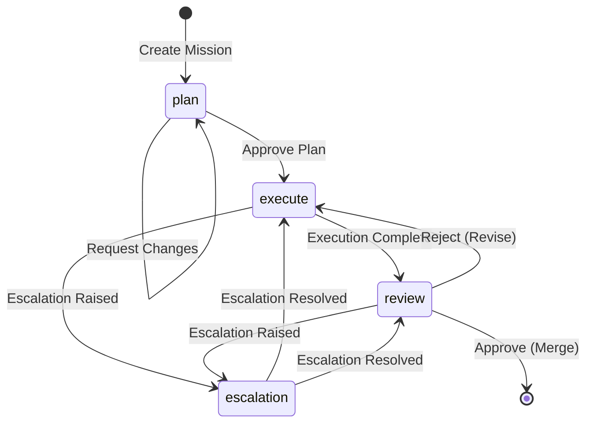
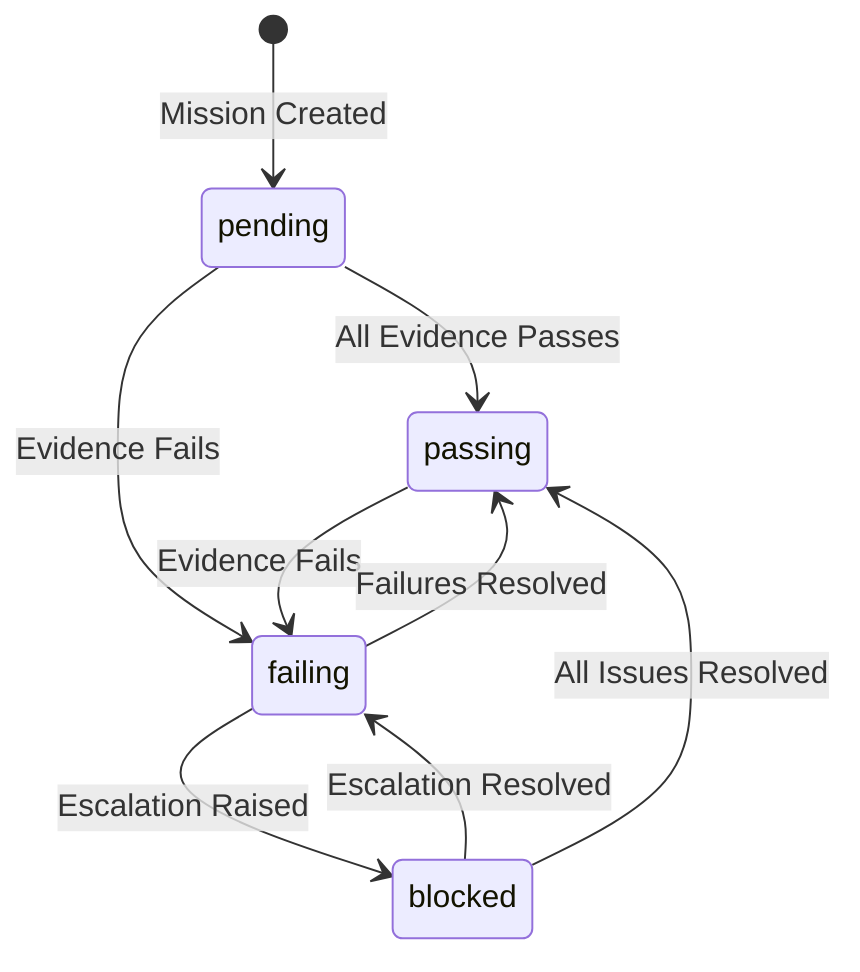
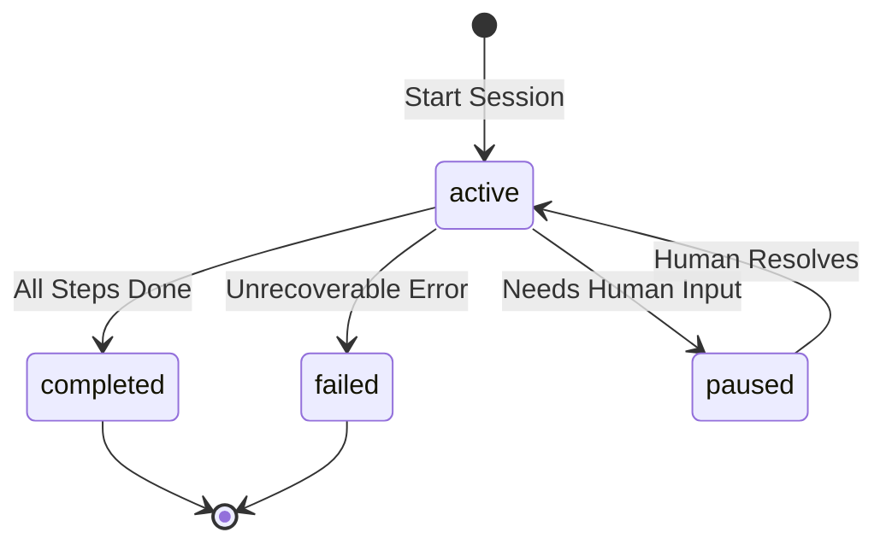
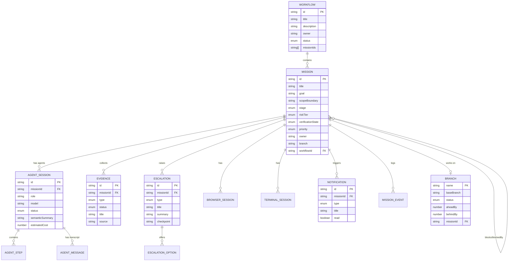

# Conceptual Model: Mission Control

> HCI analysis of the Mission Control prototype -- a mission-centered agentic IDE for orchestrating and supervising AI coding agents.
>
> **Date**: 2026-03-23
> **Analyst**: HCI Expert (Conceptual Model lens)
> **Scope**: Full system as implemented in `apps/web/`

---

## 1. Purpose of the System

Mission Control is an **orchestration and oversight tool** that lets a human operator manage multiple AI coding agents working on software engineering tasks. Its core value proposition is the "zoom in / zoom out" pattern:

- **Zoom out**: See all missions across workflows, understand status, risks, and dependencies at a glance (Workflows list, Missions inbox, Kanban board).
- **Zoom in**: Drop into a specific mission's live execution to supervise an agent in real-time (Live View mode).

The system enforces a **structured lifecycle** on every unit of work (Mission) -- plan, execute, review, escalation -- ensuring human oversight at critical decision points while letting agents operate autonomously on routine tasks.

**Primary jobs-to-be-done:**

1. Define a unit of AI work with clear scope boundaries, acceptance criteria, and risk classification.
2. Monitor agents as they execute, collecting evidence of correctness.
3. Review agent output with evidence trails before approving or rejecting.
4. Resolve ambiguities and high-stakes decisions that agents cannot handle alone.
5. Track cost, history, and policy compliance across all agent work.

---

## 2. Primary Actors

| Actor                       | Goal                                                       | Main tasks                                                                          | Notes                                                                                                      |
| --------------------------- | ---------------------------------------------------------- | ----------------------------------------------------------------------------------- | ---------------------------------------------------------------------------------------------------------- |
| **Human Operator** (Owner)  | Maintain oversight of agent-driven development             | Create missions, approve plans, review output, resolve escalations, enter Live View | The only actor in the current prototype. All UI is designed for this role. No multi-user model visible.    |
| **AI Agent** (AgentSession) | Execute mission work autonomously within scope             | Read/write code, run tests, propose plans, raise escalations                        | Not a UI actor -- represented as data flowing through the system. Multiple agents can work on one mission. |
| **System**                  | Enforce lifecycle rules and surface actionable information | Generate notifications, collect evidence, track costs                               | Implicit actor. Generates notifications (`NTF-*`), mission events (`ME-*`), and verification state.        |

**Missing actors / ambiguities:**

- No explicit **Reviewer** role distinct from Owner. The same person who creates the mission also reviews it (see `MissionReview.tsx`, `ApprovalBar`).
- No **Admin** role for Settings page. Settings appear globally accessible.
- No **Team** or **Organization** concept. Owners are free-text strings, not linked to any user model.

---

## 3. Primary Objects / Entities

| Object                          | Definition                                                      | Key attributes                                                                                                                                                                         | Related objects                                                                                                             |
| ------------------------------- | --------------------------------------------------------------- | -------------------------------------------------------------------------------------------------------------------------------------------------------------------------------------- | --------------------------------------------------------------------------------------------------------------------------- |
| **Workflow**                    | Container grouping related missions into a strategic initiative | `id`, `title`, `description`, `owner`, `status` (active/completed/paused), `missionIds`                                                                                                | Contains Missions. Displayed as Kanban board at `/workflows/:id`.                                                           |
| **Mission**                     | Atomic unit of AI-driven work with structured lifecycle         | `id`, `title`, `goal`, `scopeBoundary`, `stage`, `riskTier`, `verificationState`, `owner`, `priority`, `blockedBy`/`blocks`, `branch`, `tags`                                          | Belongs to 0..1 Workflow. Has 0..N AgentSessions, Evidence, Escalations, BrowserSessions, TerminalSessions. Central entity. |
| **AgentSession**                | A single AI agent execution run within a mission                | `id`, `missionId`, `role`, `model`, `status`, `steps[]`, `semanticSummary`, `tokensUsed`, `estimatedCost`, `toolsUsed`, `branch`                                                       | Belongs to Mission. Contains AgentSteps. Linked to AgentMessages (chat).                                                    |
| **AgentStep**                   | A discrete action taken by an agent within a session            | `id`, `action`, `status`, `detail`, `timestamp`                                                                                                                                        | Belongs to AgentSession.                                                                                                    |
| **Evidence**                    | Verification artifact proving or disproving acceptance criteria | `id`, `missionId`, `type` (test-result/policy-check/requirement-trace/risk-explanation), `status`, `detail`, `source`                                                                  | Belongs to Mission. Displayed in EvidenceRail on Plan/Execute/Review pages.                                                 |
| **Escalation**                  | A decision point requiring human judgment                       | `id`, `missionId`, `type` (ambiguous-requirement/conflicting-evidence/security-sensitive/scope-breach/architectural-friction), `title`, `summary`, `detail`, `options[]`, `checkpoint` | Belongs to Mission. Displayed on `/missions/:id/escalation`.                                                                |
| **EscalationOption**            | A possible resolution to an escalation                          | `id`, `label`, `description`, `risk`                                                                                                                                                   | Belongs to Escalation. Presented in ConsequencePanel.                                                                       |
| **Notification**                | System alert for a notable event                                | `id`, `type`, `title`, `detail`, `missionId`, `read`, `timestamp`                                                                                                                      | References Mission. Displayed in NotificationCenter (TopBar).                                                               |
| **MissionEvent**                | Audit log entry for mission lifecycle                           | `id`, `missionId`, `type`, `actor`, `detail`, `timestamp`                                                                                                                              | Belongs to Mission. Displayed in MissionTimeline.                                                                           |
| **Branch**                      | Git branch associated with a mission                            | `name`, `baseBranch`, `status`, `aheadBy`, `behindBy`, `lastCommit`, `missionId`                                                                                                       | 0..1 per Mission. Displayed in BranchBadge.                                                                                 |
| **BrowserSession**              | A browser automation session within a mission                   | `id`, `missionId`, `url`, `status`, `semanticSummary`, `screenshotPlaceholder`                                                                                                         | Belongs to Mission. Visible in Execute page and Live View.                                                                  |
| **TerminalSession**             | A terminal execution session within a mission                   | `id`, `missionId`, `command`, `status`, `semanticSummary`, `outputPreview`                                                                                                             | Belongs to Mission. Visible in Execute page and Live View.                                                                  |
| **AgentMessage**                | A single message in the agent chat transcript                   | `id`, `sessionId`, `role`, `content`, `toolName`, `toolInput`, `requiresApproval`                                                                                                      | Belongs to AgentSession. Displayed in AgentChatPanel.                                                                       |
| **Workspace** _(deprecated)_    | Former standalone entity for IDE-like environment               | `id`, `missionId`, `branch`, `activeFile`, `openFiles`, `terminalSessionId`, `browserSessionId`, `agentSessionId`                                                                      | **Dissolved.** Replaced by `Mission.branch` + `LiveViewState`. Still exists in data and code as bridge.                     |
| **LiveViewState** _(ephemeral)_ | Transient view state for fullscreen supervision mode            | `missionId`, `activeFile`, `openFiles`, `focusedPane`                                                                                                                                  | Not persisted. Only a TypeScript interface. Realized through the LiveView page component.                                   |

---

## 4. Actions Available on Each Object

| Action                           | Target object          | Preconditions                                                                                                        | Result                                                                                                                      |
| -------------------------------- | ---------------------- | -------------------------------------------------------------------------------------------------------------------- | --------------------------------------------------------------------------------------------------------------------------- |
| **Create Mission**               | Mission                | None                                                                                                                 | New mission in `plan` stage, `pending` verification, assigned risk tier. Route: `/missions/new`.                            |
| **Approve Plan**                 | Mission (plan stage)   | Mission in `plan` stage                                                                                              | Mission transitions to `execute` stage. Button: "Approve Plan & Begin Execution" in `MissionPlan.tsx`.                      |
| **Request Changes**              | Mission (plan stage)   | Mission in `plan` stage                                                                                              | Mission stays in `plan` (presumably returned for revision). Button in `MissionPlan.tsx`.                                    |
| **Enter Live View**              | Mission                | Mission exists (shown primarily when `stage === 'execute'` on Kanban, but link available on all MissionDetail pages) | Fullscreen IDE-like supervision. Route: `/missions/:id/live`. Exits via Escape key.                                         |
| **Approve/Reject** (Review)      | Mission (review stage) | Mission in `review` stage                                                                                            | Mission approved (presumably transitions to completed) or rejected (rollback preview shown). `ApprovalBar` component.       |
| **Resolve Escalation**           | Escalation             | Escalation exists, options available                                                                                 | Human selects an option from ConsequencePanel. No explicit "resolve" action wired -- options are display-only in prototype. |
| **Filter Missions**              | Mission list           | On MissionHome page                                                                                                  | Narrows visible missions by `stage` and `riskTier`. URL query params: `?stage=X&risk=Y`.                                    |
| **Select Mission** (Focus Panel) | Mission                | On MissionHome page                                                                                                  | Right-side FocusPanel shows mission summary. Click-to-select, not navigate.                                                 |
| **Navigate to Stage**            | Mission                | From MissionDetail                                                                                                   | Links to `/missions/:id/plan`, `/execute`, `/review`, `/escalation`.                                                        |
| **Create Workflow**              | Workflow               | None                                                                                                                 | New workflow with selected missions. Route: `/workflows/new`.                                                               |
| **View Workflow Board**          | Workflow               | Workflow exists                                                                                                      | Kanban board of missions by stage. Route: `/workflows/:id`.                                                                 |
| **Mark Notification Read**       | Notification           | Notification is unread                                                                                               | Removes unread indicator. Click navigates to mission detail.                                                                |
| **Search (Command Palette)**     | System-wide            | Cmd+K (implied)                                                                                                      | Searches missions, pages, and actions. Navigates to selected item's stage-specific page.                                    |
| **Toggle Policy**                | Settings               | On Settings page                                                                                                     | Enables/disables system policy.                                                                                             |
| **Configure Agent**              | AgentSession (implied) | On Execute page                                                                                                      | Opens AgentConfigPanel overlay.                                                                                             |
| **Switch Chat/Overview**         | Execute view mode      | On MissionExecute page                                                                                               | Toggles between overview (swimlanes + code preview) and chat transcript.                                                    |

---

## 5. States and Transitions

### 5.1 Mission Stage (primary lifecycle)

| Object  | State        | Meaning                                     | Entered by                           | Exited by                                                                  |
| ------- | ------------ | ------------------------------------------- | ------------------------------------ | -------------------------------------------------------------------------- |
| Mission | `plan`       | Work is being defined and scoped            | Mission creation                     | Plan approval ("Approve Plan & Begin Execution")                           |
| Mission | `execute`    | AI agents are actively working              | Plan approval                        | Execution completion (moves to `review`), or escalation triggered          |
| Mission | `review`     | Agent work complete, human verifying output | Execution completion                 | Approval (implied completion), rejection (implied rollback), or escalation |
| Mission | `escalation` | Blocked on human decision                   | Escalation raised by agent or system | Resolution of escalation (returns to `execute` or `review`)                |



### 5.2 Mission Verification State

| Object  | State     | Meaning                            | Entered by                            | Exited by                   |
| ------- | --------- | ---------------------------------- | ------------------------------------- | --------------------------- |
| Mission | `pending` | No evidence collected yet          | Mission creation, early plan stage    | Evidence begins flowing     |
| Mission | `passing` | All evidence checks pass           | All evidence items have `pass` status | Any evidence fails or warns |
| Mission | `failing` | One or more evidence items failing | Evidence item reports `fail`          | Failing evidence resolved   |
| Mission | `blocked` | Evidence blocked, cannot proceed   | Escalation or unresolvable failure    | Escalation resolved         |



### 5.3 AgentSession Status

| Object       | State       | Meaning                               | Entered by                       | Exited by                        |
| ------------ | ----------- | ------------------------------------- | -------------------------------- | -------------------------------- |
| AgentSession | `active`    | Agent is currently running            | Session started                  | Completion, failure, or pause    |
| AgentSession | `paused`    | Agent stopped, awaiting human input   | Escalation or ambiguity detected | Human resolves, agent resumes    |
| AgentSession | `completed` | Agent finished all work successfully  | All steps completed              | N/A (terminal)                   |
| AgentSession | `failed`    | Agent encountered unrecoverable error | Step failure                     | N/A (terminal, unless restarted) |



### 5.4 AgentStep Status

| Object    | State       | Meaning               | Entered by             | Exited by               |
| --------- | ----------- | --------------------- | ---------------------- | ----------------------- |
| AgentStep | `pending`   | Not yet started       | Step queued            | Agent begins step       |
| AgentStep | `running`   | Currently executing   | Agent starts step      | Step completes or fails |
| AgentStep | `completed` | Successfully finished | Step finishes          | N/A (terminal)          |
| AgentStep | `failed`    | Step failed           | Error during execution | N/A (terminal)          |

### 5.5 Workflow Status

| Object   | State       | Meaning               | Entered by            | Exited by                              |
| -------- | ----------- | --------------------- | --------------------- | -------------------------------------- |
| Workflow | `active`    | Work in progress      | Workflow creation     | All missions complete, or manual pause |
| Workflow | `paused`    | Temporarily halted    | Manual action         | Resume                                 |
| Workflow | `completed` | All missions finished | All missions approved | N/A (terminal)                         |

### 5.6 Evidence Status

| Object   | State     | Meaning              | Entered by                   | Exited by             |
| -------- | --------- | -------------------- | ---------------------------- | --------------------- |
| Evidence | `pass`    | Check succeeded      | Test passes, policy passes   | Regression            |
| Evidence | `fail`    | Check failed         | Test fails, policy violation | Fix applied           |
| Evidence | `warning` | Non-blocking concern | Partial compliance           | Addressed or accepted |
| Evidence | `pending` | Not yet evaluated    | Evidence registered          | Evaluation runs       |

### 5.7 Branch Status

| Object | State    | Meaning                      | Entered by                                   | Exited by            |
| ------ | -------- | ---------------------------- | -------------------------------------------- | -------------------- |
| Branch | `active` | Currently being worked on    | Branch created for mission                   | Merge or abandonment |
| Branch | `merged` | Integrated into base branch  | Review approved                              | N/A (terminal)       |
| Branch | `stale`  | Inactive, behind base branch | Prolonged inactivity, significant divergence | Rebase or close      |

---

## 6. Rules, Constraints, Permissions, and Guardrails

### 6.1 Lifecycle Rules (from data model and UI)

| Rule                                                        | Enforcement                                                                  | Source                                       |
| ----------------------------------------------------------- | ---------------------------------------------------------------------------- | -------------------------------------------- |
| Missions always start in `plan` stage                       | `MissionCreate.tsx` hardcodes `stage: 'plan'`                                | `apps/web/src/pages/MissionCreate.tsx:31`    |
| Missions always start with `pending` verification           | `MissionCreate.tsx` hardcodes `verificationState: 'pending'`                 | `apps/web/src/pages/MissionCreate.tsx:33`    |
| Plan approval gate: human must approve before execution     | "Approve Plan & Begin Execution" button only renders when `stage === 'plan'` | `apps/web/src/pages/MissionPlan.tsx:136`     |
| Review gate: blockers shown before approval                 | `ApprovalBar` receives `blockerCount` (fail + warning evidence)              | `apps/web/src/pages/MissionReview.tsx:38-40` |
| Escalation requires options: agent must propose resolutions | `EscalationOption[]` is required on `Escalation` interface                   | `apps/web/src/data/escalations.ts:8-13`      |
| Live View exit: Escape key always available                 | `useEffect` keydown handler in `LiveView.tsx`                                | `apps/web/src/pages/LiveView.tsx:99-107`     |

### 6.2 Risk Classification

| Risk Tier | Configured Description (Settings)                           | Automation Level (Implied)                                  |
| --------- | ----------------------------------------------------------- | ----------------------------------------------------------- |
| `low`     | Changes to non-critical paths, documentation, tests (0-30)  | Higher autonomy. Agent can proceed with less oversight.     |
| `medium`  | Feature additions, refactors, new endpoints (31-70)         | Moderate oversight. Standard review flow.                   |
| `high`    | Auth, payments, data migration, security-sensitive (71-100) | Lower autonomy. Multiple approvals, more evidence required. |

### 6.3 Configurable Policies (Settings page)

| Policy                                           | Default  | Effect                                              |
| ------------------------------------------------ | -------- | --------------------------------------------------- |
| No direct commits to main without review         | Enabled  | Enforces review stage                               |
| High-risk missions require 2 approvals           | Enabled  | Escalates approval for high-risk                    |
| All missions must pass verification before merge | Enabled  | Blocks merge when `verificationState !== 'passing'` |
| Escalations timeout after 24h -- auto-reject     | Disabled | Would auto-close stale escalations                  |

### 6.4 Notification Rules

| Event type               | Default urgency (Settings) |
| ------------------------ | -------------------------- |
| Escalation alerts        | Immediate                  |
| Review ready             | Batched (15 min)           |
| Execution status updates | On completion only         |
| Workflow summaries       | Daily digest               |

### 6.5 Dependency Constraints

- `Mission.blockedBy` and `Mission.blocks` create a directed dependency graph between missions.
- Displayed in `DependencyGraph` component on Workflows page.
- **Not enforced**: A mission can be in `execute` while its blocker is also in `execute` (MSN-002 is executing while blocked by MSN-001 in review). This is a data inconsistency in the prototype.

---

## 7. Entity Relationship Diagram



---

## 8. Ambiguities and Overloaded Concepts

### 8.1 The Workspace Ghost

**Severity: High.** The `Workspace` entity is marked `@deprecated` in `apps/web/src/data/workspaces.ts:1` with a comment saying "use Mission.branch + LiveViewState instead," yet:

- `Workspace.tsx` page still exists as a fully implemented component (`apps/web/src/pages/Workspace.tsx`).
- `WorkspaceRedirect.tsx` redirects `/workspace/:id` to Live View, acknowledging the old URL scheme.
- `LiveView.tsx:111` still queries `workspaces.find((ws) => ws.missionId === missionId)` as a "bridge until Workspace entity fully dissolved."
- The `components/workspace/` directory contains 6 components (`WorkspaceLayout`, `WorkspaceTabs`, `BranchBadge`, `BrowserPreview`, `CodeViewer`, `FileTree`, `TerminalEmulator`) -- all named around the dissolved concept.

**Impact**: A new user reading the code encounters two competing models for the same idea: "the place where an agent does its work." The Workspace says it with a standalone entity and URL. The Mission says it with `branch`, `agentSessionIds`, and a Live View mode. They mean the same thing.

**Recommendation**: Complete the dissolution. Remove `Workspace.tsx`, `WorkspaceTabs.tsx`, and the `workspaces` data file. Rename `components/workspace/` to `components/live-view/`. Stop querying `workspaces` in `LiveView.tsx`.

### 8.2 "Stage" vs. "Status" -- Two Lifecycle Dimensions

**Severity: Medium.** Mission has both `stage` (plan/execute/review/escalation) and `verificationState` (pending/passing/failing/blocked). These are orthogonal dimensions, but the UI does not always make this clear:

- `StageBadge` and `VerificationBadge` appear side-by-side on `MissionDetail` and `MissionCard`, which is good.
- But the MissionHome sort order puts `escalation` first, then `review`, then `execute`, then `plan` -- implying `stage` is a priority signal, not just a lifecycle position.
- The Kanban board on WorkflowDetail uses `stage` as columns, which works well for lifecycle visualization. But `verificationState` is not visible on the Kanban cards at all (only `RiskBadge` is shown in `MissionBoardCard`).

**Recommendation**: Always pair stage and verification state in summary views. Add `VerificationBadge` to the Kanban card. Consider whether `escalation` is truly a stage (position in lifecycle) or a status overlay that can co-occur with any stage.

### 8.3 Escalation as Stage vs. Mode

**Severity: High.** In the data model, `escalation` is one of the four stages (`'plan' | 'execute' | 'review' | 'escalation'`). This implies a mission can only be in one stage at a time. But the real semantics are different:

- An escalation can be raised _during_ execution (ESC-001 arose during AS-001's work on MSN-001, which is currently in `review` stage).
- A mission in `escalation` stage cannot simultaneously be in `review`, even though MSN-001 has both unresolved escalations AND is in review.
- Multiple escalations can exist on one mission (MSN-004 has ESC-002 and ESC-003), but the escalation page focuses on `primaryEscalation = mEscalations[0]`, treating secondary ones as subordinate.

**Impact**: The model forces a linear lifecycle where the reality is a branching one. An escalation should be a parallel concern, not a mutually exclusive stage.

**Recommendation**: Model escalation as a boolean flag or a separate collection that overlays any stage, not as a stage itself. Missions would then be `plan + escalated`, `execute + escalated`, or `review + escalated`.

### 8.4 Owner is a String, Not an Entity

**Severity: Medium.** `Mission.owner` and `Workflow.owner` are free-text strings (e.g., "Sarah Chen", "Marcus Rivera"). They are not linked to any user entity, authentication system, or permission model.

- The same person can own both workflows and missions.
- There is no concept of "who is currently logged in" or "who can approve."
- Settings page has no user identity -- all policies are global.

**Impact**: Makes it impossible to implement permission-based guardrails (e.g., "only the owner can approve a plan," "high-risk missions require a different reviewer").

### 8.5 "Priority" vs. "RiskTier" vs. Sort Order

**Severity: Low-Medium.** Three overlapping concepts of importance:

- `riskTier` (low/medium/high): Classifies the inherent danger of the work.
- `priority` (low/medium/high/critical): Classifies urgency. Optional field.
- Sort order in MissionHome: Sorts by stage first (escalation > review > execute > plan), then by risk tier -- but never by `priority`.

**Impact**: `priority` is defined in the data model and set on all sample missions but is never displayed or used for sorting in any UI component. It is an invisible attribute.

**Recommendation**: Either surface `priority` explicitly (as a filter, sort option, or badge) or remove it from the model. Currently it creates a dead concept.

### 8.6 "Branch" Appears in Three Places

**Severity: Low.** A git branch is referenced in three different ways:

1. `Mission.branch`: Optional string field (e.g., `'feature/auth-pkce'`).
2. `Branch` entity: Full object in `branches.ts` with `status`, `aheadBy`, `behindBy`, `missionId`.
3. `AgentSession.branch`: Optional string field duplicating the association.
4. `Workspace.branch` (deprecated): Yet another reference.

The `Branch` entity has a `missionId` back-reference, creating a bidirectional link that could desynchronize.

### 8.7 Notification Routing Always Goes to Mission Detail

**Severity: Low.** `NotificationCenter.tsx:59` navigates to `/missions/${n.missionId}` for all notification types. But an escalation notification should probably navigate to `/missions/:id/escalation`, and an evidence notification to `/missions/:id/review`. The current behavior drops the user at the overview page, requiring an extra click.

---

## 9. Navigation Model

### 9.1 Route Map

```
/                               --> Redirect to /missions
/missions                       --> MissionHome (inbox + focus panel)
/missions/new                   --> MissionCreate (form + preview)
/missions/:id                   --> MissionDetail (overview)
/missions/:id/plan              --> MissionPlan
/missions/:id/execute           --> MissionExecute
/missions/:id/review            --> MissionReview
/missions/:id/escalation        --> MissionEscalation
/missions/:id/live              --> LiveView (fullscreen, outside AppShell)
/workflows                      --> Workflows (list + dependency graphs)
/workflows/new                  --> WorkflowCreate (form + preview)
/workflows/:id                  --> WorkflowDetail (Kanban board)
/workflows/:wfId/missions/:mId  --> MissionDetail (workflow-contexted)
/workflows/:wfId/missions/:mId/plan|execute|review|escalation
/workflows/:wfId/missions/:mId/live --> LiveView (workflow-contexted)
/workspace/:id                  --> WorkspaceRedirect (legacy, redirects to Live View)
/costs                          --> CostDashboard
/history                        --> History
/settings                       --> Settings
```

### 9.2 Left Nav Structure

```
Workflows (/workflows)           -- GitBranch icon
Missions (/missions)             -- Target icon, badge with total count
--- separator ---
Costs (/costs)                   -- DollarSign icon
History (/history)               -- History icon
Settings (/settings)             -- Settings icon
```

**Observation**: The separator divides "work objects" (Workflows, Missions) from "utilities" (Costs, History, Settings). This is a reasonable grouping. The Missions nav item also highlights when viewing workflow-scoped mission pages, which prevents disorientation.

### 9.3 Navigation Friction Points

1. **Live View is outside AppShell**: When entering Live View, the LeftNav, TopBar, and NotificationCenter all disappear. The only exit is the Escape key or the "Back" link. This is intentional (fullscreen supervision), but it means the user loses all ambient awareness of other missions while supervising one.

2. **Dual-path routing**: Every mission page exists at both `/missions/:id/...` and `/workflows/:wfId/missions/:mId/...`. The breadcrumbs and "Back" links adapt correctly, but the CommandPalette navigates to the workflow-contexted path if a `workflowId` exists, and the notification center always navigates to `/missions/:id`. These inconsistencies could cause disorientation when context-switching.

3. **MissionDetail as hub**: The MissionDetail page has a NAVIGATION section with explicit links to all four stage pages and Live View. This is a good information architecture decision -- it makes MissionDetail the canonical "hub" for a mission. But it shows links to all stages regardless of the mission's current stage, which might tempt users to visit irrelevant stages.

---

## 10. Recommendations to Simplify the Model

### R1. Decouple Escalation from Stage Lifecycle (High Impact)

**Problem**: Modeling `escalation` as a stage forces a mission into a single-track lifecycle where it cannot be simultaneously "in review" and "escalated."

**Fix**: Remove `escalation` from the `Stage` union. Add an `escalations: Escalation[]` collection to Mission (already exists via `escalationIds`). Add a computed property `isEscalated: boolean` derived from whether unresolved escalations exist. The Kanban board can show an escalation badge overlay rather than a separate column.

**Files affected**: `apps/web/src/data/missions.ts` (Stage type), `apps/web/src/pages/WorkflowDetail.tsx` (stageColumns), `apps/web/src/pages/MissionHome.tsx` (sort order, filter options), `apps/web/src/components/mission/StageBadge.tsx`.

### R2. Complete the Workspace Dissolution (High Impact)

**Problem**: The deprecated Workspace entity creates a ghost concept that confuses the mental model.

**Fix**:

- Delete `apps/web/src/pages/Workspace.tsx` and `apps/web/src/components/workspace/WorkspaceTabs.tsx`.
- Rename `apps/web/src/components/workspace/` to `apps/web/src/components/live-view/`.
- Remove the `workspaces.find()` fallback in `LiveView.tsx` and derive all state from `Mission` and its associated sessions.
- Keep `WorkspaceRedirect.tsx` for backward compatibility, but consider a deprecation timeline.

### R3. Surface Priority or Remove It (Medium Impact)

**Problem**: `Mission.priority` exists in the data model but is invisible in the UI.

**Fix**: Either add a `PriorityBadge` component and use it in `MissionCard`, `MissionBoardCard`, and `FocusPanel` -- and make it a filter option in MissionHome -- or remove the field from the `Mission` interface entirely.

### R4. Route Notifications to Stage-Specific Pages (Low-Medium Impact)

**Problem**: All notifications navigate to `/missions/:id` regardless of type.

**Fix**: Map notification types to target routes:

- `escalation` -> `/missions/:id/escalation`
- `evidence` -> `/missions/:id/review`
- `stage-change` -> `/missions/:id` (current stage)
- `agent-failure` -> `/missions/:id/execute`
- `approval` -> `/missions/:id/plan` or `/missions/:id/review`

**File affected**: `apps/web/src/components/shell/NotificationCenter.tsx:59`.

### R5. Highlight Current Stage in MissionDetail Navigation (Low Impact)

**Problem**: MissionDetail shows navigation links to all four stages with equal visual weight, regardless of which stage the mission is actually in.

**Fix**: Visually distinguish the current stage link (e.g., filled background, different border color) and optionally gray out stages the mission has not yet reached.

**File affected**: `apps/web/src/pages/MissionDetail.tsx:252-266`.

### R6. Enforce Dependency Constraints (Medium Impact)

**Problem**: `blockedBy` / `blocks` relationships are displayed in the DependencyGraph but not enforced. MSN-002 is in `execute` while its blocker MSN-001 is in `review`.

**Fix**: Either enforce that a blocked mission cannot advance past `plan` until its blockers are resolved, or clearly label the dependency as "soft" (informational) vs. "hard" (enforced).

### R7. Introduce a User Entity (Medium Impact, Structural)

**Problem**: Owners are free-text strings. No authentication, no permissions, no multi-user awareness.

**Fix**: Define a `User` entity with `id`, `name`, `role`. Link `Mission.ownerId` and `Workflow.ownerId` to it. This enables role-based access control, reviewer assignment, and audit trails with identity rather than free text. This is a structural change and probably post-prototype.

### R8. Add Verification State to Kanban Cards (Low Impact)

**Problem**: The Kanban board (`WorkflowDetail.tsx`) shows `RiskBadge` but not `VerificationBadge` on each mission card. A mission in `review` with `failing` verification looks identical to one with `passing` verification on the board.

**Fix**: Add `<VerificationBadge state={mission.verificationState} />` to `MissionBoardCard`.

**File affected**: `apps/web/src/pages/WorkflowDetail.tsx:38-45`.

---

## 11. Evaluation: Does the Model Make Things Obvious?

### What exists in the system?

**Mostly clear.** The LeftNav clearly presents the two primary objects (Workflows, Missions) and three utility views (Costs, History, Settings). The entity hierarchy (Workflow > Mission > AgentSession/Evidence/Escalation) is well-structured. But the Workspace ghost and the invisible Priority attribute introduce phantom concepts that either clutter or are missing from the user's mental model.

**Grade: B+**

### What users can do?

**Mostly clear.** Each mission stage page presents appropriate actions: approve/reject on Plan and Review, resolve on Escalation, supervise via Live View on Execute. The Command Palette provides quick navigation. However, some actions are display-only in the prototype (escalation option selection, policy toggles, agent configuration). The user cannot tell which buttons will actually work.

**Grade: B**

### What state something is in?

**Mixed.** Stage badges, verification badges, and risk badges provide strong visual signals on individual mission views. But the Kanban board omits verification state, the mission inbox uses an implicit sort order as a proxy for urgency rather than explicit state communication, and the relationship between stage and escalation is structurally confused. The dual-axis of stage + verification is powerful when both are shown but creates gaps when one is hidden.

**Grade: B-**

### What will happen next?

**Weakest area.** The system does not clearly communicate what the next expected action is for a given mission state. A mission in `review` with `failing` evidence: does the user reject it? Wait for the agent to fix it? Re-enter Live View? The rollback preview in MissionReview hints at consequences of rejection, but there is no explicit "recommended next step" or "what happens if I do nothing." The notification system shows _what happened_ but not _what needs to happen_.

**Grade: C+**

---

## 12. Summary

Mission Control has a strong conceptual foundation: the Workflow > Mission > Agent hierarchy is clean, the four-stage lifecycle provides structure, and the zoom-in/zoom-out pattern between management views and Live View supervision is well-articulated.

The three highest-priority improvements to the conceptual model are:

1. **Decouple escalation from the stage lifecycle.** It is a concurrent concern, not a sequential stage.
2. **Complete the Workspace dissolution.** The ghost entity creates conceptual noise.
3. **Make "what happens next" obvious.** Add recommended actions, enforce or soften dependency constraints, and route notifications to contextually appropriate pages.

These changes would sharpen the conceptual model from a prototype-grade sketch into a production-ready mental model that users can internalize quickly and operate within confidently.
