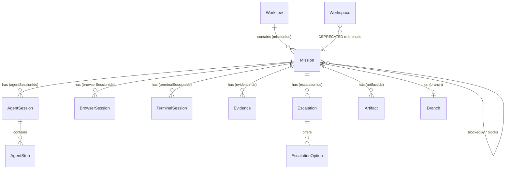

# Conceptual Model Analysis

> HCI Review Document -- Mission Control Prototype
> Date: 2026-03-24
> Scope: Conceptual objects, user roles, actions, states, rules, and structural gaps

---

## 1. Users

Mission Control is designed for **human supervisors** overseeing agentic software engineering work. Three user roles are relevant to the current prototype and its foreseeable evolution:

### 1.1 Supervisor (Primary)

The supervisor is the primary user. They review plans, monitor agent execution, approve or reject completed work, and resolve escalations. Every page in the prototype is oriented toward this role. The supervisor's core loop is:

1. Scan missions for items needing attention (MissionHome).
2. Drill into a specific mission (MissionDetail).
3. Review the plan, observe execution, approve/reject results, or resolve escalations.
4. Optionally enter Live View to observe agent work in real time.

### 1.2 Agent Developer

An implied secondary user who would configure agent behavior, set tool permissions, and tune model parameters. Currently represented only by the `AgentConfigPanel` stub on the MissionExecute page (`apps/web/src/components/execute/AgentConfigPanel.tsx`), accessed via the settings gear button at `apps/web/src/pages/MissionExecute.tsx:194-200`.

### 1.3 Platform Admin

An implied tertiary user responsible for system-level settings, cost management, and audit history. Represented by the Settings page (`apps/web/src/pages/Settings.tsx`), the CostDashboard page (`apps/web/src/pages/CostDashboard.tsx`), and the History page (`apps/web/src/pages/History.tsx`).

---

## 2. Objects

The following domain objects form the conceptual model of Mission Control:

### 2.1 Object Inventory

| #   | Object               | Definition                                                                                             | Primary Source File                         | Relationship                                                     |
| --- | -------------------- | ------------------------------------------------------------------------------------------------------ | ------------------------------------------- | ---------------------------------------------------------------- |
| 1   | **Mission**          | A unit of supervised agentic work with a defined goal, scope, risk tier, and lifecycle stage.          | `apps/web/src/data/missions.ts:8-35`        | Contains Agent Sessions, Evidence, Escalations, Artifacts        |
| 2   | **Workflow**         | A grouping of related missions under a strategic initiative.                                           | `apps/web/src/data/workflows.ts:1-9`        | Contains Missions via `missionIds`                               |
| 3   | **Agent Session**    | A single agent instance working on a mission, with steps, status, and token usage.                     | `apps/web/src/data/agent-sessions.ts:15-29` | Belongs to Mission via `missionId`                               |
| 4   | **Browser Session**  | A headless browser session an agent uses to interact with web interfaces.                              | `apps/web/src/data/browser-sessions.ts`     | Belongs to Mission via `missionId`                               |
| 5   | **Terminal Session** | A terminal session an agent uses for CLI operations.                                                   | `apps/web/src/data/terminal-sessions.ts`    | Belongs to Mission via `missionId`                               |
| 6   | **Evidence**         | A verification artifact (test result, lint check, etc.) with pass/fail/warning/pending status.         | `apps/web/src/data/evidence.ts`             | Belongs to Mission via `missionId`                               |
| 7   | **Escalation**       | An issue requiring human decision when agent work encounters a problem it cannot resolve autonomously. | `apps/web/src/data/escalations.ts`          | Belongs to Mission via `missionId`; has EscalationOptions        |
| 8   | **Artifact**         | A deliverable produced by agent work (markdown report, image, video, HTML).                            | `apps/web/src/data/artifacts.ts:1-13`       | Belongs to Mission via `missionId`; referenced by `artifactIds`  |
| 9   | **Code File**        | A source file modified or viewed during agent work.                                                    | `apps/web/src/data/code-files.ts`           | Accessed via LiveView/WorkspaceLayout                            |
| 10  | **Branch**           | A git branch associated with a mission's code changes.                                                 | `apps/web/src/data/branches.ts`             | Belongs to Mission via `mission.branch`                          |
| 11  | **Workspace**        | **DEPRECATED.** A now-dissolved entity that grouped branch + open files + sessions.                    | `apps/web/src/data/workspaces.ts:1-12`      | Replaced by LiveView; legacy redirect at `WorkspaceRedirect.tsx` |

### 2.2 Object Relationship Diagram



---

## 3. Actions

The following table maps every user action across each object. Implementation status is indicated as:

- **Yes** -- fully implemented in the prototype UI
- **Partial** -- partially implemented (e.g., toast-only feedback, no state mutation)
- **No** -- no UI exists for this action

### 3.1 Mission Actions

| Action                   | UI Location                                                   | Status  | Notes                                                                 |
| ------------------------ | ------------------------------------------------------------- | ------- | --------------------------------------------------------------------- |
| **View list**            | `MissionHome.tsx` -- left sidebar with cards                  | Yes     | Filter by stage/risk, sort by stage/title/created/risk                |
| **View detail**          | `MissionDetail.tsx` -- overview page                          | Yes     | Header, goal, scope, criteria, risks, evidence, escalations, timeline |
| **Create**               | `MissionCreate.tsx` via "NEW MISSION" button                  | Yes     | Route at `/missions/new` (`App.tsx:61`)                               |
| **Edit**                 | --                                                            | No      | No edit capability for existing missions                              |
| **Delete**               | --                                                            | No      | No delete capability                                                  |
| **Approve plan**         | `MissionPlan.tsx:166-177` -- "Approve Plan & Begin Execution" | Partial | Shows toast; no state mutation (static data)                          |
| **Request changes**      | `MissionPlan.tsx:178-186` -- "Request Changes" button         | Partial | Shows toast; no state mutation                                        |
| **Approve review**       | `ApprovalBar.tsx:72-87` -- "Approve" button                   | Partial | Shows toast; gated by `canApprove` check (line 17)                    |
| **Reject review**        | `ApprovalBar.tsx:60-70` -- "Reject" button                    | Partial | Shows toast; no state mutation                                        |
| **Re-plan**              | `ApprovalBar.tsx:48-59` -- "Re-plan" button                   | Partial | Shows toast; no state mutation                                        |
| **Monitor (inline)**     | --                                                            | No      | **GAP**: No inline agent visibility; binary fullscreen or nothing     |
| **Monitor (fullscreen)** | `LiveView.tsx` -- "ENTER LIVE VIEW" links                     | Yes     | Fullscreen page outside AppShell                                      |
| **Filter**               | `MissionHome.tsx:61-65` -- stage + risk filters               | Yes     | URL search params for stage/risk                                      |
| **Sort**                 | `MissionHome.tsx:67-75` -- sort dropdown                      | Yes     | By stage, title, created, risk                                        |
| **Switch between**       | `MissionSwitcherDropdown.tsx`, `CommandPalette.tsx`           | Yes     | Cmd+Shift+M switcher, Cmd+K palette                                   |

### 3.2 Workflow Actions

| Action                      | UI Location                               | Status | Notes                                                |
| --------------------------- | ----------------------------------------- | ------ | ---------------------------------------------------- |
| **View list**               | `Workflows.tsx`                           | Yes    |                                                      |
| **View detail**             | `WorkflowDetail.tsx`                      | Yes    | Shows member missions                                |
| **Create**                  | `WorkflowCreate.tsx` via `/workflows/new` | Yes    |                                                      |
| **Edit**                    | --                                        | No     |                                                      |
| **Delete**                  | --                                        | No     |                                                      |
| **Add mission to workflow** | --                                        | No     | Workflows reference missions via static `missionIds` |

### 3.3 Agent Session Actions

| Action          | UI Location                                         | Status | Notes                                                                |
| --------------- | --------------------------------------------------- | ------ | -------------------------------------------------------------------- |
| **View list**   | `MissionDetail.tsx:191-201` -- AGENT SESSIONS panel | Yes    | Count + status summary                                               |
| **View detail** | `MissionExecute.tsx:207-217` -- AgentSwimlane       | Yes    | Shows steps in swimlane format                                       |
| **View log**    | `MissionExecute.tsx:232-270` -- AGENT LOG           | Yes    | Last 8 steps per session                                             |
| **Chat with**   | `AgentChatPanel` via `MissionExecute.tsx:332-334`   | Yes    | Chat view toggle on execute page                                     |
| **Configure**   | `AgentConfigPanel` via `MissionExecute.tsx:337`     | Yes    | Modal overlay                                                        |
| **Pause**       | --                                                  | No     | Status `paused` exists (`agent-sessions.ts:20`) but no UI to trigger |
| **Resume**      | --                                                  | No     |                                                                      |
| **Stop**        | --                                                  | No     |                                                                      |

### 3.4 Evidence Actions

| Action           | UI Location                                                  | Status | Notes                        |
| ---------------- | ------------------------------------------------------------ | ------ | ---------------------------- |
| **View summary** | `MissionDetail.tsx:203-220` -- EVIDENCE SUMMARY              | Yes    | Pass/fail/warning counts     |
| **View rail**    | `EvidenceRail` on MissionPlan, MissionExecute, MissionReview | Yes    | Right sidebar                |
| **Create**       | --                                                           | No     | Evidence is system-generated |
| **Dismiss**      | --                                                           | No     |                              |

### 3.5 Escalation Actions

| Action                | UI Location                                                 | Status | Notes                      |
| --------------------- | ----------------------------------------------------------- | ------ | -------------------------- |
| **View list**         | `MissionDetail.tsx:222-249` -- ESCALATION ALERTS            | Yes    | Alert-style list           |
| **View detail**       | `MissionEscalation.tsx:129-140` -- ISSUE DETAIL             | Yes    |                            |
| **Select escalation** | `MissionEscalation.tsx:147-184` -- escalation selector      | Yes    | Multi-escalation switching |
| **Make decision**     | `ConsequencePanel.tsx:63-109` -- option selection + confirm | Yes    | With undo via toast        |
| **Replay timeline**   | `ReplayTimeline` at `MissionEscalation.tsx:143-145`         | Yes    | Agent step replay          |

### 3.6 Artifact Actions

| Action           | UI Location                                                 | Status | Notes                                                    |
| ---------------- | ----------------------------------------------------------- | ------ | -------------------------------------------------------- |
| **View gallery** | `ArtifactPanel.tsx:19-68` via `ActivityPreview.tsx:152-159` | Yes    | **Gated**: only `review` or `completed` stages (line 47) |
| **View detail**  | `ArtifactPanel.tsx:73-122` -- ArtifactViewer                | Yes    | Renders markdown, image, video, html                     |
| **Create**       | --                                                          | No     | Artifacts are system-generated                           |
| **Download**     | --                                                          | No     |                                                          |

---

## 4. States

### 4.1 Mission Lifecycle

Missions progress through a linear lifecycle with an escalation overlay:

```
plan --> execute --> review --> completed
                       |
                       v
                  escalation (overlay)
```

The `Stage` type is defined at `apps/web/src/data/missions.ts:2`:

```typescript
export type Stage = 'plan' | 'execute' | 'review' | 'escalation' | 'completed';
```

Note the deprecation comment at `missions.ts:1`:

```typescript
/** @deprecated 'escalation' as a stage is being replaced by the escalationActive overlay flag */
```

This signals an in-progress transition from escalation-as-stage to escalation-as-overlay, using the `escalationActive?: boolean` field (`missions.ts:33`). MSN-004 demonstrates this pattern with `stage: 'review'` and `escalationActive: true`.

### 4.2 Stage Distribution in Mock Data

| Stage      | Missions                  | Count |
| ---------- | ------------------------- | ----- |
| plan       | MSN-003                   | 1     |
| execute    | MSN-002                   | 1     |
| review     | MSN-001, MSN-004, MSN-005 | 3     |
| escalation | (none as primary stage)   | 0     |
| completed  | (none)                    | **0** |

### 4.3 Verification States

Defined at `missions.ts:4`:

```typescript
export type VerificationState = 'pending' | 'passing' | 'failing' | 'blocked';
```

Used to gate the approve button in `apps/web/src/components/review/ApprovalBar.tsx:17`:

```typescript
const canApprove = blockerCount === 0 && mission.verificationState === 'passing';
```

### 4.4 Agent Session States

Defined at `apps/web/src/data/agent-sessions.ts:20`:

```typescript
status: 'active' | 'paused' | 'completed' | 'failed';
```

> See `state-model.md` for detailed sub-state analysis and UI coverage audit.

---

## 5. Rules

### 5.1 Transition Rules

| Transition               | Trigger                                      | Human Approval Required | Implemented                  |
| ------------------------ | -------------------------------------------- | ----------------------- | ---------------------------- |
| plan --> execute         | "Approve Plan & Begin Execution" button      | Yes                     | Partial (toast only)         |
| plan --> plan (revision) | "Request Changes" button                     | Yes                     | Partial (toast only)         |
| execute --> review       | (implied: all agent work complete)           | No (automatic)          | No (no transition logic)     |
| review --> completed     | "Approve" button in ApprovalBar              | Yes                     | Partial (toast only)         |
| review --> rejected      | "Reject" button in ApprovalBar               | Yes                     | Partial (toast only)         |
| review --> plan          | "Re-plan" button in ApprovalBar              | Yes                     | Partial (toast only)         |
| any --> escalation       | System-triggered when agent encounters issue | No (automatic)          | Partial (static overlay)     |
| escalation --> resolved  | ConsequencePanel decision + confirm          | Yes                     | Partial (module-level store) |

### 5.2 Approval Gates

1. **Plan approval** (`MissionPlan.tsx:164`): Only shown when `mission.stage === 'plan'`.
2. **Review approval** (`ApprovalBar.tsx:17`): Approve button disabled unless `blockerCount === 0 && mission.verificationState === 'passing'`. This means failing evidence blocks approval.
3. **Escalation decision** (`ConsequencePanel.tsx:73-75`): Options become disabled after a decision is confirmed. Undo is available via toast callback.

### 5.3 Visibility Rules

1. **Artifacts** (`ActivityPreview.tsx:47`): Only shown when `mission.stage === 'completed' || mission.stage === 'review'`.
2. **Activity preview** (`MissionDetail.tsx:189`): Shown for all stages except `plan`.
3. **Live View link in ActivityPreview** (`ActivityPreview.tsx:162`): Only shown when `mission.stage === 'execute'` (isActive check at line 46).
4. **Approval CTA** (`MissionPlan.tsx:164`): Only shown when `mission.stage === 'plan'`.

---

## 6. Key Gaps

### 6.1 GAP: "View agent work" is a primary action but requires a fullscreen mode switch

The most important action for a supervisor -- watching what agents are doing -- requires navigating to a fullscreen LiveView page that exists entirely outside the AppShell (`App.tsx:48-49`). This is a significant conceptual model problem:

- **Entry points are buried**: The "ENTER LIVE VIEW" button appears on MissionDetail (`MissionDetail.tsx:284-295`) and MissionExecute (`MissionExecute.tsx:182-193`), but not in the LeftNav (`LeftNav.tsx:6-12` -- LiveView is absent from `navItems`).
- **Context is destroyed**: Entering LiveView removes the LeftNav, TopBar breadcrumbs, StageTabBar, and all other navigation affordances. The user is in a completely different application context.
- **Exit is non-obvious**: The only ways to exit are pressing Escape (`LiveView.tsx:106-113`) or clicking the small X button (`LiveView.tsx:178-184`). The "Back" link goes to the execute page only (`LiveView.tsx:34-36`).

**Recommendation**: Add an inline preview mode (split pane or picture-in-picture) that lets the supervisor glance at agent work without losing their navigation context.

### 6.2 GAP: No intermediate "inline monitoring" between no-view and fullscreen

The system offers a binary choice: either the supervisor has no view of agent work (the default on most pages) or they enter a fullscreen LiveView. There is no middle ground:

- No split-pane view on MissionDetail or MissionExecute.
- No picture-in-picture window for agent activity.
- No mini-view or thumbnail of agent work in the mission card or focus panel.

The Execute page's "AGENT LOG" (`MissionExecute.tsx:232-270`) provides a partial inline view of agent steps, but this is a text log, not a live workspace view. The Execute Preview (`MissionExecute.tsx:219-294`) shows code but not the agent's active work in real time.

### 6.3 GAP: Plan document should be an artifact type but renders as plain text

The MissionPlan page renders `mission.goal`, `mission.scopeBoundary`, `mission.acceptanceCriteria`, and `mission.risks` as plain text in styled divs (`MissionPlan.tsx:101-161`). It does not use MarkdownViewer.

This creates a conceptual inconsistency:

- The plan is a structured document that could contain formatting, links, and code examples.
- Artifacts support a `markdown` type with full rendering via `MarkdownViewer.tsx`.
- But the plan is not an Artifact -- it is a collection of plain-text Mission fields.

**Recommendation**: Either make "plan" an artifact type (so plans use the same rendering pipeline as other documents) or add MarkdownViewer support to MissionPlan for the plan content fields.

### 6.4 GAP: No "completed" state exercised in mock data

The mock data has 0 missions in the `completed` stage (`missions.ts:37-192`). The stage exists in the type definition (`missions.ts:2`) and in filter UI (`MissionHome.tsx:93`), but:

- No mission card ever shows a "completed" badge.
- The ArtifactPanel gating at `ActivityPreview.tsx:47` includes `completed` but is never exercised for it.
- The CommandPalette handles `completed` specially (`CommandPalette.tsx:70-71`: navigates to base URL instead of stage URL) but this path is untestable.
- The stageOrder in `MissionHome.tsx:23` places `completed` at position 4 (lowest priority) but this ordering is never visible in the list.

### 6.5 GAP: Artifacts gated to review/completed stages only

The `isCompleted` check at `ActivityPreview.tsx:47`:

```typescript
const isCompleted = mission.stage === 'completed' || mission.stage === 'review';
```

This means:

- During the `execute` stage, when agents are actively producing artifacts, the supervisor cannot view them.
- Artifacts produced during execution are invisible until the mission transitions to review.
- This contradicts the expected user mental model where artifacts are accessible as soon as they are produced.

### 6.6 GAP: Escalation dual-model creates conceptual confusion

The codebase is in mid-transition between two escalation models:

1. **Escalation-as-stage**: `Stage` type includes `'escalation'` (`missions.ts:2`), LeftNav counts escalation-stage missions as "needs review" (`LeftNav.tsx:19-21`), MissionHome offers escalation as a filter stage (`MissionHome.tsx:93`).
2. **Escalation-as-overlay**: `escalationActive?: boolean` field (`missions.ts:33`), MSN-004 uses this pattern (`missions.ts:159`), deprecation comment on Stage type.

Both models coexist, and the UI does not consistently distinguish between them. A mission can be in `stage: 'review'` with `escalationActive: true` (MSN-004), which means the escalation tab is meaningful AND the review tab is meaningful simultaneously.

---

## 7. Cross-References

- **State model details**: See `state-model.md` for sub-state analysis, UI coverage audit, and detailed Mermaid state diagrams.
- **Terminology**: See `glossary.md` for canonical term definitions and drift analysis (especially around "Live View" vs "workspace" vs "supervision mode").
- **Navigation structure**: See `information-architecture.md` for sitemap, depth analysis, and the LiveView orphan page problem.

---

## 8. Appendix: Object Field Reference

### Mission Interface (`apps/web/src/data/missions.ts:8-35`)

```typescript
export interface Mission {
  id: string;
  title: string;
  goal: string;
  scopeBoundary: string;
  risks: string[];
  acceptanceCriteria: string[];
  owner: string;
  stage: Stage;
  riskTier: RiskTier;
  verificationState: VerificationState;
  agentSessionIds: string[];
  browserSessionIds: string[];
  terminalSessionIds: string[];
  evidenceIds: string[];
  escalationIds: string[];
  createdAt: string;
  updatedAt: string;
  blockedBy?: string[];
  blocks?: string[];
  priority?: Priority;
  tags?: string[];
  workflowId?: string;
  branch?: string;
  escalationActive?: boolean;
  artifactIds?: string[];
}
```

### Workflow Interface (`apps/web/src/data/workflows.ts:1-9`)

```typescript
export interface Workflow {
  id: string;
  title: string;
  description: string;
  missionIds: string[];
  owner: string;
  status: 'active' | 'completed' | 'paused';
  createdAt: string;
}
```

### Agent Session Interface (`apps/web/src/data/agent-sessions.ts:15-29`)

```typescript
export interface AgentSession {
  id: string;
  missionId: string;
  role: string;
  model: string;
  status: 'active' | 'paused' | 'completed' | 'failed';
  steps: AgentStep[];
  semanticSummary: string;
  startedAt: string;
  updatedAt: string;
  tokensUsed?: TokenUsage;
  estimatedCost?: number;
  toolsUsed?: string[];
  branch?: string;
}
```

### Artifact Interface (`apps/web/src/data/artifacts.ts:3-13`)

```typescript
export interface Artifact {
  id: string;
  missionId: string;
  type: ArtifactType; // 'image' | 'video' | 'markdown' | 'html'
  title: string;
  content: string;
  thumbnail?: string;
  createdAt: string;
}
```
