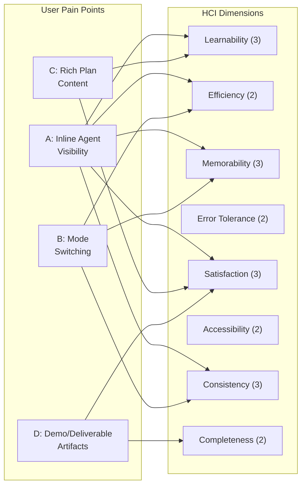

# HCI Scorecard -- Mission Control Prototype

**Date**: 2026-03-24
**Scope**: Full system -- all pages, components, data models, and interactions
**Method**: Synthesis of 11 independent HCI analyses (conceptual model, state model, glossary, information architecture, user journeys, consistency audit, failure path audit, heuristic evaluation, cognitive walkthrough) plus code-level inspection
**Pain points under evaluation**: A (Inline Agent Visibility), B (Mode Switching), C (Rich Plan Content), D (Demo/Deliverable Artifacts)

---

## Dimension Scores (1-5 scale)

| Dimension       | Score | Justification                                                                                                                                                                                                                                                                                                                                                                                                                                                                                               | Pain Points |
| --------------- | ----- | ----------------------------------------------------------------------------------------------------------------------------------------------------------------------------------------------------------------------------------------------------------------------------------------------------------------------------------------------------------------------------------------------------------------------------------------------------------------------------------------------------------- | ----------- |
| Learnability    | 3/5   | Good navigation structure, clear labels, StageTabBar aids orientation. But LiveView as a fullscreen breakout is not discoverable; plan content lacks visual hierarchy for scanning; terminology drift ("Live View" / "workspace" / "supervision mode") adds confusion.                                                                                                                                                                                                                                      | A, C        |
| Efficiency      | 2/5   | Keyboard shortcuts (Cmd+K, Cmd+Shift+M, Esc, 'n') help. But "check agent work" requires 4+ clicks and a fullscreen context switch. No inline preview mode. Mode switching is a full page transition. No bulk actions on MissionHome.                                                                                                                                                                                                                                                                        | A, B        |
| Memorability    | 3/5   | Consistent AppShell structure (LeftNav + TopBar + StageTabBar) is memorable. But two different agent views (Execute page partial vs LiveView full) confuse learned patterns. Users must remember that LiveView is a separate mode, not a tab.                                                                                                                                                                                                                                                               | A, B        |
| Error tolerance | 2/5   | ErrorBoundary wraps AppShell content. Mission-not-found states handled on all pages. But LiveView has no ErrorBoundary. No confirmation dialogs for destructive actions (approve, reject). No undo for most actions (only escalation has undo). No offline handling. Toast auto-dismissal can hide feedback.                                                                                                                                                                                                | --          |
| Satisfaction    | 3/5   | Clean `aw` design system is cohesive and visually appealing. Ambient effects (dots, scanlines, corner brackets) create a distinctive aesthetic. But inability to monitor agent work inline is frustrating. Plain text plans feel unfinished for a "review and approve" workflow. Empty completed stage undermines the "mission accomplished" satisfaction loop.                                                                                                                                             | A, C, D     |
| Accessibility   | 2/5   | Focus rings present via `aw-focus-ring` class. HelpModal uses `role="dialog"`, `aria-modal`, `aria-label`. LeftNav uses semantic `<nav>` element. But: no ARIA landmarks on main regions, no skip navigation, no screen reader announcements for state changes (toast notifications, stage transitions), no reduced-motion preferences for framer-motion animations. Color contrast in `aw` tokens (e.g., `textSoft: '#93999c'` on `paperTop: '#f7f8f8'`) may not meet WCAG AA 4.5:1 ratio for normal text. | --          |
| Consistency     | 3/5   | Design system tokens applied uniformly. StageTabBar and TopBar provide structural consistency. But: action button placement varies (bottom-left on Plan, top-right on Review, right-rail on Escalation), evidence rail widths differ (260px/280px/300px), two different agent views create a conceptual split. Terminology drift across "Live View" / "workspace" / "supervision mode".                                                                                                                     | A, B        |
| Completeness    | 2/5   | Core workflows exist for plan review, execution monitoring, code review, and escalation handling. But: completed stage has zero instances and no dedicated UX. Artifacts only render on review/completed stages. No mission edit/delete. No workflow editing. All data is static with no CRUD operations. No permission model. No offline support.                                                                                                                                                          | D           |

---

## Score Summary

| Dimension       | Score     |
| --------------- | --------- |
| Learnability    | 3         |
| Efficiency      | 2         |
| Memorability    | 3         |
| Error tolerance | 2         |
| Satisfaction    | 3         |
| Accessibility   | 2         |
| Consistency     | 3         |
| Completeness    | 2         |
| **Total**       | **20/40** |

---

## Radar Chart

```
                    Learnability (3)
                         *
                        / \
                       /   \
              Comp-  /     \ Effi-
              lete- *       * ciency
              ness  |       |  (2)
              (2)   |       |
                    |       |
           Consis-  *       * Memora-
           tency    \     /  bility
           (3)       \   /   (3)
                      \ /
                       *
                Satis-   Error
                faction  tolerance
                  (3)      (2)
                    *-----*
                    Access-
                    ibility
                      (2)
```

```
Scale: 1 (center) to 5 (edge)

Learnability:    |||===----  3/5
Efficiency:      ||========  2/5
Memorability:    |||===----  3/5
Error tolerance: ||========  2/5
Satisfaction:    |||===----  3/5
Accessibility:   ||========  2/5
Consistency:     |||===----  3/5
Completeness:    ||========  2/5
```

---

## Pain Point Impact Matrix

| Pain Point                      | Dimensions Affected                                                                        | Aggregate Impact                               |
| ------------------------------- | ------------------------------------------------------------------------------------------ | ---------------------------------------------- |
| A -- Inline Agent Visibility    | Learnability (-1), Efficiency (-2), Memorability (-1), Satisfaction (-1), Consistency (-1) | **Very High** -- affects 5 of 8 dimensions     |
| B -- Mode Switching             | Efficiency (-1), Memorability (-1), Consistency (-1)                                       | **High** -- affects 3 dimensions               |
| C -- Rich Plan Content          | Learnability (-1), Satisfaction (-1)                                                       | **Medium** -- affects 2 dimensions             |
| D -- Demo/Deliverable Artifacts | Satisfaction (-1), Completeness (-2)                                                       | **High** -- affects 2 dimensions, one severely |

---

## Top 3 Dimensions to Improve

### 1. Efficiency (2/5 -> target 4/5)

**Why**: The core supervisory workflow -- "check what the agent is doing" -- requires 4+ clicks and a fullscreen context switch. This is the primary use case and it is painfully slow for a tool designed for continuous monitoring.

**Specific recommendations**:

1. **Add inline agent preview panel** within AppShell pages. Users should be able to see live agent work (browser, code, terminal) from `MissionDetail` or `MissionExecute` without leaving the navigation context.
   - File to modify: `apps/web/src/pages/MissionExecute.tsx` -- replace the 320px "EXECUTE PREVIEW" grid with an expandable `WorkspaceLayout` component
2. **Add Cmd+Shift+L keyboard shortcut** to toggle inline LiveView panel on/off from any mission page.
   - File to modify: `apps/web/src/components/shell/AppShell.tsx:38-53` -- add to keyboard handler
3. **Add LiveView entries to command palette** so users can jump directly to LiveView for any executing mission.
   - File to modify: `apps/web/src/components/shell/CommandPalette.tsx:14-22` -- add LiveView entries
4. **Add bulk action toolbar** on MissionHome for batch plan approvals and escalation triage.
   - File to modify: `apps/web/src/pages/MissionHome.tsx`

**Expected improvement**: +2 points (from 2 to 4). Eliminating the 4-click-to-LiveView path and adding keyboard shortcuts would dramatically improve expert efficiency.

**Cross-references**:

- heuristic-evaluation.md: H7 (Flexibility and efficiency), Severity 2
- cognitive-walkthrough.md: Journey 1, Steps 1.4A-1.5 (all breakdowns)
- user-journeys.md: Journey 3 "Monitor Active Agents" friction analysis

### 2. Completeness (2/5 -> target 4/5)

**Why**: The completed stage -- the terminal state of every mission -- has zero instances and no dedicated UX. This means the full mission lifecycle has never been exercised end-to-end. Artifacts are only accessible on review/completed stages. There are no CRUD operations for missions or workflows.

**Specific recommendations**:

1. **Add at least 1-2 completed missions** to the static data layer with associated artifacts.
   - File to modify: `apps/web/src/data/missions.ts` -- add missions with `stage: 'completed'`
2. **Create a MissionCompleted page or view** with deliverable gallery, completion summary, sign-off controls, and stakeholder notification display.
   - New file or extend: `apps/web/src/pages/MissionDetail.tsx` with completed-specific rendering
3. **Make artifacts a first-class navigation target** with their own tab in StageTabBar or a dedicated route.
   - File to modify: `apps/web/src/components/mission/StageTabBar.tsx:4-10` -- add DELIVERABLES tab
4. **Add mission edit/delete capabilities** even if backed by static data with optimistic updates.
   - Files to modify: `MissionDetail.tsx`, `MissionHome.tsx`

**Expected improvement**: +2 points (from 2 to 4). Exercising the complete lifecycle and adding CRUD operations would validate the full design.

**Cross-references**:

- heuristic-evaluation.md: H9 (Error recovery), Severity 3 -- completed stage gap
- cognitive-walkthrough.md: Journey 3 (View Completed Mission Deliverables), Breakdowns B4-B5
- failure-path-audit.md: Completed stage never exercised
- state-model.md: Completed stage has zero UI coverage

### 3. Accessibility (2/5 -> target 4/5)

**Why**: The prototype lacks fundamental accessibility features that would be required for production deployment and that affect usability for all users.

**Specific recommendations**:

1. **Add ARIA landmarks** to main content regions: `role="main"` with `aria-label` on the main area, `role="banner"` on TopBar, `role="complementary"` on evidence rails.
   - File to modify: `apps/web/src/components/shell/AppShell.tsx:71` -- add `aria-label="Main content"` to `<main>`
   - Files to modify: `MissionPlan.tsx:193`, `MissionExecute.tsx:342`, `MissionReview.tsx:139` -- add `role="complementary"` to evidence rails
2. **Add skip navigation link** as first element in AppShell.
   - File to modify: `apps/web/src/components/shell/AppShell.tsx` -- add skip link before LeftNav
3. **Add aria-live regions** for toast notifications and state changes.
   - File to modify: `apps/web/src/components/primitives/ToastContainer.tsx` -- add `aria-live="polite"` or `aria-live="assertive"`
4. **Audit color contrast** for `aw.textSoft` (#93999c) on `aw.paperTop` (#f7f8f8). Calculate contrast ratio and adjust if below 4.5:1.
   - File to modify: `apps/web/src/theme/tokens.ts:14` -- darken `textSoft` if needed
5. **Add `prefers-reduced-motion`** media query to disable framer-motion animations.
   - Files to modify: all components using `<motion.div>` / `<motion.button>`

**Expected improvement**: +2 points (from 2 to 4). These are well-understood accessibility patterns with clear implementation paths.

**Cross-references**:

- heuristic-evaluation.md: H4 (Consistency), note about missing ARIA landmarks
- consistency-audit.md: Focus ring class applied but no skip navigation

---

## Dimension-to-Pain-Point Mapping



---

## Comparison: Current vs Target

| Dimension         | Current | Target | Delta   | Priority |
| ----------------- | ------- | ------ | ------- | -------- |
| Learnability      | 3       | 4      | +1      | Medium   |
| **Efficiency**    | **2**   | **4**  | **+2**  | **P1**   |
| Memorability      | 3       | 4      | +1      | Medium   |
| Error tolerance   | 2       | 3      | +1      | Medium   |
| Satisfaction      | 3       | 4      | +1      | Medium   |
| **Accessibility** | **2**   | **4**  | **+2**  | **P3**   |
| Consistency       | 3       | 4      | +1      | Medium   |
| **Completeness**  | **2**   | **4**  | **+2**  | **P2**   |
| **Total**         | **20**  | **31** | **+11** | --       |

---

## Score Trajectory

Implementing the top 3 priority improvements would move the score from 20/40 to approximately 31/40:

```
Phase 0 (current):  ████████████████████░░░░░░░░░░░░░░░░░░░░  20/40
Phase 1 (+efficiency, +completeness):
                    ███████████████████████████░░░░░░░░░░░░░░  27/40
Phase 2 (+accessibility, consistency):
                    ███████████████████████████████░░░░░░░░░░  31/40
Phase 3 (polish):   ████████████████████████████████████░░░░░  35/40
```

---

## Cross-References

| Document                    | Key Finding Reflected in Scorecard                                               |
| --------------------------- | -------------------------------------------------------------------------------- |
| conceptual-model.md         | "Monitor agent work" hidden behind fullscreen -> Efficiency score                |
| state-model.md              | No "viewing" substate, completed stage gap -> Completeness score                 |
| glossary.md                 | Terminology drift -> Learnability, Memorability scores                           |
| information-architecture.md | LiveView orphan page -> Efficiency, Consistency scores                           |
| user-journeys.md            | 4+ click agent monitoring -> Efficiency score                                    |
| consistency-audit.md        | Action button placement, rail widths, dual agent views -> Consistency score      |
| failure-path-audit.md       | Missing error states, completed stage -> Error Tolerance, Completeness scores    |
| heuristic-evaluation.md     | H1 (Severity 4), H3 (Severity 3), H9 (Severity 3) -> Efficiency, Error Tolerance |
| cognitive-walkthrough.md    | 3 critical breakdowns in Journey 1 -> Efficiency, Satisfaction                   |
