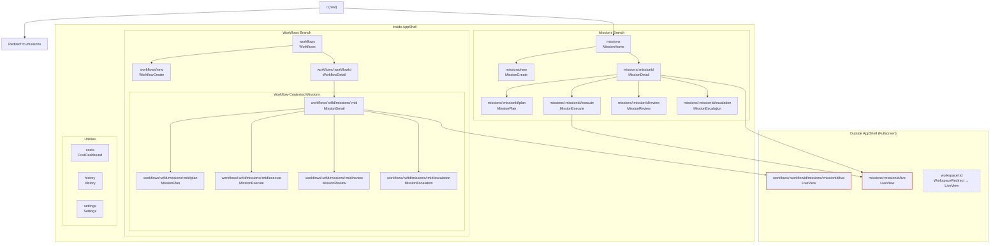
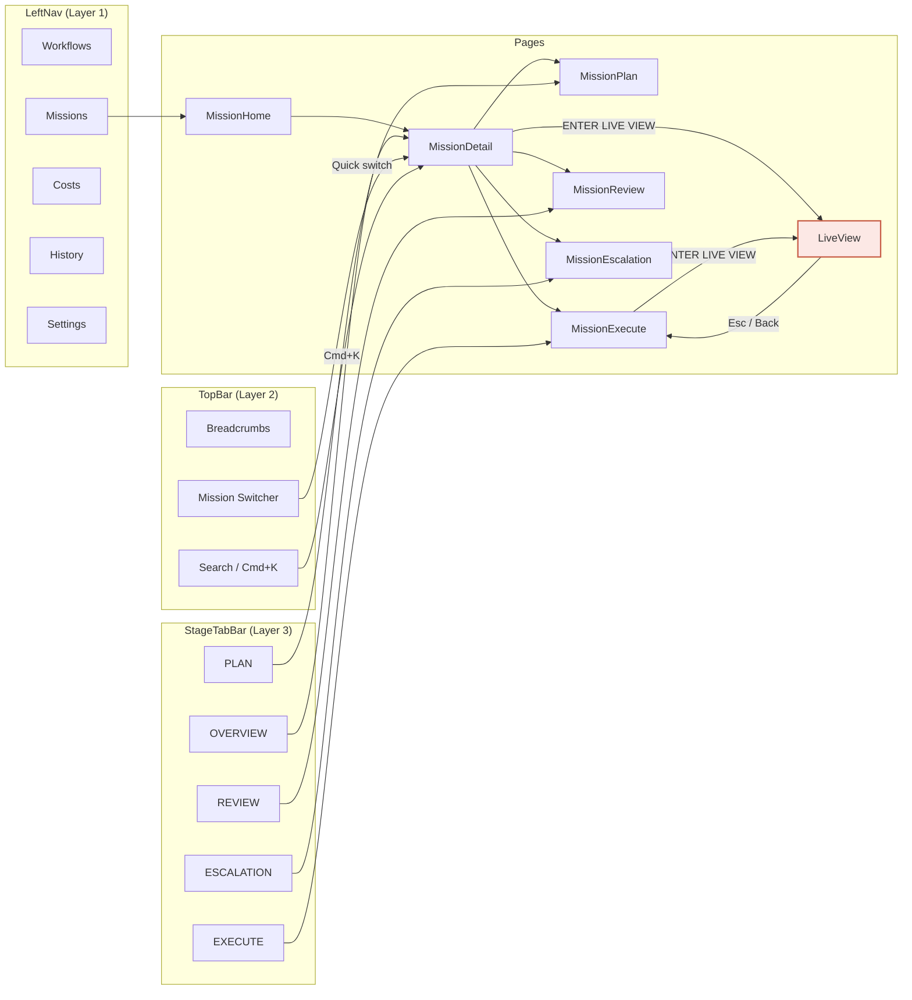

# Information Architecture Analysis

> HCI Review Document -- Mission Control Prototype
> Date: 2026-03-24
> Scope: Sitemap, navigation model, depth analysis, orphan pages, and structural gaps

---

## 1. Sitemap

### 1.1 Full Page Hierarchy



### 1.2 Route Table

Source: `apps/web/src/App.tsx:46-92`

| Route                                       | Component               | Inside AppShell | Notes                           |
| ------------------------------------------- | ----------------------- | --------------- | ------------------------------- |
| `/`                                         | Redirect to `/missions` | Yes             | `App.tsx:57`                    |
| `/missions`                                 | MissionHome             | Yes             | `App.tsx:60`                    |
| `/missions/new`                             | MissionCreate           | Yes             | `App.tsx:61`                    |
| `/missions/:missionId`                      | MissionDetail           | Yes             | `App.tsx:62`                    |
| `/missions/:missionId/plan`                 | MissionPlan             | Yes             | `App.tsx:63`                    |
| `/missions/:missionId/execute`              | MissionExecute          | Yes             | `App.tsx:64`                    |
| `/missions/:missionId/review`               | MissionReview           | Yes             | `App.tsx:65`                    |
| `/missions/:missionId/escalation`           | MissionEscalation       | Yes             | `App.tsx:66`                    |
| `/missions/:missionId/live`                 | LiveView                | **No**          | `App.tsx:48` -- fullscreen      |
| `/workflows`                                | Workflows               | Yes             | `App.tsx:69`                    |
| `/workflows/new`                            | WorkflowCreate          | Yes             | `App.tsx:70`                    |
| `/workflows/:workflowId`                    | WorkflowDetail          | Yes             | `App.tsx:71`                    |
| `/workflows/:wfId/missions/:mId`            | MissionDetail           | Yes             | `App.tsx:74`                    |
| `/workflows/:wfId/missions/:mId/plan`       | MissionPlan             | Yes             | `App.tsx:75`                    |
| `/workflows/:wfId/missions/:mId/execute`    | MissionExecute          | Yes             | `App.tsx:76`                    |
| `/workflows/:wfId/missions/:mId/review`     | MissionReview           | Yes             | `App.tsx:77`                    |
| `/workflows/:wfId/missions/:mId/escalation` | MissionEscalation       | Yes             | `App.tsx:78-81`                 |
| `/workflows/:wfId/missions/:mId/live`       | LiveView                | **No**          | `App.tsx:49` -- fullscreen      |
| `/costs`                                    | CostDashboard           | Yes             | `App.tsx:84`                    |
| `/history`                                  | History                 | Yes             | `App.tsx:85`                    |
| `/settings`                                 | Settings                | Yes             | `App.tsx:86`                    |
| `/workspace/:id`                            | WorkspaceRedirect       | No              | `App.tsx:52` -- legacy redirect |
| `*`                                         | NotFound                | Yes             | `App.tsx:89`                    |

---

## 2. Navigation Model

### 2.1 Navigation Layers

Mission Control uses four distinct navigation mechanisms layered on top of each other:

#### Layer 1: LeftNav (Global Primary Navigation)

Source: `apps/web/src/components/shell/LeftNav.tsx:6-12`

```
navItems = [
  { to: '/workflows',  label: 'Workflows',  icon: GitBranch },
  { to: '/missions',   label: 'Missions',   icon: Target,    separatorAfter: true },
  { to: '/costs',      label: 'Costs',       icon: DollarSign },
  { to: '/history',    label: 'History',     icon: History },
  { to: '/settings',   label: 'Settings',    icon: Settings },
]
```

Properties:

- Fixed 200px width (`LeftNav.tsx:25`)
- Active state: Right border accent + light background (`LeftNav.tsx:61-65`)
- Mission count badge on "Missions" item (`LeftNav.tsx:86-96`)
- Bottom status: active mission count + "needs review" count (`LeftNav.tsx:110-119`)
- Missions item is active whenever URL contains `/missions/` (`LeftNav.tsx:47-48`)
- **LiveView is NOT in LeftNav** -- no first-class navigation path to agent observation

#### Layer 2: TopBar (Contextual Breadcrumbs + Tools)

Source: `apps/web/src/components/shell/TopBar.tsx:14-134`

Properties:

- 52px height (`TopBar.tsx:45`)
- Left side: Mission ID badge (when on mission page) + breadcrumb chain
- Right side: Search (Cmd+K), NotificationCenter, User avatar, Date stamp
- Mission switcher dropdown triggered from ID badge (`TopBar.tsx:49-78`)

Breadcrumb patterns by page:

| Page              | Breadcrumbs                                                                         |
| ----------------- | ----------------------------------------------------------------------------------- |
| MissionHome       | `Missions`                                                                          |
| MissionDetail     | `Missions / {title} / Overview` or `Workflows / {wfTitle} / {title} / Overview`     |
| MissionPlan       | `Missions / {title} / Plan` or `Workflows / {wfTitle} / {title} / Plan`             |
| MissionExecute    | `Missions / {title} / Execute` or `Workflows / {wfTitle} / {title} / Execute`       |
| MissionReview     | `Missions / {title} / Review` or `Workflows / {wfTitle} / {title} / Review`         |
| MissionEscalation | `Missions / {title} / Escalation` or `Workflows / {wfTitle} / {title} / Escalation` |
| LiveView          | **NONE** (outside AppShell -- has its own custom header)                            |

#### Layer 3: StageTabBar (Mission Sub-Navigation)

Source: `apps/web/src/components/mission/StageTabBar.tsx:1-50`

```
stages = [
  { key: 'overview',   label: 'OVERVIEW',   suffix: '' },
  { key: 'plan',       label: 'PLAN',       suffix: '/plan' },
  { key: 'execute',    label: 'EXECUTE',    suffix: '/execute' },
  { key: 'review',     label: 'REVIEW',     suffix: '/review' },
  { key: 'escalation', label: 'ESCALATION', suffix: '/escalation' },
]
```

Properties:

- Horizontal tab row below TopBar
- Active tab: `aw.plate` background with `aw.inverse` text (`StageTabBar.tsx:40-41`)
- Generates URLs relative to current mission prefix (plain or workflow-contexted)
- Present on: MissionDetail, MissionPlan, MissionExecute, MissionReview, MissionEscalation
- **NOT present on**: LiveView, MissionHome, MissionCreate, Workflows, WorkflowDetail
- **Missing tab**: No "COMPLETED" tab (even though `completed` is a valid stage)

#### Layer 4: Quick-Access Shortcuts

| Shortcut    | Mechanism                                           | Source                                                     |
| ----------- | --------------------------------------------------- | ---------------------------------------------------------- |
| Cmd+K       | CommandPalette overlay                              | `AppShell.tsx:41-44`, `CommandPalette.tsx:24-254`          |
| Cmd+Shift+M | MissionSwitcherDropdown                             | `AppShell.tsx:46-49`, `MissionSwitcherDropdown.tsx:25-242` |
| `n` key     | Navigate to `/missions/new` (when no input focused) | `MissionHome.tsx:78-88`                                    |
| Esc         | Exit LiveView back to execute page                  | `LiveView.tsx:106-113`                                     |

### 2.2 Navigation Flow Diagram



---

## 3. Depth Analysis

This table counts the minimum number of clicks required to reach each user goal from the application root (`/missions`, the default landing page).

### 3.1 Click Depth Table

| User Goal                     | Target Page                  | Clicks from MissionHome | Path                                                               |
| ----------------------------- | ---------------------------- | ----------------------- | ------------------------------------------------------------------ |
| See all missions              | MissionHome                  | 0                       | Already there                                                      |
| Create new mission            | MissionCreate                | 1                       | Click "+ NEW MISSION"                                              |
| View mission overview         | MissionDetail                | 1                       | Click mission card, then click again to navigate (or double-click) |
| View mission plan             | MissionPlan                  | 2                       | Card -> MissionDetail -> PLAN tab (or card -> StageTabBar PLAN)    |
| Approve a plan                | MissionPlan (action)         | 3                       | Card -> Detail -> PLAN tab -> "Approve Plan" button                |
| View execution status         | MissionExecute               | 2                       | Card -> Detail -> EXECUTE tab                                      |
| View review + approve         | MissionReview (action)       | 3                       | Card -> Detail -> REVIEW tab -> "Approve" button                   |
| Enter Live View               | LiveView                     | 3                       | Card -> Detail -> "ENTER LIVE VIEW" button                         |
| Enter Live View (via execute) | LiveView                     | 3                       | Card -> Detail -> EXECUTE tab -> "ENTER LIVE VIEW"                 |
| Resolve escalation            | MissionEscalation (action)   | 4                       | Card -> Detail -> ESCALATION tab -> Select option -> Confirm       |
| View workflow list            | Workflows                    | 1                       | LeftNav -> Workflows                                               |
| View workflow detail          | WorkflowDetail               | 2                       | LeftNav -> Workflows -> Click workflow                             |
| View workflow mission         | MissionDetail (wf-contexted) | 3                       | LeftNav -> Workflows -> Workflow -> Mission card                   |
| View costs                    | CostDashboard                | 1                       | LeftNav -> Costs                                                   |
| View history                  | History                      | 1                       | LeftNav -> History                                                 |
| Change settings               | Settings                     | 1                       | LeftNav -> Settings                                                |
| Quick-switch mission          | (any mission page)           | 1\*                     | Cmd+Shift+M -> Select mission (\*keyboard shortcut, not click)     |
| Search for anything           | CommandPalette               | 1\*                     | Cmd+K -> Type query (\*keyboard shortcut)                          |

### 3.2 Depth Analysis Observations

1. **Live View is consistently 3 clicks deep** -- the same depth as approving a plan or executing a review action. Given that agent observation is arguably the most frequently performed supervisor action, this depth may be too high.

2. **Mission detail is a mandatory waypoint**: Every mission sub-page requires passing through MissionDetail first (or using keyboard shortcuts). There is no way to jump directly from MissionHome to, say, MissionReview without going through MissionDetail.

3. **Keyboard shortcuts reduce effective depth**: Cmd+K (CommandPalette) can jump directly to any mission's current stage page in 1 step. Cmd+Shift+M (MissionSwitcher) can switch between missions while preserving stage context. These are power-user features that dramatically flatten the navigation for experienced users.

4. **Focus Panel on MissionHome provides a preview**: Clicking a mission card on MissionHome shows a FocusPanel preview on the right, which may reduce the need to navigate to MissionDetail for quick triage. However, the FocusPanel is not a substitute for the full detail page.

---

## 4. Key Gaps

### 4.1 GAP: LiveView is an orphan page

LiveView is defined OUTSIDE the AppShell (`App.tsx:48-49`), making it architecturally distinct from every other page in the application:

| Property                           | Normal Pages                                     | LiveView                        |
| ---------------------------------- | ------------------------------------------------ | ------------------------------- |
| LeftNav                            | Yes (200px sidebar)                              | **No**                          |
| TopBar                             | Yes (breadcrumbs, search, notifications)         | **No** (custom header bar only) |
| StageTabBar                        | Yes (on mission sub-pages)                       | **No**                          |
| Bottom timestamp bar               | Yes ("MISSION.CTRL // OPERATING SURFACE v0.1.0") | **No**                          |
| Command Palette (Cmd+K)            | Yes (available everywhere)                       | **No** (AppShell context lost)  |
| Mission Switcher (Cmd+Shift+M)     | Yes (available on mission pages)                 | **No** (AppShell context lost)  |
| Ambient dots background            | Yes                                              | **No**                          |
| Page transitions (AnimatePresence) | Yes                                              | **No**                          |
| Error boundary                     | Yes (`AppShell.tsx:85-87`)                       | **No**                          |

**Entry points** (only 2):

1. "ENTER LIVE VIEW" on MissionDetail navigation section (`MissionDetail.tsx:284-295`)
2. "ENTER LIVE VIEW" on MissionExecute (`MissionExecute.tsx:182-193`)

Note: `ActivityPreview.tsx:162-170` also has an "ENTER LIVE VIEW" link, but this is rendered within MissionDetail only when `mission.stage === 'execute'`.

**Exit points** (only 2):

1. Escape key (`LiveView.tsx:106-113`) -- navigates to execute page
2. Close button X (`LiveView.tsx:178-184`) -- navigates to execute page
3. "Back" link (`LiveView.tsx:43-50`) -- navigates to execute page

All exit points return to the **execute page**, not to wherever the user came from. If a supervisor entered LiveView from MissionDetail, pressing Escape takes them to MissionExecute, not back to MissionDetail.

**Impact**: The supervisor loses ALL navigation context when entering LiveView. They cannot quickly switch to another mission, check costs, review history, or access settings without first exiting LiveView. This creates a cognitive "wormhole" -- the user enters a different application context and must remember how to get back.

### 4.2 GAP: No LiveView in LeftNav

LiveView is not represented in the LeftNav (`LeftNav.tsx:6-12`). The `navItems` array contains exactly 5 entries: Workflows, Missions, Costs, History, Settings. There is no entry for Live View or any supervision-related page.

This means:

- LiveView has no first-class navigation path from the global nav.
- The only way to reach LiveView is to first navigate to a specific mission, then find the "ENTER LIVE VIEW" link.
- A supervisor who primarily wants to monitor agents must follow a 3-click path every time.

**Recommendation**: Consider adding a "Live" or "Supervision" entry to LeftNav that lists all currently executing missions with active agents, providing one-click access to Live View.

### 4.3 GAP: No completed mission page treatment

The route `/missions/:missionId` exists and would render MissionDetail for a completed mission, but:

- No mock data exercises this path (0 completed missions).
- MissionDetail renders the same layout regardless of stage.
- The StageTabBar has no "COMPLETED" tab (`StageTabBar.tsx:4-10`) -- the `stages` array only includes `overview`, `plan`, `execute`, `review`, and `escalation`.
- The CommandPalette navigates completed missions to the base URL (`/missions/:id`) instead of a stage URL (`CommandPalette.tsx:70-71`), meaning completed missions would show the overview/detail page.

The absence of a completed state in both data and UI means the most important outcome of the entire mission lifecycle has no designed end-point.

### 4.4 GAP: Dual hierarchy between Workflows and Missions

Workflows and Missions are presented as **parallel** items in the LeftNav:

```
Workflows    <- top-level nav item
Missions     <- top-level nav item (with count badge)
```

But in the data model, Workflows **contain** Missions (`workflows.ts:5`: `missionIds: string[]`). This creates confusion:

1. A user navigating to "Workflows" and drilling into a workflow sees a list of missions. Clicking a mission takes them to `/workflows/:wfId/missions/:mId`, which renders the same MissionDetail component.
2. A user navigating to "Missions" sees ALL missions (including those belonging to workflows). Clicking a mission takes them to `/missions/:mId`.
3. The same mission can be reached via two different URL paths, with different breadcrumb context.

The LeftNav highlights "Missions" even when viewing a workflow-contexted mission page (`LeftNav.tsx:47-48`: checks if `location.pathname.includes('/missions/')`), which means navigating through the Workflows path still highlights the Missions nav item.

**Impact**: The user cannot develop a clear mental model of where they are in the hierarchy. Is a mission "inside" a workflow, or is it an independent entity that workflows reference? The navigation says the latter, but the data model says the former.

### 4.5 GAP: MissionDetail has redundant navigation

MissionDetail provides TWO mechanisms to navigate to sub-pages:

1. **StageTabBar** (`MissionDetail.tsx:106`): Horizontal tabs for OVERVIEW, PLAN, EXECUTE, REVIEW, ESCALATION.
2. **Navigation links section** (`MissionDetail.tsx:260-296`): A section at the bottom with styled link buttons for PLAN, EXECUTE, REVIEW, ESCALATION, plus "ENTER LIVE VIEW."

Both navigate to the same destinations. The StageTabBar is always visible at the top; the navigation links are at the bottom of the page content, requiring scrolling.

**Impact**: Two navigation affordances for the same action creates uncertainty about which is "correct." The bottom links have the advantage of including the Live View entry point, which the StageTabBar does not. But a user who discovers the StageTabBar first may never scroll to find the Live View link.

---

## 5. Navigation Patterns

### 5.1 Hub-and-Spoke

**Pattern**: MissionHome serves as a hub. Individual missions are spokes. Sub-pages (plan, execute, review, escalation) are secondary spokes off each mission.

```
MissionHome (hub)
  |
  +-- MSN-001 (spoke)
  |     +-- Plan (leaf)
  |     +-- Execute (leaf)
  |     +-- Review (leaf)
  |     +-- Escalation (leaf)
  |     +-- LiveView (orphan leaf)
  |
  +-- MSN-002 (spoke)
  |     +-- ...
  |
  +-- MSN-003 (spoke)
        +-- ...
```

**Strength**: Clear, predictable structure. Users always know they can return to MissionHome to see all missions.
**Weakness**: Deep nesting (3+ clicks) for common actions. LiveView breaks the spoke pattern by exiting the hub entirely.

### 5.2 Tab Navigation

**Pattern**: StageTabBar provides horizontal tab navigation within a mission context, enabling direct jumps between stage sub-pages.

**Strength**: Once on any mission sub-page, the user can switch between stages with a single click.
**Weakness**: The tab bar is visually subtle (small text, no count badges). It does not include "COMPLETED" or "LIVE VIEW." Users may not notice it if they scroll past the TopBar.

### 5.3 Quick Switching

**Pattern**: Two keyboard-driven mechanisms allow rapid cross-cutting navigation:

1. **CommandPalette (Cmd+K)**: Full-text search across missions, pages, and actions. Stage-preserving: if the user is on a `/review` page and selects a mission from the palette, they navigate to that mission's `/review` page (`CommandPalette.tsx:32-37`, `69-71`).

2. **MissionSwitcherDropdown (Cmd+Shift+M)**: Mission-specific switcher in the TopBar. Also stage-preserving (`MissionSwitcherDropdown.tsx:54-56`). Shows recent missions first, with status dots.

**Strength**: Power users can navigate the entire application with keyboard shortcuts, bypassing the hub-and-spoke depth.
**Weakness**: These features are completely hidden -- no onboarding, no visual hints. A new user would not know they exist unless they read the HelpModal or discover them by accident.

### 5.4 Fullscreen Breakout

**Pattern**: LiveView exits the AppShell entirely, creating a fullscreen workspace that replaces the normal application chrome.

**Strength**: Maximum screen real estate for agent observation. The accent-colored header bar (`LiveView.tsx:173-174`) clearly signals a mode change.
**Weakness**: Total loss of navigation context. No quick-switching, no breadcrumbs, no LeftNav. See Section 4.1 for detailed analysis.

---

## 6. AppShell Structure

The AppShell component (`apps/web/src/components/shell/AppShell.tsx:22-113`) provides the following layout:

```
+------+------------------------------------------------------+
|      |  TopBar (52px)                                        |
|      |  - Breadcrumbs | Mission Switcher | Search | User     |
| Left |------------------------------------------------------|
| Nav  |  StageTabBar (when on mission sub-page)               |
| 200px|  - OVERVIEW | PLAN | EXECUTE | REVIEW | ESCALATION    |
|      |------------------------------------------------------|
|      |  Main Content Area (Outlet)                           |
|      |  - Wrapped in AnimatePresence + ErrorBoundary          |
|      |  - Page component renders here                        |
|      |                                                        |
|      |                                                        |
|      |                                                        |
+------+------------------------------------------------------+
|  Bottom Timestamp Bar                                        |
|  MISSION.CTRL // OPERATING SURFACE v0.1.0    HH:MM:SS       |
+--------------------------------------------------------------+

CommandPalette (Cmd+K overlay, z-50)
HelpModal (accessible via ? key)
AmbientDots (background decoration)
```

Key implementation details:

- AppShell wraps its children via React Router's `<Outlet />` (`AppShell.tsx:86`)
- CommandPalette is rendered as a sibling of the main content, controlled via context (`AppShell.tsx:70`)
- Mission switcher is communicated between AppShell and TopBar via custom DOM event `mc:toggle-mission-switcher` (`AppShell.tsx:29-31`)
- The clock in the bottom bar updates every second (`AppShell.tsx:34-36`)

---

## 7. Cross-References

- **Terminology**: See `glossary.md` for definitions of AppShell, LeftNav, TopBar, StageTabBar, CommandPalette, MissionSwitcher, and LiveView, including drift analysis.
- **States and stages**: See `state-model.md` for how mission stages map to navigation tabs and how state transitions affect available pages.
- **Object model**: See `conceptual-model.md` for the relationship between Workflows and Missions that creates the dual-hierarchy problem described in Section 4.4.
