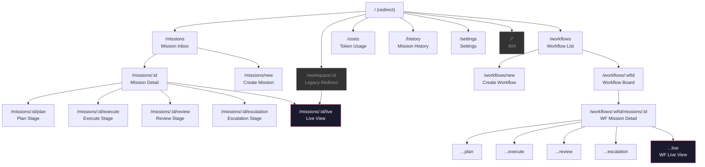
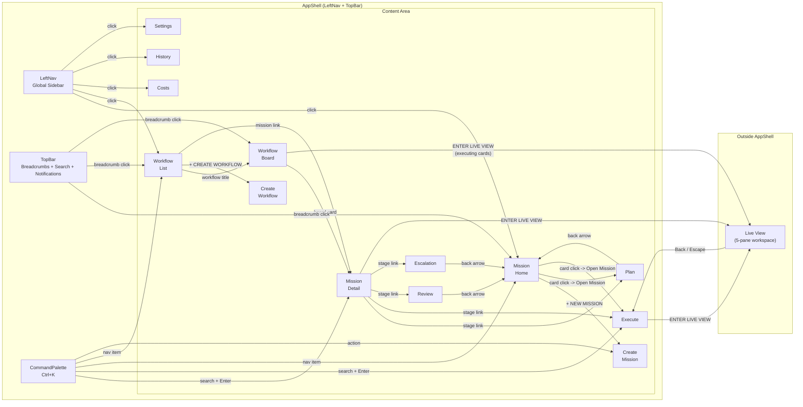

# Information Architecture Analysis -- Mission Control

> HCI audit of the Mission Control prototype's information architecture.
> Based on source analysis of all route definitions, navigation components, page components, and linking patterns.
>
> **Date**: 2026-03-23
> **Scope**: Full application (`apps/web/src/`)

---

## 1) Sitemap

Hierarchical map of every screen/view in the system. Each node lists its route, purpose, and primary action.

```
/ (redirect -> /missions)
|
+-- /missions .......................... Mission inbox (card list + focus panel)
|   |                                   Primary action: Select mission to preview
|   |
|   +-- /missions/new ................. Create mission form
|   |                                   Primary action: Fill form and submit
|   |
|   +-- /missions/:missionId .......... Mission detail (overview/brief)
|   |   |                               Primary action: Navigate to stage sub-page
|   |   |
|   |   +-- /missions/:missionId/plan ............ Plan stage (goal, scope, criteria, risks + evidence rail)
|   |   |                                          Primary action: Approve Plan & Begin Execution
|   |   |
|   |   +-- /missions/:missionId/execute ......... Execute stage (agent swimlanes, code preview, chat)
|   |   |                                          Primary action: Monitor agents, enter Live View
|   |   |
|   |   +-- /missions/:missionId/review .......... Review stage (diff-by-intent, approval bar)
|   |   |                                          Primary action: Approve or reject changes
|   |   |
|   |   +-- /missions/:missionId/escalation ...... Escalation stage (replay timeline, consequence panel)
|   |   |                                          Primary action: Choose resolution option
|   |   |
|   |   +-- /missions/:missionId/live ............ Live View (fullscreen 5-pane workspace) [OUTSIDE AppShell]
|   |                                              Primary action: Supervise agent in real-time
|   |
+-- /workflows ........................ Workflow list (cards with dependency graphs)
|   |                                   Primary action: Open workflow board
|   |
|   +-- /workflows/new ................ Create workflow form
|   |                                   Primary action: Fill form and submit
|   |
|   +-- /workflows/:workflowId ........ Workflow detail (Kanban board: Plan/Execute/Review/Escalation)
|       |                                Primary action: Click mission card to drill in
|       |
|       +-- /workflows/:workflowId/missions/:missionId ............. Workflow-contexted mission detail
|       |   |
|       |   +-- .../plan .............. Workflow-contexted Plan stage
|       |   +-- .../execute ........... Workflow-contexted Execute stage
|       |   +-- .../review ............ Workflow-contexted Review stage
|       |   +-- .../escalation ........ Workflow-contexted Escalation stage
|       |
|       +-- /workflows/:workflowId/missions/:missionId/live ....... Workflow-contexted Live View [OUTSIDE AppShell]
|
+-- /costs ............................. Token usage dashboard (per-mission, per-model, per-workflow charts)
|                                       Primary action: Review spend
|
+-- /history ........................... Mission timeline (chronological list with stage dots)
|                                       Primary action: Scan mission history
|
+-- /settings .......................... System configuration (risk tiers, notifications, policies)
|                                       Primary action: Toggle policies, save changes
|
+-- /workspace/:id .................... Legacy redirect -> /missions/:missionId/live
|
+-- /* ................................. 404 fallback (link to /missions)
```

**Total distinct screen types**: 14 (MissionHome, MissionCreate, MissionDetail, MissionPlan, MissionExecute, MissionReview, MissionEscalation, LiveView, Workflows, WorkflowCreate, WorkflowDetail, CostDashboard, History, Settings) plus NotFound and WorkspaceRedirect.

**Total addressable routes**: 22 unique route patterns (including parameterized variants and the workflow-contexted duplicates).

---

## 2) Navigation Model

### Navigation Elements Inventory

| Navigation Element                  | Type                         | What It Connects                                                                     | Always Visible?                                                          |
| ----------------------------------- | ---------------------------- | ------------------------------------------------------------------------------------ | ------------------------------------------------------------------------ |
| **LeftNav** sidebar (200px)         | Global nav (sidebar)         | Top-level sections: Workflows, Missions, Costs, History, Settings                    | Yes, within AppShell. Hidden in Live View.                               |
| **TopBar** breadcrumbs (52px)       | Breadcrumb trail             | Current location back to parent sections. Clickable ancestors.                       | Yes, within AppShell. Replaced by custom header in Live View.            |
| **TopBar** search button            | Button (global)              | Opens CommandPalette                                                                 | Yes, within AppShell. Not in Live View.                                  |
| **NotificationCenter** (bell icon)  | Dropdown (global)            | Navigates to `/missions/:missionId` on click                                         | Yes, within AppShell. Not in Live View.                                  |
| **User avatar**                     | Display only                 | Non-interactive ("SC" initials)                                                      | Yes, within AppShell. Not in Live View.                                  |
| **CommandPalette** (Ctrl+K)         | Modal overlay                | Fuzzy search to any mission (stage-aware), nav pages, and "Create Mission" action    | Available via keyboard anywhere in AppShell. Not available in Live View. |
| **MissionDetail** stage links       | In-page navigation (buttons) | Plan, Execute, Review, Escalation sub-pages + Live View                              | Only on MissionDetail page                                               |
| **MissionExecute** view toggle      | Tab-like toggle              | Overview vs. Chat view within Execute                                                | Only on MissionExecute page                                              |
| **MissionHome** stage/risk filters  | Filter buttons               | Filter visible mission cards by stage and risk tier                                  | Only on MissionHome page                                                 |
| **FocusPanel** "Open Mission" link  | In-page link                 | From MissionHome preview to mission's current stage page                             | Only in FocusPanel on MissionHome                                        |
| **"ENTER LIVE VIEW"** button        | Action button                | Transitions from Execute (or Detail, or WorkflowDetail card) to fullscreen Live View | On MissionDetail, MissionExecute, WorkflowDetail board cards             |
| **Live View "Back" link**           | Escape hatch (link)          | Returns from Live View to Execute page                                               | Only in Live View header                                                 |
| **Live View Escape key**            | Escape hatch (keyboard)      | Same as Back link -- returns to Execute page                                         | Only in Live View                                                        |
| **"+ NEW MISSION"** button          | Action button (primary CTA)  | From MissionHome to /missions/new                                                    | Only on MissionHome                                                      |
| **"+ CREATE WORKFLOW"** button      | Action button                | From Workflows list to /workflows/new                                                | Only on Workflows list page                                              |
| **Back arrows** (ArrowLeft links)   | Contextual back              | Plan/Execute/Review/Escalation back to parent list                                   | On each stage sub-page                                                   |
| **WorkflowDetail** board card links | In-page link                 | From Kanban card to workflow-contexted mission detail                                | Only on WorkflowDetail page                                              |
| **Workflows** mission links         | In-page link                 | From workflow card to workflow-contexted mission detail                              | Only on Workflows list page                                              |
| **Bottom status bar**               | Display only                 | Shows version and timestamp. Non-interactive.                                        | Yes, within AppShell.                                                    |

### Navigation Tiers

**Primary navigation** (always available in AppShell):

- LeftNav sidebar: Workflows, Missions, [separator], Costs, History, Settings
- CommandPalette (Ctrl+K): missions + nav pages + actions

**Secondary navigation** (page-level):

- TopBar breadcrumbs (clickable ancestors)
- MissionDetail stage links (Plan, Execute, Review, Escalation, Live View)
- MissionHome filters (stage + risk)
- MissionExecute view toggle (Overview / Chat)

**Tertiary navigation** (contextual):

- FocusPanel "Open Mission" link
- Back arrows on sub-pages
- WorkflowDetail board card links
- NotificationCenter click-through

**Escape hatches**:

- Live View: "Back" link + Escape key -> returns to Execute stage
- 404 page: "Go to Missions" link
- Mission-not-found states: "Back to missions" link
- Workflow-not-found state: "View all workflows" link

---

## 3) Grouping Analysis

| Group                                     | Items Contained                                                          | Grouping Logic                                                | Potential Confusion                                                                                                                                                                                                                                                                        |
| ----------------------------------------- | ------------------------------------------------------------------------ | ------------------------------------------------------------- | ------------------------------------------------------------------------------------------------------------------------------------------------------------------------------------------------------------------------------------------------------------------------------------------ |
| **LeftNav top group**                     | Workflows, Missions                                                      | Core domain objects (the work)                                | **Order is questionable.** Workflows is listed first, but Missions is the default landing page (`/` redirects to `/missions`). New users will see "Missions" highlighted but "Workflows" positioned above it, suggesting Workflows is more important.                                      |
| **LeftNav bottom group**                  | Costs, History, Settings                                                 | Utility/support pages                                         | **"Costs" is domain-specific, not a generic utility.** A new user might expect "Costs" grouped with Missions since costs are per-mission. "History" could also be confused with browser history or version control history.                                                                |
| **LeftNav separator**                     | Divider between Missions and Costs                                       | Separates core work from utilities                            | Correct and clear.                                                                                                                                                                                                                                                                         |
| **MissionDetail navigation block**        | Plan, Execute, Review, Escalation                                        | Mission lifecycle stages in order                             | **These are stages, not just views.** The grouping is good, but the presentation as flat equal-weight buttons does not communicate that they are a progression (Plan -> Execute -> Review -> Escalation).                                                                                  |
| **MissionDetail + Live View link**        | "ENTER LIVE VIEW" styled differently from stage links                    | Live View is a mode, not a stage                              | **Correct separation.** The accent border distinguishes it. However, it is placed inside the same "NAVIGATION" panel as the stage links, blurring the distinction.                                                                                                                         |
| **MissionExecute view toggle**            | Overview, Chat                                                           | Different perspectives on the same Execute data               | Clear and well-placed.                                                                                                                                                                                                                                                                     |
| **MissionHome filter groups**             | Stage filters, Risk filters                                              | Two independent filter dimensions                             | **Two separate filter rows may overwhelm.** But the grouping is logically correct.                                                                                                                                                                                                         |
| **CommandPalette sections**               | Missions, Navigation, Actions                                            | Three result types from search                                | Good grouping. **However, "Navigation" as a section label is meta-jargon.** Users search for pages, not "navigation."                                                                                                                                                                      |
| **TopBar right-side controls**            | Search, Notifications, User avatar, Date stamp                           | Global tools + identity                                       | **Date stamp is not a tool.** It is decorative information mixed with interactive controls. User avatar is non-interactive (no menu, no profile page), which may confuse users expecting a settings or logout option.                                                                      |
| **Workflow-contexted mission routes**     | All mission sub-pages duplicated under `/workflows/:id/missions/:id/...` | Same content accessible from two URL hierarchies              | **Major potential confusion.** The same mission appears at two different URLs. Bookmarks, shared links, and browser history will fragment. Users may not realize `/missions/MSN-001/plan` and `/workflows/WF-001/missions/MSN-001/plan` show identical content with different breadcrumbs. |
| **Workflows list -- unassigned missions** | Missions not belonging to any workflow                                   | Surfaced at bottom of Workflows page in dashed-border section | **Unexpected placement.** A user looking for a mission would check the Missions page, not the bottom of the Workflows page. These link to `/missions/:id` (non-workflow-contexted), which is correct, but the location is surprising.                                                      |
| **CostDashboard sections**                | Token Usage by Mission, Cost by Model, Cost by Workflow                  | Three cost perspectives                                       | Clear and well-structured.                                                                                                                                                                                                                                                                 |
| **Settings sections**                     | Risk Tier Thresholds, Notification Preferences, Active Policies          | Three config domains                                          | **These are very different concerns** (security policy vs. notification prefs vs. risk calibration). A new user might expect notification preferences under a profile/account section, not system settings.                                                                                |

---

## 4) Label Audit

| Label                                                          | What It Actually Leads To                                                  | Clear to New User?                                                                            | Alternative Label                             |
| -------------------------------------------------------------- | -------------------------------------------------------------------------- | --------------------------------------------------------------------------------------------- | --------------------------------------------- |
| **"Missions"** (LeftNav)                                       | MissionHome -- a filterable card inbox with preview panel                  | Mostly clear                                                                                  | "Mission Inbox" would be more descriptive     |
| **"Workflows"** (LeftNav)                                      | Workflow list showing cards with dependency graphs                         | Clear                                                                                         | --                                            |
| **"Costs"** (LeftNav)                                          | Token usage dashboard with per-mission, per-model, per-workflow breakdowns | **Partially unclear.** "Costs" is vague -- financial costs? Time costs?                       | "Token Usage" or "Usage & Costs"              |
| **"History"** (LeftNav)                                        | Timeline of all missions sorted by last update                             | **Ambiguous.** Could mean browser history, git history, audit log, or activity feed           | "Mission History" or "Activity Log"           |
| **"Settings"** (LeftNav)                                       | Risk tiers, notification prefs, and policies                               | Adequate but generic                                                                          | --                                            |
| **"Inbox"** (breadcrumb on MissionHome)                        | Second crumb showing "Missions / Inbox"                                    | **Not a real inbox.** There is no read/unread, no triage. It is a filterable list.            | "All Missions" or "Dashboard"                 |
| **"Overview"** (breadcrumb on MissionDetail)                   | The mission brief page                                                     | **Slightly misleading.** "Overview" suggests a dashboard; this is really a detailed brief.    | "Brief" or "Detail"                           |
| **"PLAN" / "EXECUTE" / "REVIEW" / "ESCALATION"** (stage links) | Sub-pages for each lifecycle stage                                         | Clear domain terminology                                                                      | --                                            |
| **"ENTER LIVE VIEW"**                                          | Fullscreen 5-pane workspace, exits AppShell                                | Clear and prominent                                                                           | --                                            |
| **"OVERVIEW" / "CHAT"** (MissionExecute toggle)                | Two view modes within Execute                                              | **"Overview" is overloaded.** MissionDetail is also called "Overview" in breadcrumbs.         | "Agents" or "Swimlanes" for the non-chat view |
| **"LIVE SUPERVISION MODE"** (Live View banner)                 | Label at top of Live View                                                  | Clear and unambiguous                                                                         | --                                            |
| **"+ NEW MISSION"** (MissionHome button)                       | Create mission form                                                        | Clear                                                                                         | --                                            |
| **"+ CREATE WORKFLOW"** (Workflows button)                     | Create workflow form                                                       | Clear                                                                                         | --                                            |
| **"Open Mission"** (FocusPanel link)                           | Navigates to the mission's current stage page (not MissionDetail)          | **Potentially misleading.** "Open" suggests the overview, but it routes to the current stage. | "Go to [Stage]" or "View Current Stage"       |
| **"Back"** (Live View header)                                  | Returns to the Execute page                                                | **Underspecified.** "Back" to where?                                                          | "Exit to Execute" or "Return to Mission"      |
| **"NAVIGATION"** (CommandPalette section)                      | Lists of pages (Missions, Workflows, etc.)                                 | **Meta-jargon.** Users do not think in terms of "navigation."                                 | "Pages" or "Go to..."                         |
| **"ACTIONS"** (CommandPalette section)                         | "Create Mission" quick action                                              | Clear enough                                                                                  | --                                            |
| **"Configure Agent"** (settings gear on MissionExecute)        | Opens AgentConfigPanel overlay                                             | **Unclear scope.** Configure which agent? One session or all?                                 | "Agent Settings" with session context         |
| **"AGENT SUPERVISION"** (LeftNav subtitle)                     | Decorative branding text under "Mission Control"                           | Not a navigation element; purely atmospheric                                                  | --                                            |
| **"SC"** (user avatar)                                         | Non-interactive user initials                                              | **Misleading.** Users expect avatars to be clickable (profile, logout).                       | Either make interactive or remove             |
| **"MISSION.CTRL // OPERATING SURFACE v0.1.0"** (bottom bar)    | Decorative branding                                                        | Not confusing, but consumes vertical space                                                    | --                                            |
| **"VIEW BOARD"** (Workflows list, on executing workflows)      | Same destination as the workflow title link (`/workflows/:id`)             | **Redundant.** Two links to the same place on the same card.                                  | Remove, or differentiate from the title link  |

---

## 5) Action Placement

| Action                            | Where It Lives Now                                                                                                                    | Where Users Would Look For It                                         | Mismatch?                                                                                                                                                                                                                                                                                                                                                |
| --------------------------------- | ------------------------------------------------------------------------------------------------------------------------------------- | --------------------------------------------------------------------- | -------------------------------------------------------------------------------------------------------------------------------------------------------------------------------------------------------------------------------------------------------------------------------------------------------------------------------------------------------- |
| **Create Mission**                | `+ NEW MISSION` button at top of MissionHome card list. Also in CommandPalette as "Create Mission."                                   | Top of the mission list or a global "+" button.                       | **No mismatch.** Well-placed. CommandPalette inclusion is a bonus.                                                                                                                                                                                                                                                                                       |
| **Create Workflow**               | `+ CREATE WORKFLOW` button on Workflows list page (inline, below heading).                                                            | Top of Workflows page.                                                | **Minor.** The button is positioned after the heading text, not in a toolbar. Less prominent than the mission create button. Inconsistent styling (outline border vs. filled button for missions).                                                                                                                                                       |
| **Approve Plan**                  | Two buttons ("Approve Plan & Begin Execution" + "Request Changes") at bottom of MissionPlan page, only visible when stage is `plan`.  | At the top or in a sticky bar (like the approval bar on Review page). | **Yes, mismatch.** The Review page has a dedicated `ApprovalBar` component at the top. The Plan page buries approval at the bottom of a scrollable page. Inconsistent pattern.                                                                                                                                                                           |
| **Approve/Reject Review**         | `ApprovalBar` component at top of MissionReview, below breadcrumbs.                                                                   | Top of the page.                                                      | **No mismatch.** Good placement.                                                                                                                                                                                                                                                                                                                         |
| **Choose Escalation Resolution**  | `ConsequencePanel` in right rail of MissionEscalation page.                                                                           | In the main content area or as a prominent CTA.                       | **Possible mismatch.** Right rail is easily overlooked. Destructive/impactful resolution options should be more prominent.                                                                                                                                                                                                                               |
| **Enter Live View**               | Available in 3 places: MissionDetail (navigation section), MissionExecute (top toolbar), WorkflowDetail (on executing mission cards). | From the Execute page.                                                | **Partially redundant.** Having it on MissionDetail is useful as a shortcut, but its placement inside a "NAVIGATION" panel alongside stage links dilutes its prominence.                                                                                                                                                                                 |
| **Exit Live View**                | "Back" link in Live View header + Escape key.                                                                                         | A clear "Exit" or "Close" button.                                     | **Minor mismatch.** The word "Back" is less clear than "Exit." The Escape key hint is shown in the accent bar but could be missed.                                                                                                                                                                                                                       |
| **Save Settings**                 | "Save Changes" button at the bottom of the Settings page.                                                                             | Bottom of the form (standard).                                        | **No mismatch.** Standard placement.                                                                                                                                                                                                                                                                                                                     |
| **Filter Missions**               | Stage and risk filter buttons in MissionHome left panel, above the card list.                                                         | Top of the list or in a filter bar.                                   | **No mismatch.** Well-placed.                                                                                                                                                                                                                                                                                                                            |
| **Search (CommandPalette)**       | Search icon in TopBar + Ctrl+K keyboard shortcut.                                                                                     | Top of the page.                                                      | **No mismatch.** Standard placement.                                                                                                                                                                                                                                                                                                                     |
| **Notification click-through**    | NotificationCenter dropdown, clicking a notification goes to `/missions/:missionId`.                                                  | Expected to go to the relevant mission.                               | **Partial mismatch.** Always navigates to mission overview (`/missions/:missionId`), not to the relevant stage or escalation. An escalation notification should route to the escalation page. Also, notifications for workflow-contexted missions navigate to `/missions/:missionId` instead of the workflow-contexted URL, breaking breadcrumb context. |
| **Mark notification read**        | "Mark read" text button inside each notification item.                                                                                | On the notification item.                                             | **No mismatch.**                                                                                                                                                                                                                                                                                                                                         |
| **Open mission from Focus Panel** | "Open Mission" link at bottom of FocusPanel.                                                                                          | Bottom of the preview panel.                                          | **No mismatch** for placement, but **label mismatch** (routes to current stage, not overview -- see label audit).                                                                                                                                                                                                                                        |

---

## 6) Depth and Breadth Analysis

### Deepest Path (clicks from home to leaf)

**Maximum depth: 5 clicks** to reach Live View through a workflow:

```
/missions (home)
  -> Click "Workflows" in LeftNav ............... 1 click  -> /workflows
  -> Click workflow title ....................... 2 clicks -> /workflows/:workflowId
  -> Click mission card on Kanban board ......... 3 clicks -> /workflows/:wfId/missions/:mId
  -> Click "EXECUTE" stage link ................. 4 clicks -> /workflows/:wfId/missions/:mId/execute
  -> Click "ENTER LIVE VIEW" .................... 5 clicks -> /workflows/:wfId/missions/:mId/live
```

**Alternative shortest path to same destination: 1 action** via CommandPalette:

```
Ctrl+K -> type mission name -> Enter ........... 1 action -> /workflows/:wfId/missions/:mId/execute
-> Click "ENTER LIVE VIEW" ...................... 2 actions -> Live View
```

This is a well-designed shortcut that mitigates the depth problem.

### Click Depths Summary

| Depth | Screens at this level                                                                                                                                     |
| ----- | --------------------------------------------------------------------------------------------------------------------------------------------------------- |
| 0     | `/` (redirect)                                                                                                                                            |
| 1     | `/missions`, `/workflows`, `/costs`, `/history`, `/settings`                                                                                              |
| 2     | `/missions/new`, `/missions/:id`, `/workflows/new`, `/workflows/:id`                                                                                      |
| 3     | `/missions/:id/plan`, `/missions/:id/execute`, `/missions/:id/review`, `/missions/:id/escalation`, `/missions/:id/live`, `/workflows/:wfId/missions/:mId` |
| 4     | `/workflows/:wfId/missions/:mId/plan`, `.../execute`, `.../review`, `.../escalation`                                                                      |
| 5     | `/workflows/:wfId/missions/:mId/live`                                                                                                                     |

### Widest Level

**Level 1 has 5 items** (Missions, Workflows, Costs, History, Settings). This is well within the 7 +/- 2 guideline.

**Level 3 has 6 items** for a single mission (plan, execute, review, escalation, live, plus a workflow-contexted detail). This is manageable.

### Non-Obvious Paths

1. **FocusPanel "Open Mission" routes to the mission's current stage**, not to the mission overview. A user who clicks a mission card in MissionHome, reads the preview, and clicks "Open Mission" will land on `/missions/:id/execute` (or whichever stage), not `/missions/:id`. This is a non-obvious shortcut that could disorient users expecting the overview.

2. **CommandPalette routes missions to their current stage** (`/missions/:id/:stage` or `/workflows/:wfId/missions/:id/:stage`). Implemented in `CommandPalette.tsx` line 58-59. This is smart but may surprise users who expect to land on the overview.

3. **Unassigned missions are surfaced on the Workflows page** in a dashed-border section at the bottom. A user looking for a mission that is not in any workflow would not think to check the Workflows page.

4. **NotificationCenter always navigates to `/missions/:missionId`** (the non-workflow-contexted overview), regardless of notification type or whether the mission belongs to a workflow. Found in `NotificationCenter.tsx` line 59.

5. **The "Back" arrow on Plan/Review/Escalation pages navigates to the Missions list or Workflow board**, not to the mission overview. For example, from `/missions/:id/plan`, the back arrow goes to `/missions`, skipping `/missions/:id`. Found in `MissionPlan.tsx` line 62, `MissionReview.tsx` line 68, `MissionEscalation.tsx` line 97.

### Orphan Screens

1. **History page (`/history`)**: Read-only timeline with no outbound links. Mission entries display data but are not clickable links to mission details. Users reach a dead end. Found in `History.tsx` -- mission items are rendered as `<div>` elements, not `<Link>` components.

2. **CostDashboard (`/costs`)**: Read-only charts with no outbound links to the missions or workflows being charted. Mission IDs and workflow IDs are displayed as text, not as navigation links. Found in `CostDashboard.tsx` -- mission groups render `missionId` and `missionTitle` as plain `<span>` elements.

3. **Settings page (`/settings`)**: Self-contained form with no cross-links. This is expected for a settings page.

---

## Diagrams

### Sitemap Tree



### Navigation Flow



---

## Synthesis

### Screens That Are Hard to Find

1. **History page** -- reachable only from LeftNav. No other page links to it. No cross-references from mission cards, timelines, or dashboards. A user who does not notice the LeftNav item may never discover it.

2. **CostDashboard** -- same problem as History. Only reachable from LeftNav. Not linked from any mission, execute, or workflow page, despite costs being inherently tied to missions and agent sessions.

3. **MissionDetail overview** (`/missions/:id` without a stage suffix) -- the CommandPalette bypasses it by routing directly to the current stage. The FocusPanel "Open Mission" link also bypasses it. The primary path to reach the overview is either: (a) clicking a mission link from Workflows list page or WorkflowDetail board, or (b) typing the URL manually. The overview is an important "brief" page that is easy to skip past.

4. **Workflow-contexted mission pages** -- there is no indication to the user that they are viewing a mission "within" a workflow context versus standalone. The only difference is the breadcrumb trail. If a user arrives at `/missions/:id/execute` and `/workflows/:wfId/missions/:id/execute`, the content is identical. The distinction is invisible at the page level.

### Groupings That Will Confuse New Users

1. **LeftNav ordering** (Workflows first, Missions second) contradicts the default landing page (`/missions`). Users will assume the first item is the most important or the default. Recommendation: either reorder to put Missions first, or change the default landing page to `/workflows`.

2. **"Costs" grouped with "History" and "Settings"** suggests it is a utility page, but token usage is a first-class operational concern. A supervisor monitoring agent spend would expect to find cost information near the mission or workflow views, not in a utility section.

3. **Unassigned missions on the Workflows page** are grouped by exclusion (missions without a workflow). This section belongs on the MissionHome page as a filter state, not buried at the bottom of the Workflows page.

4. **Settings page combines three unrelated concerns**: risk tier configuration (security policy), notification preferences (personal preference), and active policies (organizational governance). These address different user roles and mental models.

### Labels That Need to Change

| Current Label                             | Problem                                                           | Recommended Label                      |
| ----------------------------------------- | ----------------------------------------------------------------- | -------------------------------------- |
| **"Inbox"** (MissionHome breadcrumb)      | Not an inbox; no read/unread semantics                            | "All Missions" or "Dashboard"          |
| **"History"** (LeftNav)                   | Ambiguous -- could mean git history, browser history, audit log   | "Mission Log" or "Activity"            |
| **"Costs"** (LeftNav)                     | Vague -- financial costs? time costs?                             | "Token Usage" or "Usage & Costs"       |
| **"Overview"** (MissionDetail breadcrumb) | Overloaded -- MissionExecute also has an "Overview" toggle        | "Brief" or "Summary"                   |
| **"OVERVIEW"** (MissionExecute toggle)    | Overloaded with MissionDetail breadcrumb                          | "Agents" or "Swimlanes"                |
| **"Open Mission"** (FocusPanel)           | Misleading -- does not open the overview, routes to current stage | "Go to [Stage]" or "Continue Mission"  |
| **"Back"** (Live View header)             | Underspecified -- back to where?                                  | "Exit to Execute" or "Exit Live View"  |
| **"NAVIGATION"** (CommandPalette section) | Meta-jargon                                                       | "Pages" or "Go to"                     |
| **"SC"** (user avatar)                    | Appears interactive but is not                                    | Add click handler or remove affordance |
| **"VIEW BOARD"** (Workflows list)         | Redundant with workflow title link                                | Remove or merge with title             |

### Actions That Are in the Wrong Place

1. **Plan approval buttons are at the bottom of a scrollable page** (`MissionPlan.tsx` lines 136-154). The Review page correctly uses a sticky `ApprovalBar` at the top. Plan approval should use the same pattern. Burying a critical gate-keeping action below the fold is a findability problem.

2. **Escalation resolution options are in the right rail** (`ConsequencePanel` in `MissionEscalation.tsx` line 150). This is a high-stakes decision (resolve, retry, rollback) hidden in a side panel. It should be promoted to the main content area or given a dedicated action bar like the Review page's `ApprovalBar`.

3. **NotificationCenter routes to mission overview** (`/missions/:missionId`) regardless of notification type. Escalation notifications should route to the escalation page. Stage-change notifications should route to the new stage. Evidence notifications should route to the relevant stage with evidence visible.

4. **The "Back" arrow on stage sub-pages (Plan, Review, Escalation) jumps to the list page**, skipping the mission overview. The breadcrumb trail correctly provides a link to the parent, but the prominent back arrow takes a different, non-obvious path. The back arrow should go to the mission overview, not the list. Source: `MissionPlan.tsx` line 62 links to `/missions` or `/workflows/:wfId`, not to `/missions/:id`.

### Depth Problems

1. **Workflow-contexted Live View is 5 clicks deep.** Mitigated by CommandPalette (2 actions), but the workflow-to-live-view journey is long for users who navigate visually rather than via keyboard shortcuts.

2. **No direct path from Live View back to the mission overview.** The "Back" link returns to Execute, and from there the user must use the breadcrumb to reach the overview, then navigate to another stage. The Live View header has a breadcrumb showing the mission title, but it is not a link. Source: `LiveView.tsx` lines 68-69 -- mission title is a `<span>`, not a `<Link>`.

3. **No direct path from History or Costs to a specific mission.** Both are dead-end pages. Clicking on a mission in History should navigate to it; clicking on a cost entry should navigate to the mission.

### Recommendations for Restructuring

**R1. Make History and Costs interactive dead-ends into navigation hubs.**
Add `<Link>` wrappers around mission entries in `History.tsx` and around mission/workflow identifiers in `CostDashboard.tsx`. These pages should be portals into the mission detail, not read-only displays.

**R2. Standardize approval/action placement.**
Adopt the `ApprovalBar` pattern consistently: Plan gets a sticky approval bar at the top (like Review has). Escalation gets a sticky consequence bar or inline CTA in the main content, not a right-rail panel.

**R3. Fix the back-arrow inconsistency on stage sub-pages.**
Change the `<ArrowLeft>` back link on MissionPlan, MissionReview, and MissionEscalation to navigate to the mission overview (`/missions/:id` or `/workflows/:wfId/missions/:id`), not to the list page. The breadcrumbs already handle list-level navigation.

**R4. Reorder LeftNav to match the landing page.**
Put Missions first, Workflows second. Or: change the default redirect to `/workflows` if workflows are the intended primary entry point.

**R5. Make the Live View breadcrumb actionable.**
In `LiveView.tsx`, the mission title in the header breadcrumb (`<span>` at line 68-69) should be a `<Link>` to the mission overview, giving users a way to jump to the brief without going through Execute first.

**R6. Route notifications to the correct context.**
In `NotificationCenter.tsx`, change the navigation target (line 59) to be stage-aware: route escalation notifications to `/missions/:id/escalation`, stage-change notifications to the new stage, etc. Also respect workflow context when the mission belongs to a workflow.

**R7. Disambiguate the dual-URL problem.**
Either (a) use a single canonical URL for missions (`/missions/:id/...`) with a query parameter for workflow context (`?workflow=WF-001`), or (b) add a visible indicator on the page when viewing in workflow context so users understand the URL distinction.

**R8. Remove or consolidate the "OVERVIEW" label collision.**
Rename the MissionExecute toggle from "OVERVIEW" to "AGENTS" or "SWIMLANES" to avoid confusion with the MissionDetail "Overview" breadcrumb.

**R9. Add cross-links from Costs and History into the LeftNav badge or into mission detail.**
Consider adding a small "View costs" link on MissionDetail or MissionExecute, and a "View history" link on MissionDetail, creating bidirectional navigation between these orphan pages and the core workflow.
