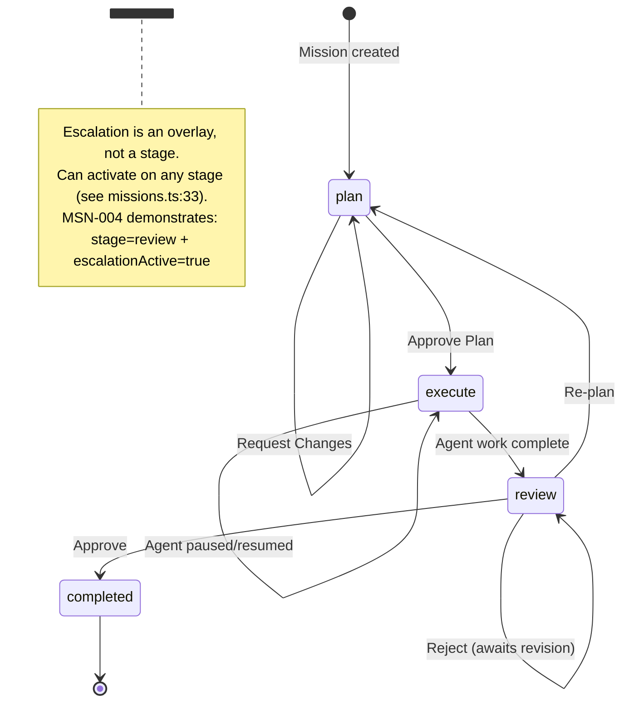
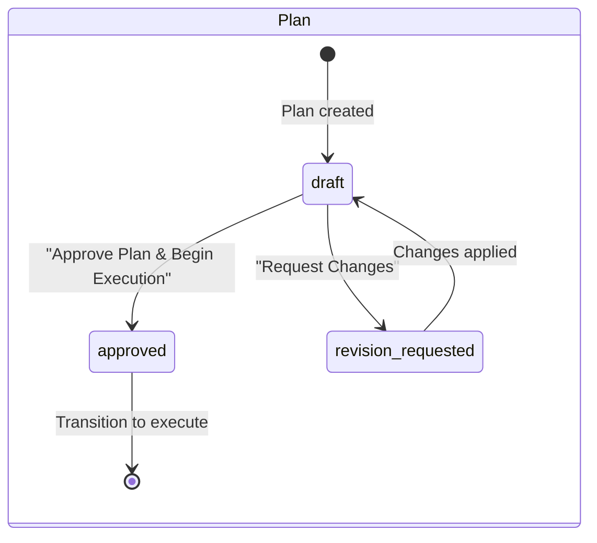
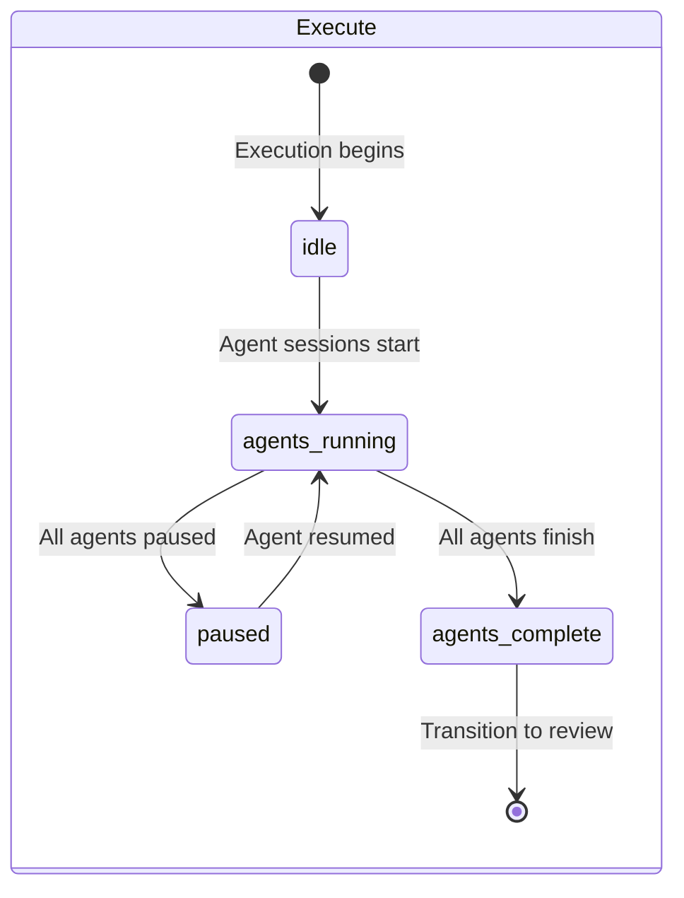
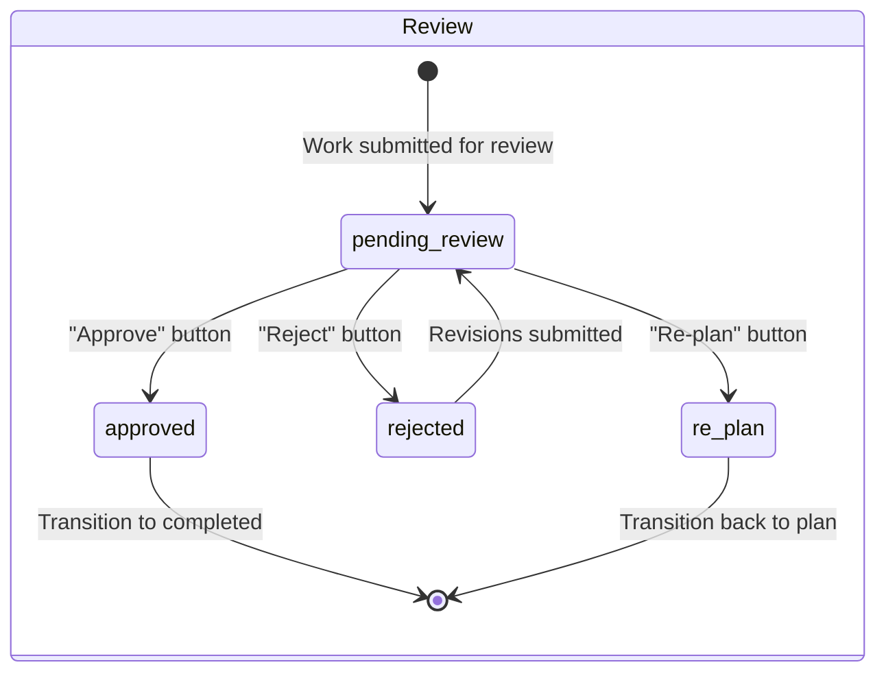
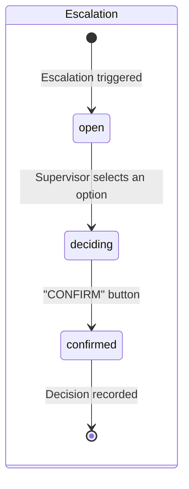
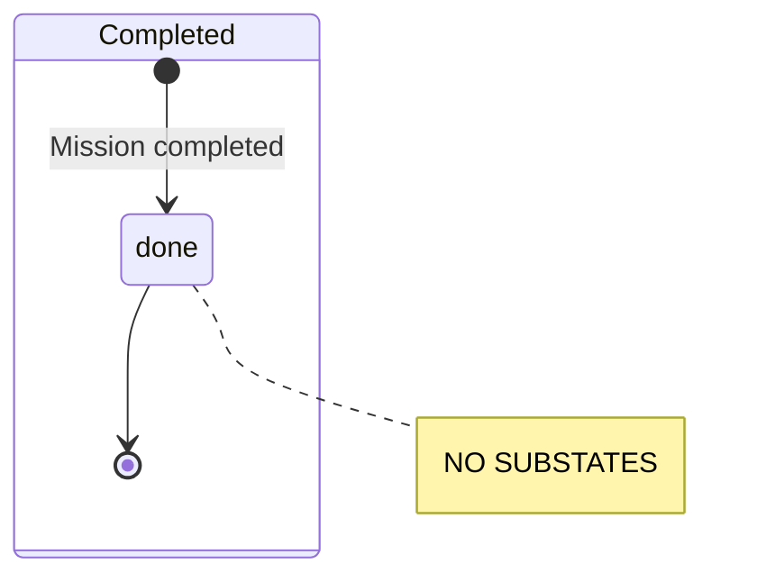
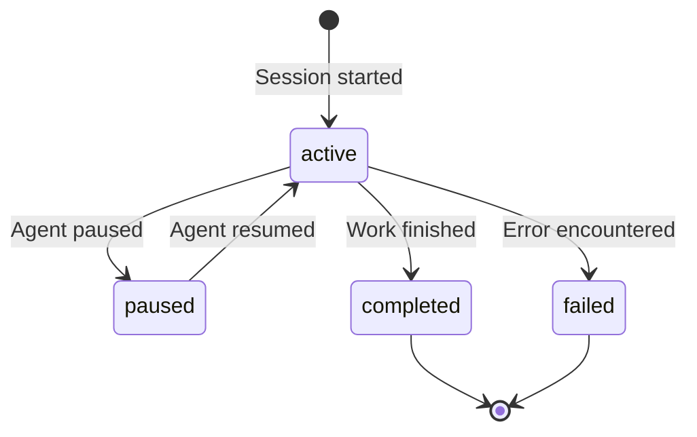
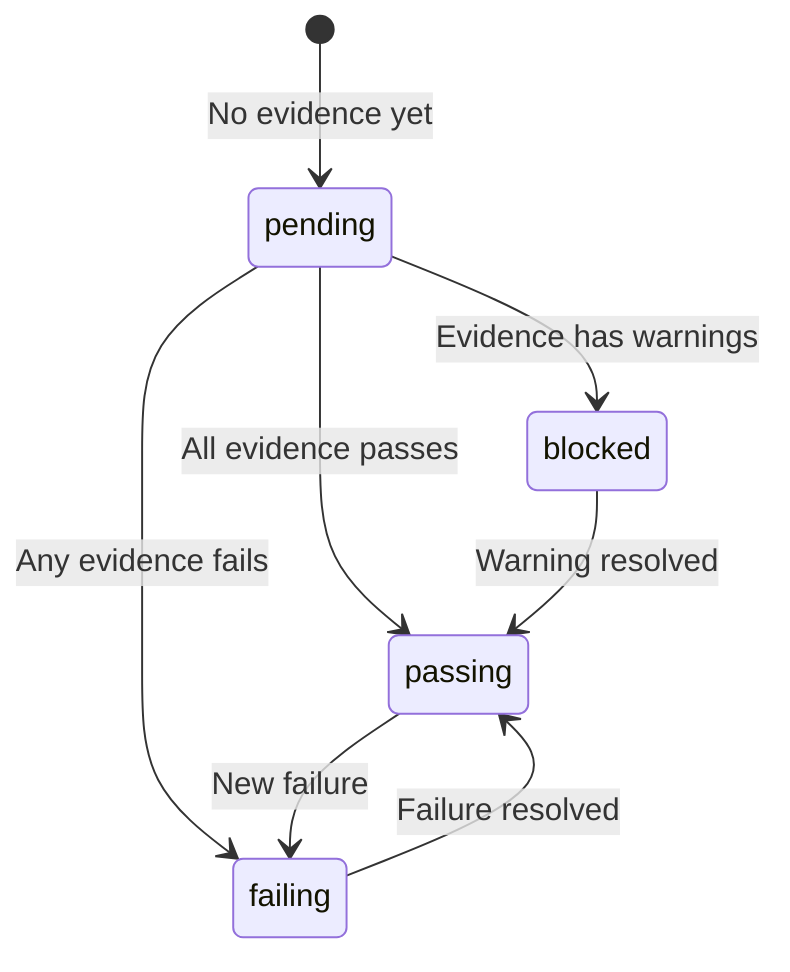
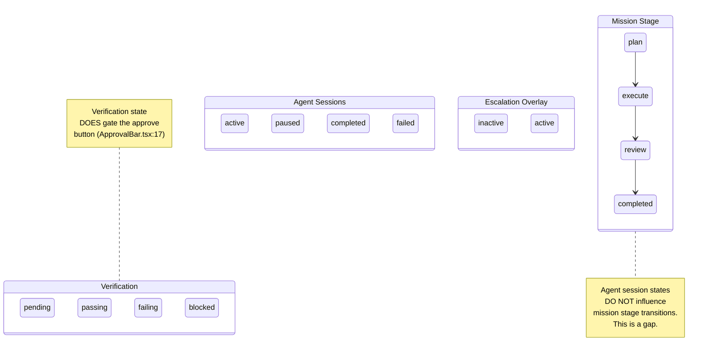

# State Model Analysis

> HCI Review Document -- Mission Control Prototype
> Date: 2026-03-24
> Scope: State machines, sub-states, transitions, and UI coverage for all stateful entities

---

## 1. Mission Lifecycle

The mission is the central stateful entity in Mission Control. Its lifecycle governs which pages, components, and actions are available to the supervisor.

### 1.1 Primary State Diagram



### 1.2 Stage Type Definition

Source: `apps/web/src/data/missions.ts:1-2`

```typescript
/** @deprecated 'escalation' as a stage is being replaced by the escalationActive overlay flag */
export type Stage = 'plan' | 'execute' | 'review' | 'escalation' | 'completed';
```

The deprecation comment indicates the codebase is transitioning from escalation-as-a-stage to escalation-as-overlay via `escalationActive?: boolean` (`missions.ts:33`).

### 1.3 Stage Distribution in Mock Data

| Stage        | Mission IDs               | Count | Has Escalation Overlay             |
| ------------ | ------------------------- | ----- | ---------------------------------- |
| `plan`       | MSN-003                   | 1     | No                                 |
| `execute`    | MSN-002                   | 1     | No                                 |
| `review`     | MSN-001, MSN-004, MSN-005 | 3     | MSN-004 (`escalationActive: true`) |
| `escalation` | --                        | 0     | --                                 |
| `completed`  | --                        | **0** | --                                 |

---

## 2. Sub-States Per Stage

### 2.1 Plan Stage



**UI mapping**:

| Sub-State            | UI Representation                                                              | Source                    |
| -------------------- | ------------------------------------------------------------------------------ | ------------------------- |
| `draft`              | Plan page shows "Approve Plan & Begin Execution" and "Request Changes" buttons | `MissionPlan.tsx:164-188` |
| `approved`           | Toast: "Plan approved. Execution will begin shortly."                          | `MissionPlan.tsx:174`     |
| `revision_requested` | Toast: "Change request submitted."                                             | `MissionPlan.tsx:183`     |

**Gap**: There is no persistent visual indicator distinguishing a fresh draft from a revision-requested plan. Both render identically. The toast messages are ephemeral -- once dismissed, the state difference is invisible.

### 2.2 Execute Stage



**UI mapping**:

| Sub-State         | UI Representation                                                                             | Source                       |
| ----------------- | --------------------------------------------------------------------------------------------- | ---------------------------- |
| `idle`            | "No agent activity yet" message in AGENT LOG                                                  | `MissionExecute.tsx:266-268` |
| `agents_running`  | Green "N agents running" status text; agent swimlanes show `running` steps                    | `MissionExecute.tsx:306-309` |
| `paused`          | Agent session status `paused` shown in AgentSwimlane, but no mission-level "paused" indicator | `agent-sessions.ts:20`       |
| `agents_complete` | (Not distinguished from agents_running at mission level)                                      | --                           |

**Gaps**:

- Agent session statuses (`active`, `paused`, `completed`, `failed`) are displayed per-session in swimlanes but have **no roll-up effect** on the mission-level UI. A mission with all agents paused looks identical to a mission with all agents completed at the stage level.
- There is no "supervisor is watching" indicator. The system cannot represent whether the supervisor is actively monitoring or has left the page.
- The `idle` sub-state (execution started but no agents yet) has only a text placeholder, not a structured empty state.

### 2.3 Review Stage



**UI mapping**:

| Sub-State        | UI Representation                                    | Source                  |
| ---------------- | ---------------------------------------------------- | ----------------------- |
| `pending_review` | ApprovalBar showing blocker count and action buttons | `ApprovalBar.tsx:19-89` |
| `approved`       | Toast: "Review approved. Changes will be deployed."  | `MissionReview.tsx:66`  |
| `rejected`       | Toast: "Review rejected. Author will be notified."   | `MissionReview.tsx:67`  |
| `re_plan`        | Toast: "Sent back for re-planning."                  | `MissionReview.tsx:68`  |

**ApprovalBar gating logic** (`ApprovalBar.tsx:17`):

```typescript
const canApprove = blockerCount === 0 && mission.verificationState === 'passing';
```

When `canApprove` is false:

- Background color changes to `aw.paperTop` instead of `semantic.successSoft` (`ApprovalBar.tsx:24`)
- Alert triangle icon replaces check circle (`ApprovalBar.tsx:30-32`)
- Approve button is disabled with `opacity: 0.5` and `cursor: 'not-allowed'` (`ApprovalBar.tsx:76-79`)

**Gap**: Like plan sub-states, review sub-states are ephemeral toast-only. After the toast dismisses, a rejected review looks identical to a pending review. There is no persistent badge or indicator showing "this review was rejected, awaiting revisions."

### 2.4 Escalation Stage/Overlay



**UI mapping**:

| Sub-State   | UI Representation                                                                            | Source                                                     |
| ----------- | -------------------------------------------------------------------------------------------- | ---------------------------------------------------------- |
| `open`      | EscalationHeader with title, type, summary; ConsequencePanel with option buttons             | `MissionEscalation.tsx:111`, `ConsequencePanel.tsx:42-154` |
| `deciding`  | Inline confirmation panel appears below selected option: "Are you sure?" with CONFIRM/CANCEL | `ConsequencePanel.tsx:112-149`                             |
| `confirmed` | Green check icon, "Decision recorded at [time]" text, other options dimmed to 40% opacity    | `ConsequencePanel.tsx:80-89`, `ConsequencePanel.tsx:69`    |

**Persistence**: ConsequencePanel uses a module-level `decisionStore` (`ConsequencePanel.tsx:17`) that survives component re-mounts but is lost on full page reload. This creates a confusing mid-ground between ephemeral and persistent state.

**Gap**: There is no "resolved" terminal state for escalations visible in the UI. Once a decision is confirmed, the escalation page looks the same on next visit (after page reload) because the store is in-memory only.

### 2.5 Completed Stage



**UI mapping**: **NONE**. There are zero missions in the `completed` stage in the mock data. The completed state has:

- No dedicated page treatment (MissionDetail renders the same layout)
- No "completed" visual treatment on mission cards
- No summary/report view for completed missions
- The ArtifactPanel gate includes `completed` (`ActivityPreview.tsx:47`) but it is never exercised
- The CommandPalette handles `completed` by navigating to the base URL instead of a stage sub-URL (`CommandPalette.tsx:70-71`), but this cannot be observed

---

## 3. Secondary State Machines

### 3.1 Agent Session States

Source: `apps/web/src/data/agent-sessions.ts:20`



**Distribution in mock data**:

| Status      | Session IDs                    | Count |
| ----------- | ------------------------------ | ----- |
| `active`    | AS-003                         | 1     |
| `paused`    | AS-004                         | 1     |
| `completed` | AS-001, AS-002, AS-005, AS-006 | 4     |
| `failed`    | --                             | 0     |

**UI visibility**: Agent session statuses are shown in `AgentSwimlane` on the MissionExecute page and in the session count summary on MissionDetail (`MissionDetail.tsx:61-76`). However, they have **no influence on the mission-level stage badge, color, or navigation**.

### 3.2 Agent Step States

Source: `apps/web/src/data/agent-sessions.ts:4`

```typescript
status: 'completed' | 'running' | 'pending' | 'failed';
```

Steps are displayed in AgentSwimlane and in the AGENT LOG on MissionExecute. Completed steps show a green checkmark (`MissionExecute.tsx:257-260`). Running steps are implied by timestamp presence. Pending steps have empty timestamps.

### 3.3 Verification States

Source: `apps/web/src/data/missions.ts:4`



The `computeVerificationState` function at `missions.ts:197-207` derives this from evidence items:

- Any `fail` status -> `failing`
- Any `warning` status -> `blocked`
- Any `pending` status -> `pending`
- All `pass` -> `passing`

**UI impact**: VerificationBadge is shown on MissionDetail (`MissionDetail.tsx:122`). The `failing` and `blocked` states disable the approve button on the review page via `ApprovalBar.tsx:17`.

### 3.4 Evidence Item States

```typescript
status: 'pass' | 'fail' | 'warning' | 'pending';
```

Displayed in EvidenceRail with color-coded indicators: green for pass, red for fail, amber for warning, gray for pending.

---

## 4. UI State Coverage Audit

This table audits whether each state has dedicated UI treatment (a distinct visual representation that communicates the state to the user).

### 4.1 Mission Stage Coverage

| State        | Dedicated Page           | Visual Indicator                  | Badge                      | Filter Support           | Mock Data                 |
| ------------ | ------------------------ | --------------------------------- | -------------------------- | ------------------------ | ------------------------- |
| `plan`       | MissionPlan.tsx          | StageTabBar highlights PLAN       | StageBadge                 | MissionHome stage filter | MSN-003                   |
| `execute`    | MissionExecute.tsx       | StageTabBar highlights EXECUTE    | StageBadge                 | MissionHome stage filter | MSN-002                   |
| `review`     | MissionReview.tsx        | StageTabBar highlights REVIEW     | StageBadge                 | MissionHome stage filter | MSN-001, MSN-004, MSN-005 |
| `escalation` | MissionEscalation.tsx    | StageTabBar highlights ESCALATION | StageBadge                 | MissionHome stage filter | -- (overlay only)         |
| `completed`  | (MissionDetail, generic) | (none specific)                   | (StageBadge theoretically) | MissionHome stage filter | **NONE**                  |

### 4.2 Plan Sub-State Coverage

| Sub-State            | Dedicated UI                 | Visual Indicator           | Persistence   |
| -------------------- | ---------------------------- | -------------------------- | ------------- |
| `draft`              | Plan page default appearance | None (no badge/label)      | N/A (default) |
| `approved`           | Toast only                   | None after toast dismisses | None          |
| `revision_requested` | Toast only                   | None after toast dismisses | None          |

### 4.3 Execute Sub-State Coverage

| Sub-State             | Dedicated UI                  | Visual Indicator         | Persistence |
| --------------------- | ----------------------------- | ------------------------ | ----------- |
| `idle`                | Text placeholder in AGENT LOG | "No agent activity yet"  | Static data |
| `agents_running`      | AgentSwimlane + status text   | Green "N agents running" | Static data |
| `paused`              | Per-session in swimlane       | None at mission level    | Static data |
| `agents_complete`     | (Not distinguished)           | None                     | --          |
| `supervisor_watching` | **MISSING**                   | **MISSING**              | --          |

### 4.4 Review Sub-State Coverage

| Sub-State        | Dedicated UI | Visual Indicator                   | Persistence |
| ---------------- | ------------ | ---------------------------------- | ----------- |
| `pending_review` | ApprovalBar  | Blocker count, conditional approve | Static data |
| `approved`       | Toast only   | Green toast                        | None        |
| `rejected`       | Toast only   | Red toast                          | None        |
| `re_plan`        | Toast only   | Blue toast                         | None        |

### 4.5 Escalation Sub-State Coverage

| Sub-State   | Dedicated UI             | Visual Indicator        | Persistence                    |
| ----------- | ------------------------ | ----------------------- | ------------------------------ |
| `open`      | ConsequencePanel options | Option buttons visible  | Static data                    |
| `deciding`  | Inline confirmation      | "Are you sure?" panel   | Component state                |
| `confirmed` | Green check + timestamp  | Disabled options at 40% | Module-level store (in-memory) |

### 4.6 Agent Session Status Coverage

| Status      | Visual in Swimlane | Visual in MissionDetail | Mission-Level Impact           |
| ----------- | ------------------ | ----------------------- | ------------------------------ |
| `active`    | Yes (green dot)    | Count in summary text   | None on stage badge            |
| `paused`    | Yes (amber dot)    | Count in summary text   | **None** -- mission looks same |
| `completed` | Yes (gray dot)     | Count in summary text   | None on stage badge            |
| `failed`    | Yes (red dot)      | Count in summary text   | **None** -- mission looks same |

---

## 5. Key Gaps

### 5.1 GAP: No "viewing" sub-state for supervisor presence

There is no mechanism to represent or communicate that the supervisor is currently monitoring agent work. In a real-time supervision system, this is critical information:

- Agents cannot know if a human is watching.
- Other supervisors (in a multi-user scenario) cannot see if someone else is already monitoring.
- The system cannot prioritize escalations based on supervisor attention.

**Where it would appear**: A "supervisor viewing" indicator could be shown in the LiveView header bar (`LiveView.tsx:170-185`), in the LeftNav active mission badge, and in the MissionSwitcherDropdown status dots (`MissionSwitcherDropdown.tsx:17-23`).

### 5.2 GAP: No "inline preview" state for partial agent visibility

The current state model is binary: either the supervisor is on a normal page (no agent view) or in fullscreen LiveView (complete agent view). There is no intermediate state:

- No "split view" state where agent work occupies part of the screen.
- No "picture-in-picture" state with a floating agent window.
- No "glanceable" state showing a thumbnail or summary of live agent activity.

The Execute page's "EXECUTE PREVIEW" (`MissionExecute.tsx:219-294`) provides a static two-column view (agent log + code preview) but this is not live -- it shows the last 8 steps and a static code file.

### 5.3 GAP: Completed has zero UI coverage

The `completed` stage is defined in the type system but has absolutely no visual representation in the prototype:

- **0 missions** in mock data have `stage: 'completed'` (`missions.ts:37-192`).
- No completed-specific component or page variant exists.
- The MissionHome filter includes `completed` as an option (`MissionHome.tsx:93`) but selecting it always yields zero results.
- The stageOrder map assigns completed the lowest priority at position 4 (`MissionHome.tsx:23`), meaning completed missions would sort to the bottom -- but this cannot be observed.

This means the most important outcome state (the goal of the entire lifecycle) has never been visually designed or tested.

### 5.4 GAP: Agent session states do not propagate to mission-level UI

Agent session statuses (`active`, `paused`, `completed`, `failed`) are only visible within the MissionExecute page's swimlane view and the MissionDetail summary text. They have zero impact on:

- The mission's StageBadge color or label
- The LeftNav mission count or "needs review" count
- The MissionCard appearance on MissionHome
- The MissionSwitcherDropdown status dots
- The TopBar breadcrumb styling

This means a mission with all agents failed looks identical to a mission with all agents active at every navigation level above the execute page.

### 5.5 GAP: Transition feedback is ephemeral-only

Every state transition in the prototype produces only a toast notification:

- Plan approval: `MissionPlan.tsx:174` -- "Plan approved. Execution will begin shortly."
- Review approval: `MissionReview.tsx:66` -- "Review approved. Changes will be deployed."
- Escalation decision: `ConsequencePanel.tsx:134` -- "Decision recorded: {label}"

After the toast auto-dismisses (default 4 seconds, escalation toast at 5 seconds per `MissionEscalation.tsx:24`), there is **no persistent visual record** that a transition occurred. The page looks the same as before the action was taken because the underlying data is static.

---

## 6. State Interaction Diagram

This diagram shows how states across different entities interact:



---

## 7. Cross-References

- **Object model**: See `conceptual-model.md` for the full object inventory, relationship diagram, and action tables.
- **Navigation**: See `information-architecture.md` for how stages map to routes and how the StageTabBar provides intra-mission navigation.
- **Terminology**: See `glossary.md` for the distinction between "stage" (lifecycle position) and "state" (verification/session status), and the "escalation" terminology confusion.
