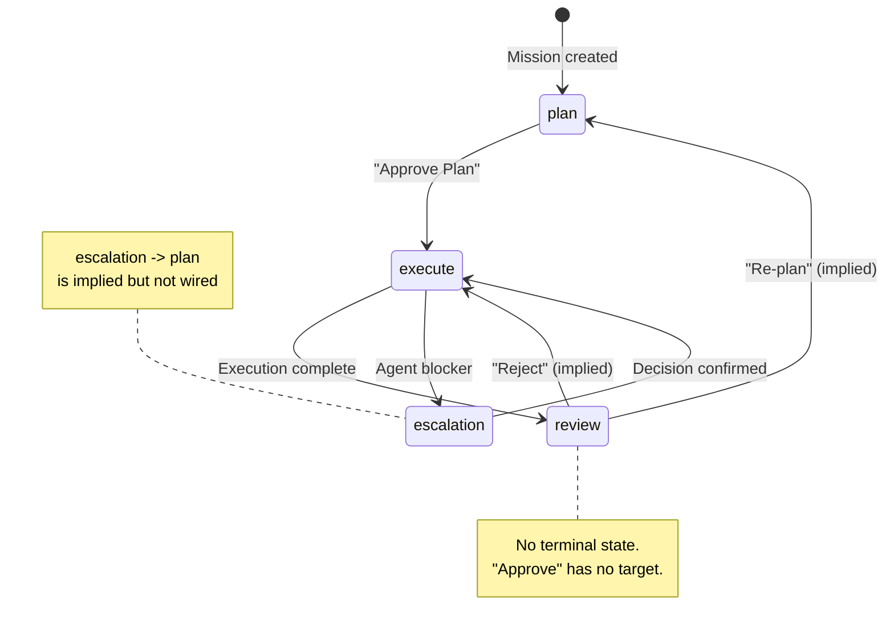
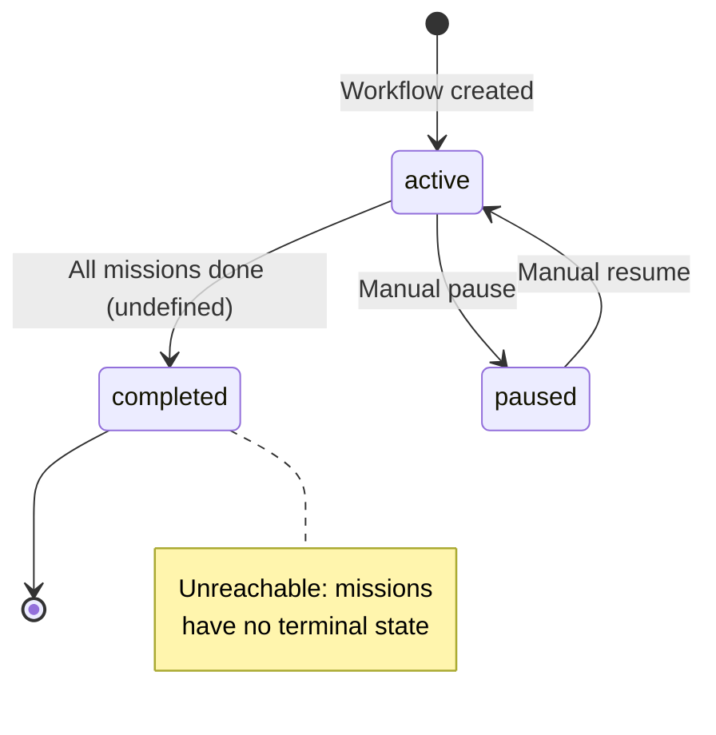
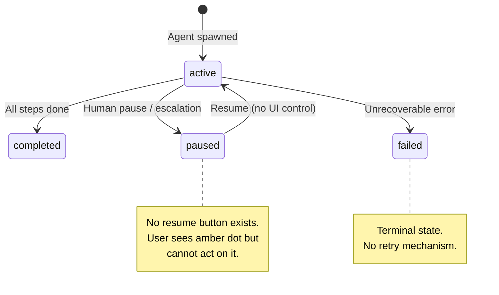
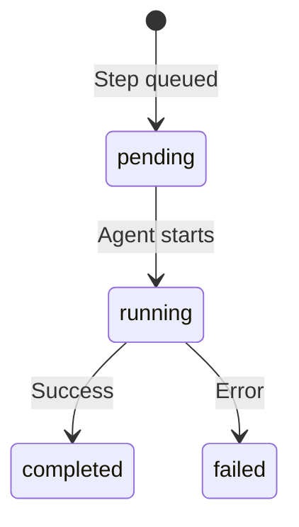
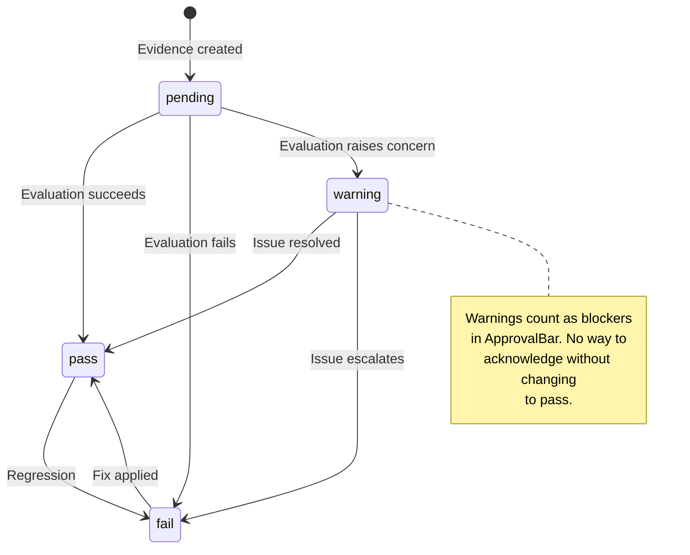
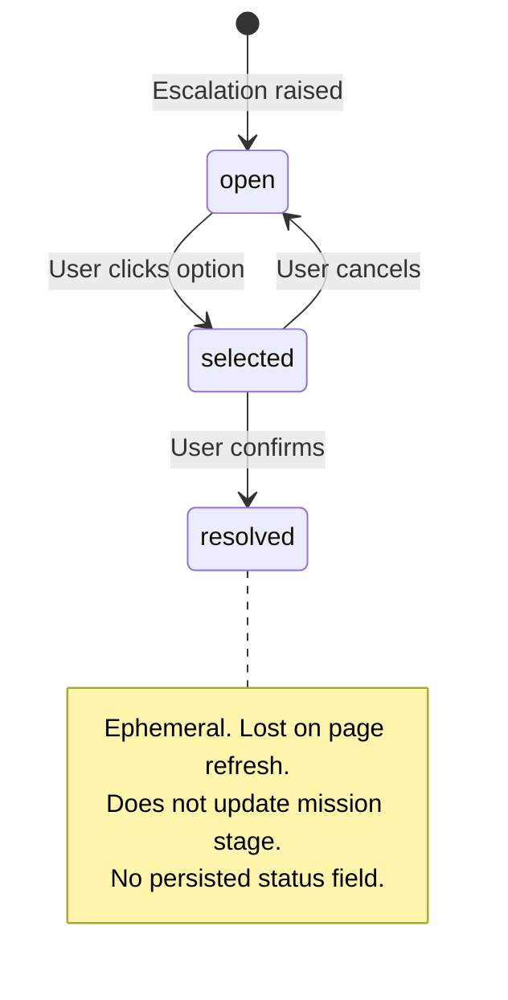
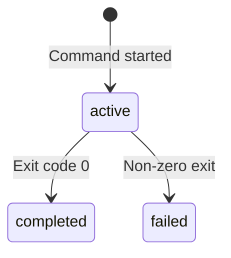
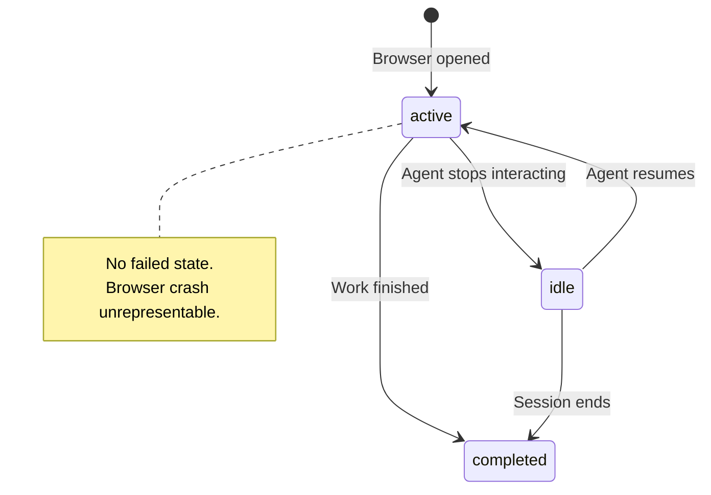
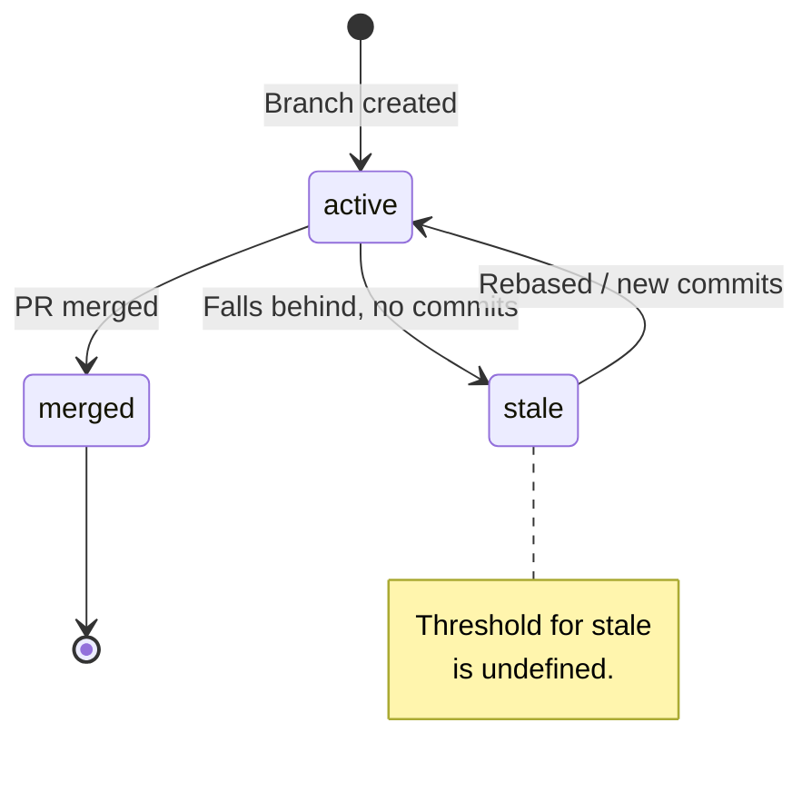
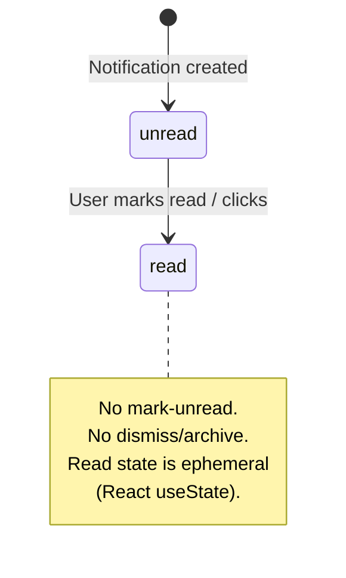

# State Model Analysis -- Mission Control

> **Methodology**: State-machine decomposition of every lifecycle entity in the Mission Control prototype.
> **Analyst**: HCI review pass, 2026-03-23
> **Codebase snapshot**: static data layer (`apps/web/src/data/*.ts`) + component layer (`apps/web/src/components/**/*.tsx`) + page layer (`apps/web/src/pages/*.tsx`)

---

## Table of Contents

1. [Entity Inventory](#1-entity-inventory)
2. [Mission](#2-mission)
3. [Workflow](#3-workflow)
4. [AgentSession](#4-agentsession)
5. [AgentStep](#5-agentstep)
6. [Evidence](#6-evidence)
7. [Escalation](#7-escalation)
8. [TerminalSession](#8-terminalsession)
9. [BrowserSession](#9-browsersession)
10. [Branch](#10-branch)
11. [Notification](#11-notification)
12. [Workspace (deprecated) / LiveViewState](#12-workspace--liveviewstate)
13. [Cross-Entity Dependencies](#13-cross-entity-dependencies)
14. [UI State Coverage Matrix](#14-ui-state-coverage-matrix)
15. [Synthesis and Recommendations](#15-synthesis-and-recommendations)

---

## 1. Entity Inventory

| Entity          | Source file                       | State field(s)                                       | Cardinality            |
| --------------- | --------------------------------- | ---------------------------------------------------- | ---------------------- |
| Mission         | `data/missions.ts`                | `stage`, `riskTier`, `verificationState`, `priority` | 4 orthogonal axes      |
| Workflow        | `data/workflows.ts`               | `status`                                             | 1 axis                 |
| AgentSession    | `data/agent-sessions.ts`          | `status`                                             | 1 axis                 |
| AgentStep       | `data/agent-sessions.ts` (nested) | `status`                                             | 1 axis                 |
| Evidence        | `data/evidence.ts`                | `status`                                             | 1 axis                 |
| Escalation      | `data/escalations.ts`             | `type` (category, not lifecycle)                     | **0 axes -- see note** |
| TerminalSession | `data/terminal-sessions.ts`       | `status`                                             | 1 axis                 |
| BrowserSession  | `data/browser-sessions.ts`        | `status`                                             | 1 axis                 |
| Branch          | `data/branches.ts`                | `status`                                             | 1 axis                 |
| Notification    | `data/notifications.ts`           | `read` (boolean), `type` (category)                  | 1 boolean axis         |
| Workspace       | `data/workspaces.ts`              | **none** (deprecated)                                | 0 axes                 |
| LiveViewState   | `data/workspaces.ts`              | `focusedPane` (UI-only)                              | 1 axis                 |

**Key observation**: Mission is the only entity with multiple orthogonal state axes, making it the most complex lifecycle object in the system.

---

## 2. Mission

### 2.1 State Axis: `stage`

Mission stage is the primary lifecycle driver. It determines which page/view the user is routed to and which actions are available.

**Type**: `'plan' | 'execute' | 'review' | 'escalation'`

#### States Table

| State        | Meaning                                                                                   | User-visible cue                                                                                                                                                   | Entry condition                                                                                                       | Exit condition                                          |
| ------------ | ----------------------------------------------------------------------------------------- | ------------------------------------------------------------------------------------------------------------------------------------------------------------------ | --------------------------------------------------------------------------------------------------------------------- | ------------------------------------------------------- |
| `plan`       | Mission goal, scope, risks, and acceptance criteria are being defined/reviewed by a human | `StageBadge` with `bg: aw.plate` (#63696d, dark gray). Label "PLAN". MissionPlan page shows "Approve Plan & Begin Execution" CTA                                   | Mission created                                                                                                       | Human clicks "Approve Plan & Begin Execution"           |
| `execute`    | Agent(s) are actively working toward the mission goal; code is being written and tested   | `StageBadge` with `bg: aw.plateDark` (#4f5559, darker gray). Label "EXECUTE". Execute page shows agent swimlanes, terminal/browser sessions, Live View entry point | Plan approved                                                                                                         | All acceptance criteria met **or** escalation triggered |
| `review`     | Human reviews diffs, evidence, and decides to approve, reject, or re-plan                 | `StageBadge` with `bg: aw.accentStrong` (#c85f49, red-orange). Label "REVIEW". ApprovalBar appears with Approve/Reject/Re-plan buttons                             | Execution complete (all agent sessions completed or sufficient evidence gathered)                                     | Human approves, rejects, or re-plans                    |
| `escalation` | Agent has encountered a blocker requiring human decision; mission is paused               | `StageBadge` with `bg: aw.accent` (#d56f5f, salmon-red). Label "ESCALATION". EscalationHeader shown with ConsequencePanel decision options                         | Agent encounters ambiguous requirement, conflicting evidence, security issue, scope breach, or architectural friction | Human selects and confirms a decision option            |

#### Allowed Transitions

| From         | To           | Trigger                                 | Who can trigger             | Side effects                                                                               |
| ------------ | ------------ | --------------------------------------- | --------------------------- | ------------------------------------------------------------------------------------------ |
| `plan`       | `execute`    | "Approve Plan & Begin Execution" button | Human (mission owner)       | Should spawn AgentSession(s); notification of type `approval` expected                     |
| `execute`    | `review`     | Agent work complete, evidence collected | System (automatic) or Human | Notification of type `stage-change` emitted (see NTF-004)                                  |
| `execute`    | `escalation` | Agent detects blocker                   | System (agent)              | Escalation entity created; notification of type `escalation` emitted; agent session paused |
| `review`     | `plan`       | "Re-plan" button on ApprovalBar         | Human                       | **Implied but no side effects defined** -- should reset verificationState?                 |
| `review`     | _completed_  | "Approve" button on ApprovalBar         | Human                       | **No completed state exists** -- see gap below                                             |
| `review`     | `execute`    | "Reject" button on ApprovalBar          | Human                       | **Implied re-execution but no formal transition defined**                                  |
| `escalation` | `execute`    | Human confirms decision option          | Human                       | ConsequencePanel records decision; agent session should resume                             |
| `escalation` | `plan`       | Human decides to re-plan                | Human                       | **Implied but not wired**                                                                  |

#### Invalid Transitions

| From         | To           | Why invalid                                                                 | What happens if attempted                                                  |
| ------------ | ------------ | --------------------------------------------------------------------------- | -------------------------------------------------------------------------- |
| `plan`       | `review`     | Cannot review work that has not been executed                               | No UI affordance exists; but no guard prevents programmatic transition     |
| `plan`       | `escalation` | No agent work has occurred; nothing to escalate                             | No UI affordance exists                                                    |
| `review`     | `escalation` | Escalations are raised during execution, not review                         | No UI affordance, but no model constraint prevents it                      |
| `escalation` | `review`     | Must return to execution first; agent needs to complete work after decision | No UI guard; the stage field is a raw string with no transition validation |

#### Ambiguous / Undefined States

| Issue                                                 | Detail                                                                                                                                                                                                                       |
| ----------------------------------------------------- | ---------------------------------------------------------------------------------------------------------------------------------------------------------------------------------------------------------------------------- |
| **No `completed` / `done` / `merged` terminal state** | A mission in `review` that gets approved has nowhere to go. The `stage` type is `'plan' \| 'execute' \| 'review' \| 'escalation'` -- there is no terminal state. The mission would remain in `review` forever or be deleted. |
| **No `cancelled` / `archived` state**                 | If a mission is abandoned, there is no way to represent that.                                                                                                                                                                |
| **No `draft` state**                                  | MissionCreate page exists (`pages/MissionCreate.tsx`) but there is no `draft` stage. A mission enters the system already at `plan`.                                                                                          |
| **`review` -> ??? after approval**                    | The ApprovalBar has an "Approve" button but its `onClick` is not wired (no handler). The approve action has no defined target state.                                                                                         |
| **`review` -> `plan` feedback loop**                  | The "Re-plan" button exists but has no handler. The state model allows infinite plan-execute-review-plan cycles with no guard against infinite regression.                                                                   |

#### Mermaid State Diagram



### 2.2 State Axis: `riskTier`

**Type**: `'low' | 'medium' | 'high'`

This is a **classification** rather than a lifecycle state. It does not have transitions in the traditional sense -- it is set at mission creation and may be updated during execution.

| State    | User-visible cue                                                                                                               | Component       |
| -------- | ------------------------------------------------------------------------------------------------------------------------------ | --------------- |
| `low`    | `RiskBadge`: label "LOW RISK", `bg: aw.haze` (#eef1f1), `text: aw.textSoft` (#93999c)                                          | `RiskBadge.tsx` |
| `medium` | `RiskBadge`: label "MED RISK", `bg: aw.lineFaint` (#dcdfdf), `text: aw.textStrong` (#5a6266)                                   | `RiskBadge.tsx` |
| `high`   | `RiskBadge`: label "HIGH RISK", `bg: aw.accent` (#d56f5f), `text: aw.inverse` (#f8f8f8), **+ `aw-pulse-accent` CSS animation** | `RiskBadge.tsx` |

**Ambiguity**: There is no `critical` risk tier in the type definition, yet the `Priority` type includes `critical`. The `ConsequencePanel` has a `getRiskIntensity()` function that returns `'critical'` as a possible value, but this is for escalation options, not missions. Users may confuse risk tier and priority.

### 2.3 State Axis: `verificationState`

**Type**: `'pending' | 'passing' | 'failing' | 'blocked'`

This is a **derived/computed** state that reflects the aggregate status of evidence items, but it is stored as a flat field on the mission rather than being computed.

| State     | Meaning                          | User-visible cue                                                                         | Component               |
| --------- | -------------------------------- | ---------------------------------------------------------------------------------------- | ----------------------- |
| `pending` | No evidence collected yet        | Dot: `aw.textSoft` (#93999c), label "PENDING", `bg: aw.haze`                             | `VerificationBadge.tsx` |
| `passing` | All evidence items pass          | Dot: `semantic.success` (#5a8a5a), label "PASSING", `bg: semantic.successSoft` (#f0f5f0) | `VerificationBadge.tsx` |
| `failing` | At least one evidence item fails | Dot: `aw.accent` (#d56f5f), label "FAILING", `bg: semantic.errorSoft` (#f5e8e6)          | `VerificationBadge.tsx` |
| `blocked` | Cannot verify; dependency issue  | Dot: `aw.plateDark` (#4f5559), label "BLOCKED", `bg: aw.lineFaint` (#dcdfdf)             | `VerificationBadge.tsx` |

**Ambiguity**: `verificationState` is a denormalized field. MSN-001 has `verificationState: 'failing'` with evidence [pass, fail, warning, pass] -- this appears correct. But MSN-002 has `verificationState: 'passing'` with evidence [pass, pass] -- also correct. The concern is that this field is manually maintained in static data, and there is no derivation logic to keep it in sync with evidence. In a dynamic system, stale `verificationState` values could mislead users.

### 2.4 State Axis: `priority`

**Type**: `'low' | 'medium' | 'high' | 'critical'`

**Not rendered anywhere in the UI.** The `priority` field exists on the `Mission` interface and is populated in the data, but no component reads or displays it. There is no `PriorityBadge` component. This is a hidden state axis.

---

## 3. Workflow

### States Table

| State       | Meaning                                                    | User-visible cue                                                                                                        | Entry condition             | Exit condition                               |
| ----------- | ---------------------------------------------------------- | ----------------------------------------------------------------------------------------------------------------------- | --------------------------- | -------------------------------------------- |
| `active`    | Workflow is in progress; contains missions being worked on | `RuleLabel` with `accent={true}` -- renders with accent styling. Status text "ACTIVE" shown in workflow header and list | Workflow created            | All missions completed (undefined) or paused |
| `completed` | All missions within the workflow are done                  | `RuleLabel` with `accent={false}` -- renders without accent. Status text "COMPLETED"                                    | All child missions approved | N/A (terminal)                               |
| `paused`    | Workflow temporarily suspended                             | `RuleLabel` with `accent={false}`. Status text "PAUSED"                                                                 | Manual pause by owner       | Manual resume                                |

### Allowed Transitions

| From     | To          | Trigger                                 | Who can trigger    | Side effects                                          |
| -------- | ----------- | --------------------------------------- | ------------------ | ----------------------------------------------------- |
| `active` | `completed` | All child missions reach terminal state | System (automatic) | **Not implemented -- no terminal state for missions** |
| `active` | `paused`    | Manual pause                            | Human              | Should pause all child missions' agent sessions       |
| `paused` | `active`    | Manual resume                           | Human              | Should resume child missions                          |

### Invalid Transitions

| From        | To       | Why invalid                      | What happens if attempted |
| ----------- | -------- | -------------------------------- | ------------------------- |
| `completed` | `active` | Cannot reopen completed workflow | No UI guard               |
| `completed` | `paused` | Cannot pause completed work      | No UI guard               |

### Ambiguous / Undefined States

| Issue                             | Detail                                                                                                                                               |
| --------------------------------- | ---------------------------------------------------------------------------------------------------------------------------------------------------- |
| **No `draft` state**              | Workflows are created immediately as `active`. The `WorkflowCreate.tsx` page exists but there is no draft state for incomplete workflow definitions. |
| **Completion is undefined**       | Since missions have no terminal state, workflow completion can never be reached programmatically.                                                    |
| **No cascading behavior defined** | Pausing a workflow does not propagate to child missions or their agent sessions.                                                                     |
| **No `archived` state**           | Old workflows cannot be hidden from the active list.                                                                                                 |

### Mermaid State Diagram



---

## 4. AgentSession

### States Table

| State       | Meaning                                       | User-visible cue                                                                                                                               | Entry condition                                             | Exit condition                                  |
| ----------- | --------------------------------------------- | ---------------------------------------------------------------------------------------------------------------------------------------------- | ----------------------------------------------------------- | ----------------------------------------------- |
| `active`    | Agent is currently executing steps            | Status dot: `semantic.success` (#5a8a5a, green). Status text "ACTIVE" in accent color. In Live View header: "{N} agents active" shown in green | Agent spawned for a mission                                 | All steps complete, step fails, or human pauses |
| `paused`    | Agent halted, awaiting human input            | Status dot: `semantic.warning` (#b8860b, amber). Status text "PAUSED"                                                                          | Human pauses, or agent encounters escalation-worthy blocker | Human resumes, or escalation decision made      |
| `completed` | Agent finished all assigned work successfully | Status dot: `aw.textSoft` (#93999c, gray). Status text "COMPLETED"                                                                             | All steps reach `completed` status                          | N/A (terminal)                                  |
| `failed`    | Agent encountered an unrecoverable error      | Status dot: `aw.accentStrong` (#c85f49, red). Status text "FAILED"                                                                             | A step fails and no recovery is possible                    | N/A (terminal, unless retried)                  |

### Allowed Transitions

| From     | To          | Trigger                              | Who can trigger | Side effects                                                       |
| -------- | ----------- | ------------------------------------ | --------------- | ------------------------------------------------------------------ |
| `active` | `completed` | All steps completed successfully     | System (agent)  | Evidence generated; mission may advance stage                      |
| `active` | `paused`    | Human intervention or escalation     | Human or System | Notification of type `agent-failure` (misleading name)             |
| `active` | `failed`    | Step failure with no recovery        | System          | Notification of type `agent-failure`; mission may enter escalation |
| `paused` | `active`    | Human resumes or escalation resolved | Human           | **No UI control exists for resuming**                              |
| `paused` | `failed`    | Human decides to abandon session     | Human           | **No UI control exists**                                           |

### Invalid Transitions

| From        | To          | Why invalid                               | What happens if attempted          |
| ----------- | ----------- | ----------------------------------------- | ---------------------------------- |
| `completed` | `active`    | Cannot restart completed session          | No guard; model is a raw string    |
| `completed` | `failed`    | Completed work cannot retroactively fail  | No guard                           |
| `failed`    | `completed` | Cannot complete failed work without retry | No guard; would need a new session |
| `failed`    | `active`    | Cannot resume from failure                | No guard                           |

### Ambiguous / Undefined States

| Issue                               | Detail                                                                                                                                                                                                                          |
| ----------------------------------- | ------------------------------------------------------------------------------------------------------------------------------------------------------------------------------------------------------------------------------- |
| **No resume control**               | `AgentSwimlane.tsx` displays session status but provides no pause/resume/retry buttons. The user can see that AS-004 is paused but cannot interact with it.                                                                     |
| **`paused` vs `failed` conflation** | NTF-002 says "Agent AS-004 paused with failure" -- the notification type is `agent-failure` but the session status is `paused`. The user sees a "failure" notification but the session dot is amber (paused), not red (failed). |
| **No `retrying` state**             | If a failed session is retried, there is no state to represent "retrying from failure."                                                                                                                                         |

### Mermaid State Diagram



---

## 5. AgentStep

### States Table

| State       | Meaning                       | User-visible cue                                                                                          | Entry condition                   | Exit condition                                   |
| ----------- | ----------------------------- | --------------------------------------------------------------------------------------------------------- | --------------------------------- | ------------------------------------------------ |
| `pending`   | Step not yet started          | Icon: `Circle` (hollow), color: `aw.textSoft` (#93999c). Left border: gray                                | Queued in agent plan              | Agent begins executing step                      |
| `running`   | Step currently being executed | Icon: `Loader` with `animate-spin` CSS class, color: `aw.accentStrong` (#c85f49). Left border: red-orange | Agent starts step                 | Step completes or fails                          |
| `completed` | Step finished successfully    | Icon: `CheckCircle`, color: `semantic.success` (#5a8a5a). Left border: green                              | Agent finishes step without error | N/A (terminal)                                   |
| `failed`    | Step encountered an error     | Icon: `XCircle`, color: `aw.accent` (#d56f5f). Left border: red                                           | Agent step throws error           | N/A (terminal, unless parent session is retried) |

### Allowed Transitions

| From      | To          | Trigger                          | Who can trigger | Side effects                                        |
| --------- | ----------- | -------------------------------- | --------------- | --------------------------------------------------- |
| `pending` | `running`   | Agent scheduler picks up step    | System          | Step gets timestamp                                 |
| `running` | `completed` | Step logic finishes successfully | System          | Next pending step becomes running                   |
| `running` | `failed`    | Step logic throws                | System          | May cascade to parent AgentSession failure or pause |

### Invalid Transitions

| From        | To          | Why invalid                                       | What happens if attempted |
| ----------- | ----------- | ------------------------------------------------- | ------------------------- |
| `pending`   | `completed` | Cannot skip execution                             | No guard                  |
| `pending`   | `failed`    | Cannot fail before starting                       | No guard                  |
| `completed` | `running`   | Cannot re-execute completed step                  | No guard                  |
| `failed`    | `running`   | Cannot retry individual steps (only full session) | No guard                  |

### Ambiguous / Undefined States

| Issue                                                     | Detail                                                                                                                                                                                                                                                               |
| --------------------------------------------------------- | -------------------------------------------------------------------------------------------------------------------------------------------------------------------------------------------------------------------------------------------------------------------- |
| **`running` with no timestamp**                           | A step can be `running` with an empty `timestamp: ''` (seen in AS-003 step s4 which is `pending` with empty timestamp -- but the running step s3 has a valid timestamp)                                                                                              |
| **MissionExecute references `step.status === 'success'`** | Line 234 of `MissionExecute.tsx` checks `step.status === 'success'` but the valid statuses are `completed`, `running`, `pending`, `failed`. The value `'success'` never matches, so the checkmark icon is never shown in the execute preview log. This is a **bug**. |

### Mermaid State Diagram



---

## 6. Evidence

### States Table

| State     | Meaning                               | User-visible cue                                                                                                           | Entry condition                                      | Exit condition                      |
| --------- | ------------------------------------- | -------------------------------------------------------------------------------------------------------------------------- | ---------------------------------------------------- | ----------------------------------- |
| `pass`    | Evidence confirms requirement is met  | Icon: `CheckCircle`, color: `semantic.success` (#5a8a5a). Status label "PASS" in green. In summary: counted as "PASS"      | Test passes, policy check clears, requirement traced | Re-evaluation fails (status change) |
| `fail`    | Evidence shows requirement not met    | Icon: `XCircle`, color: `aw.accentStrong` (#c85f49). Status label "FAIL" in red. In summary: counted as "FAIL"             | Test fails, policy violation found                   | Re-run passes (status change)       |
| `warning` | Partial compliance or risk noted      | Icon: `AlertTriangle`, color: `semantic.warning` (#b8860b). Status label "WARNING" in amber. In summary: counted as "WARN" | Check raises concern but does not block              | Human acknowledges or resolves      |
| `pending` | Evidence collection not yet attempted | Icon: `Clock`, color: `aw.textSoft` (#93999c). Status label "PENDING" in gray                                              | Evidence item created, awaiting evaluation           | Evaluation runs                     |

### Allowed Transitions

| From      | To        | Trigger                               | Who can trigger                     | Side effects                                                   |
| --------- | --------- | ------------------------------------- | ----------------------------------- | -------------------------------------------------------------- |
| `pending` | `pass`    | Evaluation succeeds                   | System (test runner, policy engine) | May update mission `verificationState`                         |
| `pending` | `fail`    | Evaluation fails                      | System                              | May update mission `verificationState`; may trigger escalation |
| `pending` | `warning` | Evaluation raises concern             | System                              | May update mission `verificationState`                         |
| `pass`    | `fail`    | Re-evaluation fails (regression)      | System                              | Should update mission `verificationState`                      |
| `fail`    | `pass`    | Fix applied and re-evaluation passes  | System                              | Should update mission `verificationState`                      |
| `warning` | `pass`    | Issue addressed, re-evaluation passes | System or Human                     | Should update mission `verificationState`                      |
| `warning` | `fail`    | Issue escalates on re-evaluation      | System                              | Should update mission `verificationState`                      |

### Invalid Transitions

| From   | To        | Why invalid                   | What happens if attempted                |
| ------ | --------- | ----------------------------- | ---------------------------------------- |
| `pass` | `pending` | Cannot "un-evaluate" evidence | No guard; model allows any status change |
| `fail` | `pending` | Same                          | No guard                                 |

### Ambiguous / Undefined States

| Issue                                                  | Detail                                                                                                                                                                                                                                                                                                                           |
| ------------------------------------------------------ | -------------------------------------------------------------------------------------------------------------------------------------------------------------------------------------------------------------------------------------------------------------------------------------------------------------------------------- |
| **No `dismissed` / `acknowledged` state for warnings** | A warning like EV-003 ("refresh token accessible via JavaScript in dev mode") has no mechanism for a human to acknowledge it without changing its status to `pass`.                                                                                                                                                              |
| **Evidence summary in ApprovalBar**                    | `ApprovalBar` counts `fail` and `warning` together as "blockers" (`blockerCount = mEvidence.filter(e => e.status === 'fail' \|\| e.status === 'warning').length`). This means warnings are treated as hard blockers for approval, which may not be the intent.                                                                   |
| **No lifecycle for evidence type**                     | The `type` field (`test-result`, `policy-check`, `requirement-trace`, `risk-explanation`) is a category, not a state. But `risk-explanation` evidence is inherently non-evaluable -- it cannot `pass` or `fail` in a meaningful binary sense. EV-009 has status `warning` which is the closest fit, but the concept is strained. |

### Mermaid State Diagram



---

## 7. Escalation

### State Analysis

**Escalation has no lifecycle state field.** The `Escalation` interface contains:

- `type`: `EscalationType` (a categorization: `ambiguous-requirement`, `conflicting-evidence`, `security-sensitive`, `scope-breach`, `architectural-friction`)
- `options`: `EscalationOption[]` (decision choices)

There is no `status` field like `'open' | 'resolved' | 'dismissed'`.

### Implied Lifecycle (derived from UI behavior)

The `ConsequencePanel` component manages escalation resolution through local React state:

- `selectedOption: string | null` -- which option the user is considering
- `confirmedOption: string | null` -- which option was confirmed
- `confirmedAt: string | null` -- timestamp of confirmation

This means escalation resolution is **ephemeral** -- it exists only in the browser's React state and is lost on page refresh.

| Implied State          | Meaning                                               | User-visible cue                                                                                                                                         | How represented                                       |
| ---------------------- | ----------------------------------------------------- | -------------------------------------------------------------------------------------------------------------------------------------------------------- | ----------------------------------------------------- |
| Open (unresolved)      | Escalation needs human decision                       | All option buttons are active and clickable                                                                                                              | `confirmedOption === null` in ConsequencePanel        |
| Selected (considering) | User has clicked an option, confirmation dialog shown | Inline confirmation panel appears below selected option with "CONFIRM" / "CANCEL" buttons                                                                | `selectedOption !== null && confirmedOption === null` |
| Resolved               | User has confirmed a decision                         | Confirmed option shows green `CheckCircle` icon, label "Decision recorded at {time}", other options dimmed to `opacity: 0.4` and `pointerEvents: 'none'` | `confirmedOption !== null`                            |

### Ambiguous / Undefined States

| Issue                                                 | Detail                                                                                                                                                                                                                                              |
| ----------------------------------------------------- | --------------------------------------------------------------------------------------------------------------------------------------------------------------------------------------------------------------------------------------------------- |
| **No persisted resolution state**                     | Escalation resolution lives in React `useState`. Refreshing the page resets all escalations to "open."                                                                                                                                              |
| **No `status` field on the data model**               | The `Escalation` type has no `status` property. There is no way to distinguish between an open escalation and a resolved one in the data layer.                                                                                                     |
| **Resolved escalation does not update mission stage** | After confirming a decision in ConsequencePanel, the mission remains in `escalation` stage. There is no mechanism to transition back to `execute`.                                                                                                  |
| **Multiple escalations per mission**                  | MSN-004 has 3 escalations (ESC-002, ESC-003). The UI shows only the "primary" escalation (index 0) in the header and lists others below. But resolving one does not resolve the others, and there is no aggregate "all escalations resolved" check. |

### Mermaid State Diagram



---

## 8. TerminalSession

### States Table

| State       | Meaning                       | User-visible cue                                                                                                     | Entry condition    | Exit condition             |
| ----------- | ----------------------------- | -------------------------------------------------------------------------------------------------------------------- | ------------------ | -------------------------- |
| `active`    | Command is currently running  | Label "TERMINAL // ACTIVE" in `SessionPane`. In MissionExecute: "Terminal: active" shown in `semantic.success` green | Command started    | Command finishes or errors |
| `completed` | Command finished successfully | Label "TERMINAL // COMPLETED"                                                                                        | Exit code 0        | N/A (terminal)             |
| `failed`    | Command exited with error     | Label "TERMINAL // FAILED"                                                                                           | Non-zero exit code | N/A (terminal)             |

### Allowed Transitions

| From     | To          | Trigger                          | Who can trigger | Side effects                                 |
| -------- | ----------- | -------------------------------- | --------------- | -------------------------------------------- |
| `active` | `completed` | Process exits with code 0        | System          | Output captured in `outputPreview`           |
| `active` | `failed`    | Process exits with non-zero code | System          | Output captured; may trigger Evidence `fail` |

### Invalid Transitions

| From        | To       | Why invalid                      | What happens if attempted         |
| ----------- | -------- | -------------------------------- | --------------------------------- |
| `completed` | `active` | Cannot restart completed session | No guard                          |
| `failed`    | `active` | Cannot restart failed session    | No guard (would need new session) |
| `completed` | `failed` | Cannot retroactively fail        | No guard                          |

### Ambiguous / Undefined States

| Issue                                             | Detail                                                                                                                                                                                                                                      |
| ------------------------------------------------- | ------------------------------------------------------------------------------------------------------------------------------------------------------------------------------------------------------------------------------------------- |
| **No `idle` state**                               | Unlike BrowserSession, TerminalSession has no `idle` state. A terminal waiting for input (like TS-003 in `test:watch` mode) is represented as `active`, which is technically correct but semantically different from "actively processing." |
| **No visual differentiation of active sub-types** | TS-003 is `active` and running `test:watch` (waiting), while a hypothetical session actively compiling would also be `active`. The user cannot distinguish waiting-active from working-active.                                              |
| **Status only shown as text, no color-coded dot** | Unlike AgentSession (which has a colored status dot), TerminalSession shows status only as uppercase text in the "TERMINAL // {STATUS}" label. No dot or icon differentiates the states at a glance.                                        |

### Mermaid State Diagram



---

## 9. BrowserSession

### States Table

| State       | Meaning                                       | User-visible cue                           | Entry condition                                         | Exit condition                            |
| ----------- | --------------------------------------------- | ------------------------------------------ | ------------------------------------------------------- | ----------------------------------------- |
| `active`    | Browser is actively being controlled by agent | Label "BROWSER // ACTIVE" in `SessionPane` | Agent navigates to URL                                  | Agent finishes interaction or goes idle   |
| `idle`      | Browser is open but not being interacted with | Label "BROWSER // IDLE"                    | Agent stops interacting but does not close session      | Agent resumes interaction or session ends |
| `completed` | Browser session finished                      | Label "BROWSER // COMPLETED"               | Agent closes browser or finishes all browser-based work | N/A (terminal)                            |

### Allowed Transitions

| From     | To          | Trigger                           | Who can trigger | Side effects                      |
| -------- | ----------- | --------------------------------- | --------------- | --------------------------------- |
| `active` | `idle`      | Agent stops interacting           | System          | Screenshot preserved              |
| `active` | `completed` | Agent finishes browser work       | System          | Final screenshot/summary captured |
| `idle`   | `active`    | Agent resumes interaction         | System          |                                   |
| `idle`   | `completed` | Session times out or agent closes | System          |                                   |

### Invalid Transitions

| From        | To       | Why invalid                     | What happens if attempted |
| ----------- | -------- | ------------------------------- | ------------------------- |
| `completed` | `active` | Cannot reopen completed session | No guard                  |
| `completed` | `idle`   | Cannot idle a completed session | No guard                  |

### Ambiguous / Undefined States

| Issue                                                   | Detail                                                                                                                                                                                                 |
| ------------------------------------------------------- | ------------------------------------------------------------------------------------------------------------------------------------------------------------------------------------------------------ |
| **No `failed` state**                                   | Unlike TerminalSession, BrowserSession has no `failed` state. If a browser session crashes, there is no way to represent that.                                                                         |
| **`idle` is ambiguous**                                 | BS-002 is `idle` -- it was used to confirm a GBP formatting bug. But is it idle because the agent is done looking at it, or because it is waiting for the agent to come back? The semantic is unclear. |
| **Status only shown as text, no color-coded indicator** | Like TerminalSession, status is rendered as uppercase text only. No dot, icon, or color change differentiates `active` from `idle` from `completed`.                                                   |

### Mermaid State Diagram



---

## 10. Branch

### States Table

| State    | Meaning                                                               | User-visible cue                                                                                           | Entry condition                                                 | Exit condition                     |
| -------- | --------------------------------------------------------------------- | ---------------------------------------------------------------------------------------------------------- | --------------------------------------------------------------- | ---------------------------------- |
| `active` | Branch has recent commits and is being worked on                      | `BranchBadge`: dot colored `semantic.success` (#5a8a5a, green). Plus ahead/behind count (+N / -N)          | Branch created                                                  | Merged or becomes stale            |
| `merged` | Branch has been merged to base                                        | `BranchBadge`: dot colored `aw.textSoft` (#93999c, gray)                                                   | PR merged                                                       | N/A (terminal)                     |
| `stale`  | Branch has not been updated recently and is significantly behind base | `BranchBadge`: dot colored `semantic.warning` (#b8860b, amber). Example: feature/webhook-retry is +3 / -14 | No commits for extended period, falls significantly behind base | Receives new commits or is deleted |

### Allowed Transitions

| From     | To       | Trigger                                    | Who can trigger     | Side effects                                   |
| -------- | -------- | ------------------------------------------ | ------------------- | ---------------------------------------------- |
| `active` | `merged` | PR merged                                  | Human / System      | Should update associated mission if one exists |
| `active` | `stale`  | Time passes without commits, falls behind  | System (time-based) | May indicate abandoned work                    |
| `stale`  | `active` | New commits pushed, rebased on latest base | Human               |                                                |

### Invalid Transitions

| From     | To       | Why invalid                            | What happens if attempted |
| -------- | -------- | -------------------------------------- | ------------------------- |
| `merged` | `active` | Merged branches should not be reopened | No guard                  |
| `merged` | `stale`  | Merged branches are terminal           | No guard                  |

### Ambiguous / Undefined States

| Issue                           | Detail                                                                                                                                                                 |
| ------------------------------- | ---------------------------------------------------------------------------------------------------------------------------------------------------------------------- |
| **`stale` threshold undefined** | feature/webhook-retry is `stale` at -14 behind. But what makes a branch stale? Is it time-based? Commit-count-based? Behind-count-based? The threshold is not defined. |
| **No `deleted` state**          | Branches can be deleted after merge, but there is no state to represent that.                                                                                          |
| **Orphaned branches**           | feature/webhook-retry has no `missionId`. It is an orphan branch visible in the system but not associated with any mission. The UI does not flag this.                 |
| **No branch status for `main`** | `main` branch has `status: 'active'` and is its own base (`baseBranch: 'main'`). This is semantically different from a feature branch being "active."                  |

### Mermaid State Diagram



---

## 11. Notification

### States Table

Notification has a simple boolean state: `read` / `unread`.

| State                    | Meaning                               | User-visible cue                                                                                                                          | Entry condition      | Exit condition                                     |
| ------------------------ | ------------------------------------- | ----------------------------------------------------------------------------------------------------------------------------------------- | -------------------- | -------------------------------------------------- |
| `unread` (`read: false`) | New notification not yet seen by user | 3px left border in `aw.accentStrong` (#c85f49). "Mark read" link shown. Bell icon badge shows unread count in `semantic.error` red circle | Notification created | User clicks "Mark read" or clicks the notification |
| `read` (`read: true`)    | Notification has been acknowledged    | 1px left border in `aw.lineFaint` (#dcdfdf). No "Mark read" link. Count decremented from bell badge                                       | User marks as read   | N/A (terminal, unless "mark unread" added)         |

### Allowed Transitions

| From     | To     | Trigger                                                       | Who can trigger | Side effects                                                                |
| -------- | ------ | ------------------------------------------------------------- | --------------- | --------------------------------------------------------------------------- |
| `unread` | `read` | User clicks "Mark read" button or clicks the notification row | Human           | Unread count badge decremented; navigation to mission detail if row clicked |

### Invalid Transitions

| From   | To       | Why invalid                           | What happens if attempted |
| ------ | -------- | ------------------------------------- | ------------------------- |
| `read` | `unread` | No "mark unread" functionality exists | Not possible through UI   |

### Ambiguous / Undefined States

| Issue                                                   | Detail                                                                                                                                                                                              |
| ------------------------------------------------------- | --------------------------------------------------------------------------------------------------------------------------------------------------------------------------------------------------- |
| **Read state is local**                                 | `readIds` is managed via React `useState` in `NotificationCenter.tsx`. Refreshing the page resets read state to the initial `notifications.filter(n => n.read)` set from static data.               |
| **No `dismissed` / `archived` state**                   | Notifications cannot be dismissed or removed. The list grows indefinitely.                                                                                                                          |
| **No `actionable` vs `informational` distinction**      | NTF-001 (escalation) requires action; NTF-003 (evidence collected) is informational. Both look the same except for the type icon. There is no visual urgency differentiation.                       |
| **Notification type icons all render in `aw.textSoft`** | Despite different type icons (AlertTriangle for escalations, XCircle for failures), they all use the same gray color (`aw.textSoft`). The icon shape varies but the color does not signal severity. |

### Mermaid State Diagram



---

## 12. Workspace / LiveViewState

### Workspace (deprecated)

The `Workspace` interface is marked with `@deprecated` -- "Workspace entity is dissolved -- use Mission.branch + LiveViewState instead."

Despite deprecation, `workspaces` data is still actively consumed by `LiveView.tsx`:

```typescript
const workspace = workspaces.find((ws) => ws.missionId === missionId);
```

Workspace has **no status field** and no lifecycle. It is a snapshot of UI state (active file, open files, terminal/browser/agent session bindings). This is a **configuration** entity, not a stateful one.

### LiveViewState

```typescript
interface LiveViewState {
  missionId: string;
  activeFile: string;
  openFiles: string[];
  focusedPane: 'code' | 'terminal' | 'browser' | 'chat';
}
```

`focusedPane` is the only state-like field, but it is a **UI focus** state, not a domain lifecycle state. It is defined as a type but never instantiated in the data layer. It exists only as a type declaration.

### Ambiguity

| Issue                                | Detail                                                                                                                                                                   |
| ------------------------------------ | ------------------------------------------------------------------------------------------------------------------------------------------------------------------------ |
| **Deprecated but still in use**      | `LiveView.tsx` falls back to `workspaces` data when constructing `effectiveWorkspace`. Removal would break the page.                                                     |
| **LiveViewState never instantiated** | The type is exported but no `liveViewStates` array or factory exists.                                                                                                    |
| **No "supervision mode" state**      | Live View has a header bar showing "LIVE SUPERVISION MODE" but there is no backend state distinguishing supervision from editing. This is purely a UI chrome difference. |

---

## 13. Cross-Entity Dependencies

### 13.1 Entity Coupling Map

```
Workflow (1) ──contains──> (N) Mission
Mission  (1) ──owns──────> (N) AgentSession
Mission  (1) ──owns──────> (N) Evidence
Mission  (1) ──owns──────> (N) Escalation
Mission  (1) ──owns──────> (N) BrowserSession
Mission  (1) ──owns──────> (N) TerminalSession
Mission  (1) ──associated─> (0..1) Branch
AgentSession (1) ──contains──> (N) AgentStep
AgentSession (1) ──works-on──> (0..1) Branch
Notification (N) ──references──> (1) Mission
Mission  (N) ──blocked-by──> (N) Mission
```

### 13.2 Cascading Transitions

| Parent transition                            | Expected child cascade                                            | Currently implemented?                               |
| -------------------------------------------- | ----------------------------------------------------------------- | ---------------------------------------------------- |
| Mission stage: `plan` -> `execute`           | Should spawn AgentSession(s)                                      | No -- static data only                               |
| Mission stage: `execute` -> `escalation`     | Should pause active AgentSession(s)                               | No -- AgentSession status is independent             |
| Mission stage: `execute` -> `review`         | Should verify all AgentSessions are `completed`                   | No -- no guard                                       |
| AgentSession status: `active` -> `failed`    | Should update Mission `verificationState`                         | No -- `verificationState` is denormalized and static |
| AgentSession status: `active` -> `completed` | Should generate Evidence items                                    | No -- static data only                               |
| AgentStep status: `running` -> `failed`      | Should update parent AgentSession to `failed` or `paused`         | No -- no cascading logic                             |
| Evidence status changes                      | Should recompute Mission `verificationState`                      | No -- denormalized                                   |
| Escalation resolved (ephemeral)              | Should transition Mission from `escalation` -> `execute`          | No                                                   |
| Workflow status: `active` -> `paused`        | Should pause all child Missions and their AgentSessions           | No                                                   |
| Branch status: `active` -> `merged`          | Should update associated Mission (mark branch work as integrated) | No                                                   |
| Mission blocked-by resolution                | Should unblock dependent mission                                  | No -- `blockedBy` is not reactive                    |

### 13.3 Orphaned State Scenarios

| Scenario                                                               | Entities affected        | Problem                                                                                                                                          |
| ---------------------------------------------------------------------- | ------------------------ | ------------------------------------------------------------------------------------------------------------------------------------------------ |
| Mission in `execute` but all AgentSessions are `completed` or `failed` | Mission, AgentSession    | Mission appears to be executing but nothing is running. No automatic stage advancement.                                                          |
| Mission in `review` but `verificationState` is `failing`               | Mission, Evidence        | The review page shows blockers but the mission is already in review. How did it get there?                                                       |
| Escalation resolved in UI but mission still in `escalation` stage      | Escalation, Mission      | ConsequencePanel shows decision recorded but mission header still shows ESCALATION badge.                                                        |
| Mission has `blockedBy: ['MSN-001']` but is in `execute` stage         | Mission                  | MSN-002 is `execute` stage but blocked by MSN-001 (which is in `review` with `failing` verification). The blocking relationship is not enforced. |
| Branch is `stale` but associated mission is `active`                   | Branch, Mission          | feature/webhook-retry is stale with no mission. But if it had one, the stale branch would not affect mission state.                              |
| Notification references resolved escalation                            | Notification, Escalation | NTF-001 alerts about ESC-001 but if ESC-001 were resolved, the notification would still appear with the same urgency.                            |

### 13.4 Dependency Diagram

```mermaid
graph TD
    WF[Workflow<br/>status: active|completed|paused] -->|contains| M[Mission<br/>stage + riskTier + verificationState]
    M -->|owns| AS[AgentSession<br/>status: active|paused|completed|failed]
    M -->|owns| EV[Evidence<br/>status: pass|fail|warning|pending]
    M -->|owns| ESC[Escalation<br/>NO status field]
    M -->|owns| BS[BrowserSession<br/>status: active|idle|completed]
    M -->|owns| TS[TerminalSession<br/>status: active|completed|failed]
    M -.->|associated| BR[Branch<br/>status: active|merged|stale]
    AS -->|contains| STEP[AgentStep<br/>status: completed|running|pending|failed]
    NTF[Notification<br/>read: boolean] -.->|references| M
    M -.->|blockedBy| M

    style ESC stroke-dasharray: 5 5
    style NTF stroke-dasharray: 5 5
```

---

## 14. UI State Coverage Matrix

| Entity              | State                        | Has visual cue                                               | Has available actions                  | Has transition feedback                     | Gap                                            |
| ------------------- | ---------------------------- | ------------------------------------------------------------ | -------------------------------------- | ------------------------------------------- | ---------------------------------------------- |
| **Mission**         | `plan`                       | Yes (StageBadge gray)                                        | Yes ("Approve Plan" button)            | No (no animation/toast on transition)       | Missing transition feedback                    |
| **Mission**         | `execute`                    | Yes (StageBadge dark gray)                                   | Yes (agent swimlanes, Live View entry) | No                                          | Missing transition feedback                    |
| **Mission**         | `review`                     | Yes (StageBadge red-orange)                                  | Yes (Approve/Reject/Re-plan)           | No                                          | Buttons have no onClick handlers               |
| **Mission**         | `escalation`                 | Yes (StageBadge salmon)                                      | Yes (ConsequencePanel)                 | Partial (decision recorded timestamp shown) | Resolution does not update stage               |
| **Mission**         | `verificationState: pending` | Yes (VerificationBadge gray dot)                             | No                                     | No                                          | No action available to trigger evaluation      |
| **Mission**         | `verificationState: passing` | Yes (VerificationBadge green dot)                            | No                                     | No                                          | Read-only display                              |
| **Mission**         | `verificationState: failing` | Yes (VerificationBadge red dot)                              | No                                     | No                                          | No action to re-run failing tests              |
| **Mission**         | `verificationState: blocked` | Yes (VerificationBadge dark dot)                             | No                                     | No                                          | No information about what is blocking          |
| **Mission**         | `riskTier: high`             | Yes (RiskBadge red + pulse)                                  | No                                     | N/A                                         | Pulse animation is the only differentiated cue |
| **Mission**         | `riskTier: medium`           | Yes (RiskBadge gray)                                         | No                                     | N/A                                         | Visually similar to `low`                      |
| **Mission**         | `riskTier: low`              | Yes (RiskBadge light gray)                                   | No                                     | N/A                                         |                                                |
| **Mission**         | `priority`                   | **No**                                                       | No                                     | No                                          | **Not rendered anywhere**                      |
| **Workflow**        | `active`                     | Yes (RuleLabel accent)                                       | No (no pause/complete buttons)         | No                                          | No lifecycle controls                          |
| **Workflow**        | `completed`                  | Yes (RuleLabel plain)                                        | No                                     | No                                          | Unreachable state                              |
| **Workflow**        | `paused`                     | Yes (RuleLabel plain)                                        | No                                     | No                                          | No resume button                               |
| **AgentSession**    | `active`                     | Yes (green dot + "ACTIVE" text)                              | No (no pause button)                   | No                                          | No user controls                               |
| **AgentSession**    | `paused`                     | Yes (amber dot + "PAUSED" text)                              | No (no resume button)                  | No                                          | **Cannot resume**                              |
| **AgentSession**    | `completed`                  | Yes (gray dot + "COMPLETED" text)                            | No                                     | No                                          | Read-only                                      |
| **AgentSession**    | `failed`                     | Yes (red dot + "FAILED" text)                                | No (no retry button)                   | No                                          | **Cannot retry**                               |
| **AgentStep**       | `pending`                    | Yes (hollow circle + gray border)                            | No                                     | No                                          |                                                |
| **AgentStep**       | `running`                    | Yes (spinning loader + red border)                           | No                                     | Yes (spin animation)                        |                                                |
| **AgentStep**       | `completed`                  | Yes (check icon + green border)                              | No                                     | No                                          |                                                |
| **AgentStep**       | `failed`                     | Yes (X icon + red border)                                    | No                                     | No                                          | No retry/skip action                           |
| **Evidence**        | `pass`                       | Yes (green check + "PASS")                                   | No                                     | No                                          |                                                |
| **Evidence**        | `fail`                       | Yes (red X + "FAIL")                                         | No                                     | No                                          | No re-run action                               |
| **Evidence**        | `warning`                    | Yes (amber triangle + "WARNING")                             | No (no acknowledge action)             | No                                          | **Cannot acknowledge**                         |
| **Evidence**        | `pending`                    | Yes (gray clock + "PENDING")                                 | No                                     | No                                          | No "run now" action                            |
| **Escalation**      | open (implied)               | Yes (EscalationHeader + options)                             | Yes (select option)                    | No                                          |                                                |
| **Escalation**      | selected (implied)           | Yes (confirmation inline panel)                              | Yes (confirm/cancel)                   | Yes (inline expansion)                      |                                                |
| **Escalation**      | resolved (implied)           | Yes (green check + timestamp)                                | No (other options dimmed)              | Yes (check + timestamp)                     | **Ephemeral -- lost on refresh**               |
| **TerminalSession** | `active`                     | Partial (text "ACTIVE" only)                                 | No                                     | No                                          | **No color-coded indicator**                   |
| **TerminalSession** | `completed`                  | Partial (text "COMPLETED" only)                              | No                                     | No                                          | **No color-coded indicator**                   |
| **TerminalSession** | `failed`                     | Partial (text "FAILED" only)                                 | No                                     | No                                          | **No color-coded indicator**                   |
| **BrowserSession**  | `active`                     | Partial (text "ACTIVE" only)                                 | No                                     | No                                          | **No color-coded indicator**                   |
| **BrowserSession**  | `idle`                       | Partial (text "IDLE" only)                                   | No                                     | No                                          | **No color-coded indicator**                   |
| **BrowserSession**  | `completed`                  | Partial (text "COMPLETED" only)                              | No                                     | No                                          | **No color-coded indicator**                   |
| **Branch**          | `active`                     | Yes (green dot + ahead/behind)                               | No                                     | No                                          |                                                |
| **Branch**          | `merged`                     | Yes (gray dot)                                               | No                                     | No                                          |                                                |
| **Branch**          | `stale`                      | Yes (amber dot + ahead/behind)                               | No                                     | No                                          | No "delete stale" action                       |
| **Notification**    | `unread`                     | Yes (3px red-orange left border + "Mark read" + badge count) | Yes (mark read, click to navigate)     | Yes (border changes, count decrements)      |                                                |
| **Notification**    | `read`                       | Yes (thin gray border, no "Mark read")                       | Yes (click to navigate)                | No                                          | No mark-unread                                 |

---

## 15. Synthesis and Recommendations

### 15.1 Entities with the Most Ambiguous State Models

**Ranked by severity:**

1. **Escalation** -- Has no `status` field at all. Resolution is ephemeral React state. Resolution does not cascade to mission stage. Multiple escalations per mission have no aggregate resolution check. **Most critical gap.**

2. **Mission** -- Four orthogonal state axes with `priority` invisible in the UI. No terminal state (`completed`/`done`). Approval/rejection/re-plan buttons on the review page have no handlers. The `verificationState` field is denormalized and can drift from actual evidence. The `stage` field has no transition validation.

3. **Workflow** -- `completed` state is unreachable because missions have no terminal state. No lifecycle controls (pause/resume/complete buttons) exist on any workflow page. Status is displayed but not actionable.

4. **AgentSession** -- Status is displayed with clear visual cues but has zero user controls. Sessions cannot be paused, resumed, or retried from the UI. The `paused` state is a dead end without manual intervention at the data layer.

### 15.2 States That Users Cannot Distinguish Visually

| State pair                                                   | Why confusing                                                                                                                                                                                                              | Where visible                         |
| ------------------------------------------------------------ | -------------------------------------------------------------------------------------------------------------------------------------------------------------------------------------------------------------------------- | ------------------------------------- |
| `riskTier: low` vs `riskTier: medium`                        | Both use muted gray backgrounds (`aw.haze` vs `aw.lineFaint`). On a typical monitor, the difference is approximately 10-15 in RGB value. Only `high` is visually distinct (red + pulse).                                   | MissionCard, MissionHeader, RiskBadge |
| `verificationState: pending` vs `verificationState: blocked` | Both use gray-spectrum dots (`aw.textSoft` vs `aw.plateDark`). The difference is ~30 RGB points in a gray-on-gray context. Labels differ ("PENDING" vs "BLOCKED") but at `text-[9px]` size, these are hard to distinguish. | VerificationBadge                     |
| `TerminalSession: active` vs `completed` vs `failed`         | All rendered as uppercase text "TERMINAL // {STATUS}" with no color differentiation. The text color is `aw.textSoft` (#93999c) for all states.                                                                             | SessionPane                           |
| `BrowserSession: active` vs `idle` vs `completed`            | Same problem as TerminalSession. All rendered as "BROWSER // {STATUS}" in the same gray text.                                                                                                                              | SessionPane                           |
| `Notification: escalation` vs `agent-failure`                | Both are urgent. Icon shapes differ (AlertTriangle vs XCircle) but both rendered in `aw.textSoft` gray. No color signals urgency.                                                                                          | NotificationCenter                    |

### 15.3 Transitions That Happen Silently Without Feedback

| Transition                        | What should happen                                 | What actually happens                                                                                                         |
| --------------------------------- | -------------------------------------------------- | ----------------------------------------------------------------------------------------------------------------------------- |
| Mission `plan` -> `execute`       | Toast/animation confirming plan approval           | Button "Approve Plan & Begin Execution" has no onClick handler. Nothing happens.                                              |
| Mission `execute` -> `review`     | Stage advancement notification + visual transition | Notification NTF-004 exists in data but there is no toast or animated badge update when it happens.                           |
| Mission `execute` -> `escalation` | Alert/modal interrupting the user                  | Notification NTF-007 exists but the transition itself is silent.                                                              |
| AgentSession `active` -> `paused` | Indication that agent stopped + reason             | The status dot changes from green to amber, but there is no transient notification within the execute page itself.            |
| AgentSession `active` -> `failed` | Error alert with failure details                   | The status dot changes from green to red, and a notification exists (NTF-002), but on the execute page, the change is silent. |
| Evidence status changes           | Update to mission verificationState badge          | `verificationState` is denormalized; no recomputation occurs.                                                                 |
| Branch `active` -> `stale`        | Warning that work may be abandoned                 | No notification type for branch staleness exists.                                                                             |

### 15.4 Invalid Transitions That the UI Does Not Prevent

| Invalid transition                             | Why it matters                              | Prevention status                                                               |
| ---------------------------------------------- | ------------------------------------------- | ------------------------------------------------------------------------------- |
| Mission: `plan` -> `review` (skipping execute) | Could present unexecuted work for review    | **Not prevented** -- `stage` is a raw string, any value can be set              |
| Mission: any stage -> same stage               | Redundant transition wastes a notification  | **Not prevented**                                                               |
| Mission: `review` -> `escalation`              | Escalations should arise during execution   | **Not prevented** -- routing allows `/missions/{id}/escalation` for any mission |
| AgentSession: `completed` -> `active`          | Zombie session could corrupt evidence       | **Not prevented** -- no state machine enforcement                               |
| Evidence: `pass` -> `pending`                  | Reverting evaluated evidence to unevaluated | **Not prevented**                                                               |
| Workflow: `completed` -> `active`              | Reopening closed workflow                   | **Not prevented**                                                               |

The navigation structure allows any mission to visit any stage page regardless of its current `stage` value. The `MissionDetail` page renders links to all four stages (plan, execute, review, escalation) unconditionally:

```typescript
{(['plan', 'execute', 'review', 'escalation'] as const).map((stage) => (
  <Link to={`${prefix}/${stage}`} ... >
    {stage.toUpperCase()}
  </Link>
))}
```

### 15.5 Recommendations

#### R1: Add terminal states to Mission

Add `completed` and `cancelled` to the `Stage` type. Wire the "Approve" button on `ApprovalBar` to transition missions to `completed`. This unblocks Workflow completion.

```typescript
type Stage = 'plan' | 'execute' | 'review' | 'escalation' | 'completed' | 'cancelled';
```

#### R2: Add a `status` field to Escalation

```typescript
interface Escalation {
  // ... existing fields
  status: 'open' | 'resolved' | 'dismissed';
  resolvedOptionId?: string;
  resolvedAt?: string;
  resolvedBy?: string;
}
```

This makes resolution persistent and enables cascading transitions back to `execute` when all escalations on a mission are resolved.

#### R3: Add color-coded status indicators to TerminalSession and BrowserSession

Replace the text-only "TERMINAL // ACTIVE" pattern with a colored dot matching the AgentSession convention:

| Status      | Dot color                  |
| ----------- | -------------------------- |
| `active`    | `semantic.success` (green) |
| `idle`      | `semantic.warning` (amber) |
| `completed` | `aw.textSoft` (gray)       |
| `failed`    | `aw.accentStrong` (red)    |

#### R4: Add lifecycle controls to AgentSession

Add pause/resume/retry buttons to `AgentSwimlane`:

- Active session: show "Pause" button
- Paused session: show "Resume" and "Abort" buttons
- Failed session: show "Retry" button

#### R5: Compute `verificationState` from evidence

Replace the denormalized `verificationState` field with a derived computation:

```typescript
function computeVerificationState(evidenceItems: Evidence[]): VerificationState {
  if (evidenceItems.length === 0) return 'pending';
  if (evidenceItems.some((e) => e.status === 'fail')) return 'failing';
  if (evidenceItems.some((e) => e.status === 'pending')) return 'pending';
  if (evidenceItems.every((e) => e.status === 'pass')) return 'passing';
  return 'failing'; // warnings present
}
```

#### R6: Guard stage navigation

Disable or visually de-emphasize navigation links to stages that are not the mission's current stage. Replace the unconditional stage links on `MissionDetail` with a conditional pattern:

```typescript
{stages.map((stage) => (
  <Link
    to={`${prefix}/${stage}`}
    style={{
      opacity: stage === mission.stage ? 1 : 0.4,
      pointerEvents: stage === mission.stage ? 'auto' : 'none',
    }}
  >
    {stage.toUpperCase()}
  </Link>
))}
```

Or, if viewing historical stages is desired, mark the current stage distinctly and label non-current stages as read-only.

#### R7: Display `priority` or remove it

The `priority` field is populated on every mission but never rendered. Either add a `PriorityBadge` component or remove the field from the interface to avoid confusion between priority and risk tier.

#### R8: Differentiate notification urgency by color

Change the icon color in `NotificationCenter` from uniform `aw.textSoft` to type-specific colors:

| Type            | Icon color                  |
| --------------- | --------------------------- |
| `escalation`    | `aw.accentStrong` (red)     |
| `agent-failure` | `semantic.error` (red)      |
| `evidence`      | `semantic.info` (blue)      |
| `stage-change`  | `aw.textStrong` (dark gray) |
| `approval`      | `semantic.success` (green)  |

#### R9: Increase visual contrast between `low` and `medium` risk

Consider adding an icon, border pattern, or more distinct background color to `medium` risk. The current `aw.haze` (#eef1f1) vs `aw.lineFaint` (#dcdfdf) difference is insufficient for reliable visual scanning.

#### R10: Add transition feedback

For every state transition that the user triggers (plan approval, decision confirmation, reject, re-plan), add a transient feedback mechanism -- a toast notification, an animated badge update, or a brief highlight on the changed element. Currently, button clicks that should trigger transitions produce no visible response.

---

## Appendix: Color Reference for State Cues

| Token                  | Hex     | Used for                                                                                                          |
| ---------------------- | ------- | ----------------------------------------------------------------------------------------------------------------- |
| `aw.plate`             | #63696d | StageBadge `plan` background                                                                                      |
| `aw.plateDark`         | #4f5559 | StageBadge `execute` background; VerificationBadge `blocked` dot                                                  |
| `aw.accentStrong`      | #c85f49 | StageBadge `review` background; StepCard `running` color; AgentSession `failed` dot                               |
| `aw.accent`            | #d56f5f | StageBadge `escalation` background; RiskBadge `high` background; StepCard `failed` color                          |
| `aw.haze`              | #eef1f1 | RiskBadge `low` background; VerificationBadge `pending` background                                                |
| `aw.lineFaint`         | #dcdfdf | RiskBadge `medium` background; VerificationBadge `blocked` background                                             |
| `aw.textSoft`          | #93999c | VerificationBadge `pending` dot; StepCard `pending` color; AgentSession `completed` dot; BranchBadge `merged` dot |
| `semantic.success`     | #5a8a5a | VerificationBadge `passing` dot; StepCard `completed` color; AgentSession `active` dot; BranchBadge `active` dot  |
| `semantic.successSoft` | #f0f5f0 | VerificationBadge `passing` background; ApprovalBar ready-to-approve background                                   |
| `semantic.warning`     | #b8860b | AgentSession `paused` dot; BranchBadge `stale` dot; EvidenceCard `warning` color                                  |
| `semantic.error`       | #c85f49 | Notification unread badge background                                                                              |
| `semantic.errorSoft`   | #f5e8e6 | VerificationBadge `failing` background                                                                            |
