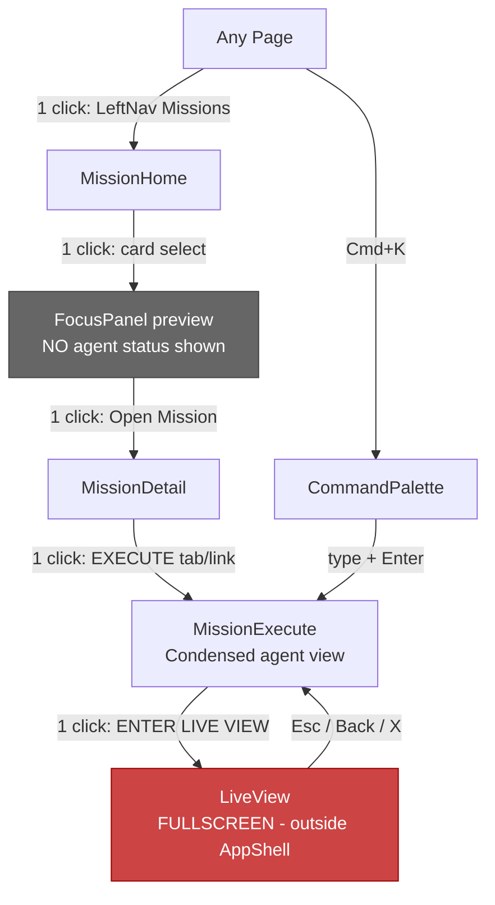
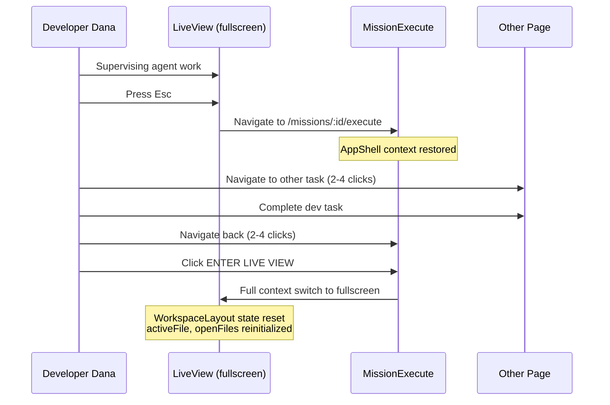
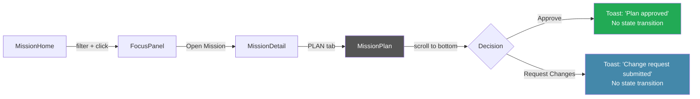
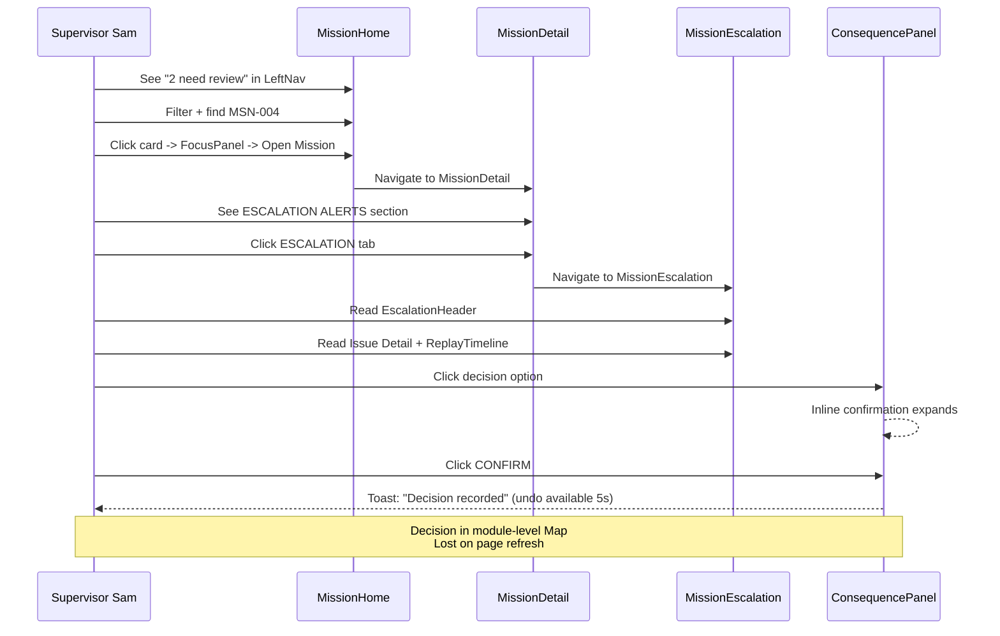
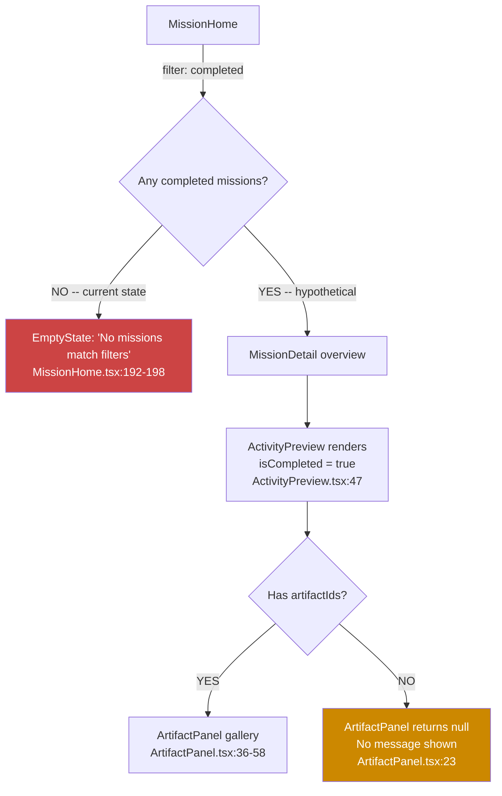
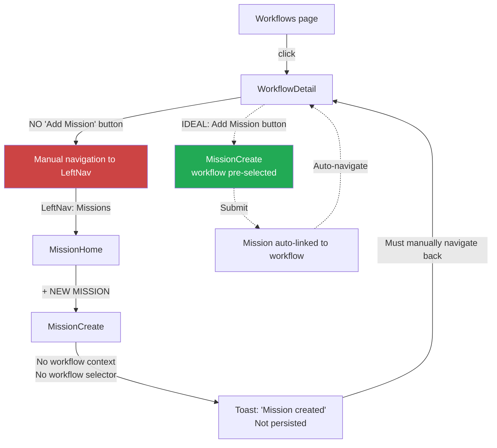
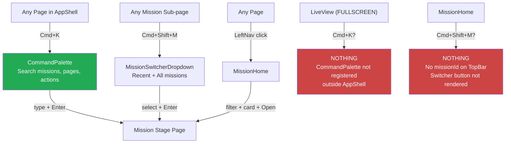

# User Journeys -- Mission Control HCI Review

> Document 5 of 10 | Date: 2026-03-24
> Cross-references: [conceptual-model.md](./conceptual-model.md), [information-architecture.md](./information-architecture.md), [state-model.md](./state-model.md)

---

## Overview

This document maps 7 critical user journeys through the Mission Control prototype. For each journey, we analyze the current interaction path, compute click counts, identify pain points, compare against ideal flows, and provide Mermaid diagrams.

### Personas

| Persona            | Role                       | Primary Goal                                                                  |
| ------------------ | -------------------------- | ----------------------------------------------------------------------------- |
| **Supervisor Sam** | Engineering manager        | Monitor agent work, approve/reject deliverables, handle escalations           |
| **Developer Dana** | IC engineer                | Check agent progress, review code, switch between supervision and development |
| **Ops Olivia**     | DevOps / platform engineer | Track costs, workflows, coordinate multi-mission efforts                      |

---

## Journey 1: "Check What the Agent Is Doing" (CRITICAL)

**Persona**: Developer Dana
**Goal**: See what an agent is currently doing on an in-flight mission
**Entry Point**: Any page within the AppShell
**Priority**: CRITICAL -- this is the primary use case for an agent supervision tool

### Current Flow

| Step | Screen         | Action                                                                                            | Component                                        | Click # |
| ---- | -------------- | ------------------------------------------------------------------------------------------------- | ------------------------------------------------ | ------- |
| 1    | Any page       | Click "Missions" in LeftNav                                                                       | `LeftNav.tsx:52-100`                             | 1       |
| 2    | MissionHome    | Locate mission in 360px sidebar list, click card                                                  | `MissionCard` in `MissionHome.tsx:184-190`       | 2       |
| 3    | MissionHome    | Read FocusPanel preview (goal, scope, badges). No agent status visible. Click "Open Mission"      | `FocusPanel.tsx:86-96`                           | 3       |
| 4    | MissionDetail  | Scroll to NAVIGATION section (line 260-296) or use StageTabBar (line 106). Click EXECUTE.         | `StageTabBar.tsx` or `MissionDetail.tsx:267-281` | 4       |
| 5    | MissionExecute | View condensed agent info: AgentSwimlane, 320px Execute Preview (agent log + code), session panes | `MissionExecute.tsx:206-330`                     | --      |
| 6    | MissionExecute | Want full view. Click "ENTER LIVE VIEW" button.                                                   | `MissionExecute.tsx:182-193`                     | 5       |
| 7    | LiveView       | FULLSCREEN mode. Outside AppShell. All shell context lost.                                        | `LiveView.tsx:170-203`                           | --      |

**Current click count: 5 (to LiveView), 4 (to Execute page)**

### Alternative Paths

| Path              | Mechanism                       | Clicks                | Notes                                                                                                                                                                             |
| ----------------- | ------------------------------- | --------------------- | --------------------------------------------------------------------------------------------------------------------------------------------------------------------------------- |
| CommandPalette    | Cmd+K, type mission name, Enter | 2 keystrokes + typing | Lands on mission's current stage page (`CommandPalette.tsx:64-76`). For execute-stage mission, lands directly on MissionExecute. Then 1 click to LiveView = 3 total.              |
| MissionSwitcher   | Cmd+Shift+M from TopBar         | 2 interactions        | Only available when already viewing a mission -- TopBar requires `missionId` prop (`TopBar.tsx:49`). Not available from MissionHome (`MissionHome.tsx:98` passes no `missionId`). |
| StageTabBar       | Click EXECUTE tab               | 1 click               | Only available on mission sub-pages. Not available from MissionHome.                                                                                                              |
| FocusPanel direct | Click "Open Mission"            | 1 click               | Routes to mission's current stage via `stageRoute()` (`FocusPanel.tsx:10-17`). For execute-stage missions, goes to MissionExecute directly (2 clicks from MissionHome).           |

### Ideal Flow

| Step | Screen      | Action                                                                                         | Click #     |
| ---- | ----------- | ---------------------------------------------------------------------------------------------- | ----------- |
| 1    | MissionHome | See inline agent activity preview in FocusPanel (live status, recent actions, terminal output) | 0 (visible) |
| 2    | MissionHome | Click "Watch" or similar affordance for split-view supervision                                 | 1           |

**Ideal click count: 1-2**

### Click Count Analysis

| Metric                         | Current                   | Ideal                     | Gap |
| ------------------------------ | ------------------------- | ------------------------- | --- |
| To see any agent status        | 3-4 (need MissionExecute) | 0 (visible in FocusPanel) | 3-4 |
| To full supervision (LiveView) | 5                         | 1-2                       | 3-4 |
| Via CommandPalette to Execute  | 3                         | 1-2                       | 1-2 |
| Via FocusPanel shortcut        | 2 (for execute-stage)     | 1                         | 1   |

### Pain Points

1. **FocusPanel is agent-blind** -- `FocusPanel.tsx` renders goal, scope, criteria, badges, evidence/escalation counts, owner, and an "Open Mission" link. It does NOT show: agent session status, recent agent actions, terminal output, code changes, or any live activity indicator. The single most important piece of information for a supervision tool -- "what is the agent doing right now?" -- is completely absent from the primary landing screen.

2. **LiveView severs all context** -- LiveView routes (`App.tsx:48-49`) are outside the AppShell. Entering LiveView means losing: LeftNav navigation, TopBar breadcrumbs, CommandPalette (Cmd+K), NotificationCenter, the bottom timestamp bar, and ErrorBoundary protection (`AppShell.tsx:85`). The only exit mechanisms are: Esc key (`LiveView.tsx:106-108`), the Back link in LiveViewHeader (`LiveView.tsx:43-50`), and the X close button (`LiveView.tsx:178-184`).

3. **MissionExecute is a poor middle ground** -- MissionExecute shows agent activity in a condensed form: AgentSwimlane components, a 320px-tall execute preview grid with agent log (last 8 entries, `MissionExecute.tsx:241`) and read-only CodeViewer, plus browser/terminal session panes. But this is NOT the same view as LiveView, which uses `WorkspaceLayout` (`WorkspaceLayout.tsx:47-77`) with a completely different component tree (FileTree, full CodeViewer, BrowserPreview, TerminalEmulator, AgentChatPanel). The user sees two different representations of the same underlying activity.

4. **No ambient activity indicators** -- LeftNav (`LeftNav.tsx:16-21`) shows counts of active missions and missions needing review. But there are no per-mission pulse indicators, no "agent completed a step" animations, and no way to tell from MissionHome which missions have agents actively working.

### Mermaid Flow Diagram

---

## Journey 2: "Quick-Switch Between Supervisor and Dev Mode"

**Persona**: Developer Dana
**Goal**: Toggle between supervising agent work (LiveView) and doing own development work (reviewing code, checking other missions, handling notifications)
**Entry Point**: LiveView (fullscreen)

### Current Flow

| Step | Screen         | Action                                                                | Component                    | Click # |
| ---- | -------------- | --------------------------------------------------------------------- | ---------------------------- | ------- |
| 1    | LiveView       | Press Esc to exit supervision                                         | `LiveView.tsx:106-108`       | 1       |
| 2    | MissionExecute | Context partially restored (inside AppShell). Navigate to other view. | --                           | 1+      |
| 3    | Other page     | Complete development task                                             | --                           | --      |
| 4    | Other page     | Navigate back to MissionExecute                                       | Various                      | 2-4     |
| 5    | MissionExecute | Click "ENTER LIVE VIEW"                                               | `MissionExecute.tsx:182-193` | 1       |
| 6    | LiveView       | Fullscreen again. All WorkspaceLayout state reset.                    | `WorkspaceLayout.tsx:31-32`  | --      |

**Current clicks per round-trip: 5-7**

### Ideal Flow

| Step | Screen         | Action                                                            | Click # |
| ---- | -------------- | ----------------------------------------------------------------- | ------- |
| 1    | MissionExecute | Press keyboard shortcut to toggle supervision panel               | 1       |
| 2    | MissionExecute | Split view: left = AppShell context, right = live workspace panel | 0       |

**Ideal clicks per toggle: 1**

### Click Count Analysis

| Metric                | Current                          | Ideal      | Gap |
| --------------------- | -------------------------------- | ---------- | --- |
| Exit supervision      | 1 (Esc)                          | 1 (toggle) | 0   |
| Return to supervision | 4-6 (nav back + ENTER LIVE VIEW) | 1 (toggle) | 3-5 |
| Full round-trip       | 5-7                              | 1-2        | 3-6 |

### Pain Points

1. **Full context switch per toggle** -- LiveView is rendered outside AppShell (`App.tsx:48-49`). There is no "docked" or "picture-in-picture" mode. Every entry into supervision is a full-screen takeover; every exit is a navigation event that changes the URL.

2. **WorkspaceLayout state resets on re-entry** -- `WorkspaceLayout.tsx:31-32` initializes `activeFile` and `openFiles` from the `workspace` prop on each mount. Since LiveView constructs `effectiveWorkspace` fresh each time (`LiveView.tsx:136-145`), any file navigation the user did during the previous LiveView session is lost.

3. **Esc key is overloaded** -- LiveView registers an Esc handler (`LiveView.tsx:106-108`) with `document.addEventListener('keydown', handler)`. If a CommandPalette, modal, or dropdown were open inside LiveView (they cannot be, since LiveView is outside AppShell), Esc would navigate away instead of closing the overlay. However, if LiveView eventually adds any overlays, this conflict would emerge.

4. **MissionExecute overview/chat toggle is unique** -- `MissionExecute.tsx:161-179` has a view mode toggle between OVERVIEW and CHAT. This toggle pattern exists nowhere else in the application. The `viewMode` state is local (`useState<'overview' | 'chat'>('overview')` at line 28) and is lost on navigation.

5. **No CommandPalette in LiveView** -- since LiveView is outside AppShell, the CommandPalette keyboard shortcut handler (registered in `AppShell.tsx:38-53`) does not run. The user cannot use Cmd+K to navigate to another mission without first exiting LiveView.

### Mermaid Sequence Diagram

---

## Journey 3: "Review and Approve a Plan"

**Persona**: Supervisor Sam
**Goal**: Read a mission plan, evaluate risks, approve or request changes
**Entry Point**: MissionHome or notification that MSN-003 is in plan stage

### Current Flow

| Step | Screen        | Action                                                                                                    | Component                                        | Click # |
| ---- | ------------- | --------------------------------------------------------------------------------------------------------- | ------------------------------------------------ | ------- |
| 1    | MissionHome   | Filter by stage: "plan"                                                                                   | `MissionHome.tsx:120-133`                        | 1       |
| 2    | MissionHome   | Click MSN-003 mission card                                                                                | `MissionCard`                                    | 2       |
| 3    | MissionHome   | Read FocusPanel. Click "Open Mission".                                                                    | `FocusPanel.tsx:86-96`                           | 3       |
| 4    | MissionDetail | Click PLAN in StageTabBar or NAVIGATION links                                                             | `StageTabBar.tsx` or `MissionDetail.tsx:267-281` | 4       |
| 5    | MissionPlan   | Read Goal (plain text, line 107-108), Scope (line 118-119), Criteria (line 130-137), Risks (line 151-158) | `MissionPlan.tsx:100-161`                        | --      |
| 6    | MissionPlan   | Scroll to bottom. Click "Approve Plan & Begin Execution"                                                  | `MissionPlan.tsx:166-177`                        | 5       |

**Current click count: 5**

### Alternative Path (CommandPalette)

| Step | Action                                                                                                                                   | Clicks       |
| ---- | ---------------------------------------------------------------------------------------------------------------------------------------- | ------------ |
| 1    | Cmd+K, type "MSN-003" or "timezone", Enter                                                                                               | 2 keystrokes |
| 2    | Lands on `/missions/MSN-003/plan` (CommandPalette routes to mission's own stage; MSN-003 is in `plan` stage, `CommandPalette.tsx:69-70`) | 0            |
| 3    | Read plan, scroll down, click Approve                                                                                                    | 1            |

**Alternative total: 3 interactions**

### Click Count Analysis

| Metric                | Current | Ideal                | Gap |
| --------------------- | ------- | -------------------- | --- |
| Navigate to plan page | 4       | 1-2 (CommandPalette) | 2-3 |
| Read + approve        | 1       | 1                    | 0   |
| Total                 | 5       | 2-3                  | 2-3 |

### Pain Points

1. **Plan content is plain text, NOT markdown** -- `MissionPlan.tsx:107-108` renders `mission.goal` inside `
{mission.goal}
`. This is raw text interpolation. Same treatment for scopeBoundary (line 118-119), acceptanceCriteria (line 130-137), and risks (line 151-158). The codebase has a `MarkdownViewer.tsx` component, but it is used ONLY inside `ArtifactPanel.tsx:107`. It is never used on the MissionPlan page. For complex plans with code snippets, links, or structured content, plain text rendering is inadequate.

2. **Approval buttons are at the bottom** -- the "Approve Plan & Begin Execution" and "Request Changes" buttons (`MissionPlan.tsx:165-188`) appear after ALL plan content (goal, scope, criteria, risks). On a mission with many criteria and risks, the user must scroll past everything to reach the CTA. There is no sticky action bar like MissionReview's `ApprovalBar` (`ApprovalBar.tsx:19-91`).

3. **No diff view for plan revisions** -- if a plan was sent back via "Request Changes" and revised, there is no way to see what changed. The plan page shows only the current snapshot.

4. **Evidence rail is empty for plan-stage missions** -- `MissionPlan.tsx:200-207` shows "No evidence gathered yet. Evidence will appear once execution begins." for MSN-003 (plan stage, `evidenceIds: []`). This leaves a 280px right column (`w-[280px]`, line 193) consuming screen real estate with a single line of placeholder text.

5. **Toast-only feedback, no state transition** -- clicking "Approve Plan" fires `show('Plan approved. Execution will begin shortly.', 'success')` (`MissionPlan.tsx:174`). No actual stage transition occurs. No navigation to the execute page. The mission remains in plan stage.

6. **Approval gated on stage only** -- the approval section renders only when `mission.stage === 'plan'` (`MissionPlan.tsx:164`). If the user views the plan page for a non-plan-stage mission, the approval CTA disappears silently with no explanation.

### Mermaid Flow Diagram

---

## Journey 4: "Handle an Escalation"

**Persona**: Supervisor Sam
**Goal**: Review an escalation, understand the issue, replay the timeline, and make a decision
**Entry Point**: MissionHome (see LeftNav "needs review" count)

### Current Flow

| Step | Screen            | Action                                                                                      | Component                       | Click # |
| ---- | ----------------- | ------------------------------------------------------------------------------------------- | ------------------------------- | ------- |
| 1    | MissionHome       | Notice "2 need review" in LeftNav bottom status                                             | `LeftNav.tsx:114-118`           | 0       |
| 2    | MissionHome       | Filter stage = "review" or "escalation", locate MSN-004                                     | `MissionHome.tsx:120-133`       | 1       |
| 3    | MissionHome       | Click MSN-004 card                                                                          | `MissionCard`                   | 2       |
| 4    | MissionHome       | Click "Open Mission" in FocusPanel                                                          | `FocusPanel.tsx:86-96`          | 3       |
| 5    | MissionDetail     | See ESCALATION ALERTS section (line 223-248). Click ESCALATION in StageTabBar or nav links. | `MissionDetail.tsx:267-281`     | 4       |
| 6    | MissionEscalation | Read EscalationHeader: type, title, summary, checkpoint                                     | `EscalationHeader.tsx:13-56`    | --      |
| 7    | MissionEscalation | Read Issue Detail section                                                                   | `MissionEscalation.tsx:130-140` | --      |
| 8    | MissionEscalation | Review ReplayTimeline                                                                       | `MissionEscalation.tsx:143-145` | --      |
| 9    | MissionEscalation | Click decision option in ConsequencePanel (right rail, 300px)                               | `ConsequencePanel.tsx:64-74`    | 5       |
| 10   | MissionEscalation | Read confirmation: "Are you sure? This will: [description]". Click CONFIRM.                 | `ConsequencePanel.tsx:122-138`  | 6       |

**Current click count: 6**

### Click Count Analysis

| Metric                      | Current | Ideal                                 | Gap |
| --------------------------- | ------- | ------------------------------------- | --- |
| Navigate to escalation page | 4       | 1-2 (notification -> escalation page) | 2-3 |
| Read + decide + confirm     | 2       | 2 (two-step is good)                  | 0   |
| Total                       | 6       | 3-4                                   | 2-3 |

### Pain Points

1. **Escalation is ambiguously both a stage and an overlay** -- `missions.ts:1` has a `@deprecated` comment noting that `'escalation'` as a stage is being replaced by the `escalationActive` overlay flag. MSN-004 has `stage: 'review'` with `escalationActive: true` (`missions.ts:159`). But the StageTabBar always shows an ESCALATION tab (`StageTabBar.tsx:9`) regardless of `escalationActive`. Users cannot tell whether "escalation" is a phase the mission enters or a concurrent concern overlaid on another stage.

2. **No urgency indicators on MissionHome** -- LeftNav shows "2 need review" count (`LeftNav.tsx:19-21`) but the MissionCard in MissionHome does not visually distinguish "needs review" from "has active escalation." The MissionSwitcherDropdown shows a warning icon for `escalationActive` (`MissionSwitcherDropdown.tsx:230-233`) but MissionHome's MissionCard does not.

3. **ConsequencePanel is in the right rail** -- decision options are in a 300px right column (`MissionEscalation.tsx:188-201`). The issue detail and replay timeline occupy the dominant center area. For a time-critical escalation where the decision IS the primary action, the action affordance is visually subordinate.

4. **Decision persistence is module-level but not backend-level** -- `ConsequencePanel.tsx:17` uses a `decisionStore` Map at module scope, so decisions survive component re-mounts within the same session. But a page refresh clears everything. The toast callback provides an undo function (`MissionEscalation.tsx:195-198`) that clears the decision from the store, but the toast auto-dismisses after 5000ms (`useToast(5000)` at line 24).

5. **Multiple escalation selector is below the fold** -- when a mission has multiple escalations (MSN-004 has ESC-002 and ESC-003), the selector appears at `MissionEscalation.tsx:148-184`, below the ReplayTimeline. A user might not scroll down to discover that additional escalations exist.

### Mermaid Sequence Diagram

---

## Journey 5: "Review Completed Mission Deliverables"

**Persona**: Supervisor Sam
**Goal**: Review final deliverables of a completed mission -- artifacts, test results, demo recordings
**Entry Point**: MissionHome

### Current Flow -- CANNOT BE COMPLETED

| Step | Screen      | Action                     | Result                                                              |
| ---- | ----------- | -------------------------- | ------------------------------------------------------------------- |
| 1    | MissionHome | Filter stage = "completed" | **0 results**                                                       |
| 2    | --          | --                         | EmptyState: "No missions match filters" (`MissionHome.tsx:192-198`) |

**Journey terminates. No completed missions exist in the dataset.**

### Data Evidence

All 5 missions in `missions.ts:37-192`:

| Mission | Stage     | Notes                                                               |
| ------- | --------- | ------------------------------------------------------------------- |
| MSN-001 | `review`  | Has `artifactIds: ['ART-001', 'ART-002']`                           |
| MSN-002 | `execute` | No artifacts                                                        |
| MSN-003 | `plan`    | No artifacts                                                        |
| MSN-004 | `review`  | Has `artifactIds: ['ART-003', 'ART-004']`, `escalationActive: true` |
| MSN-005 | `review`  | Has `artifactIds: ['ART-005', 'ART-006']`                           |

**0 completed missions. The completed stage path is NEVER exercised.**

### Hypothetical Flow (If a Completed Mission Existed)

| Step | Screen        | Action                                                                                                                                        | Component                                                             | Click # |
| ---- | ------------- | --------------------------------------------------------------------------------------------------------------------------------------------- | --------------------------------------------------------------------- | ------- |
| 1    | MissionHome   | Click completed mission card                                                                                                                  | `MissionCard`                                                         | 1       |
| 2    | MissionHome   | Click "Open Mission" in FocusPanel                                                                                                            | `FocusPanel.tsx:15-16` routes completed to overview (no stage suffix) | 2       |
| 3    | MissionDetail | ActivityPreview renders because `mission.stage !== 'plan'` (`MissionDetail.tsx:189`)                                                          | `ActivityPreview.tsx`                                                 | --      |
| 4    | MissionDetail | ActivityPreview shows ArtifactPanel: `isCompleted = mission.stage === 'completed' \|\| mission.stage === 'review'` (`ActivityPreview.tsx:47`) | `ArtifactPanel.tsx`                                                   | --      |
| 5    | MissionDetail | Click artifact thumbnails in gallery to view markdown/video/image/html                                                                        | `ArtifactPanel.tsx:36-58`                                             | 3       |

**Hypothetical click count: 3**

### Click Count Analysis

| Metric                        | Current          | Ideal | Gap      |
| ----------------------------- | ---------------- | ----- | -------- |
| Navigate to completed mission | N/A (impossible) | 2     | N/A      |
| View artifacts                | N/A              | 1     | N/A      |
| Total                         | Blocked          | 3     | CRITICAL |

### Pain Points

1. **CRITICAL: Zero completed missions in mock data** -- the entire completed-stage code path is untested. This includes: ActivityPreview rendering with `isCompleted = true`, ArtifactPanel display within ActivityPreview, the completed summary bar (`ActivityPreview.tsx:130-150`), and any empty states specific to the completed stage.

2. **ArtifactPanel returns null for empty artifacts** -- `ArtifactPanel.tsx:23` does `if (artifacts.length === 0) return null;`. If a completed mission has no `artifactIds`, the artifact section silently vanishes. No "No deliverables produced" or "No artifacts available" message is shown.

3. **No dedicated deliverables/completed page** -- there is no `/missions/:id/completed` or `/missions/:id/deliverables` route. Completed missions route to MissionDetail overview (the same layout as every other stage). There is no post-completion summary, no acceptance criteria pass/fail checklist, no deployment status.

4. **No demo video section** -- `ArtifactPanel` supports the `video` type (`ArtifactPanel.tsx:87-102`) with HTML5 `<video>` element and poster support. But there is no dedicated "demo recording" section, no embedded video player with chapters, and no screenshot gallery view.

5. **FocusPanel routes completed to overview** -- `FocusPanel.tsx:15-16`: `if (mission.stage === 'completed') return base;`. This means completed missions land on the generic overview. Unlike other stages that have dedicated sub-pages (plan, execute, review), completed has no specialization.

### Mermaid Flow Diagram

---

## Journey 6: "Create and Track a New Mission Within a Workflow"

**Persona**: Ops Olivia
**Goal**: Create a new mission that belongs to an existing workflow and track it through workflow context
**Entry Point**: Workflows page

### Current Flow

| Step | Screen         | Action                                                                                               | Component                 | Click #    |
| ---- | -------------- | ---------------------------------------------------------------------------------------------------- | ------------------------- | ---------- |
| 1    | Any page       | Click "Workflows" in LeftNav                                                                         | `LeftNav.tsx:7`           | 1          |
| 2    | Workflows page | Click a workflow card (e.g., WF-001)                                                                 | --                        | 2          |
| 3    | WorkflowDetail | See related missions in Kanban board. Want to add a new one.                                         | --                        | --         |
| 4    | WorkflowDetail | No "Add Mission to Workflow" button exists. Must navigate elsewhere.                                 | --                        | --         |
| 5    | WorkflowDetail | Click "Missions" in LeftNav                                                                          | `LeftNav.tsx:8`           | 3          |
| 6    | MissionHome    | Click "+ NEW MISSION"                                                                                | `MissionHome.tsx:105-112` | 4          |
| 7    | MissionCreate  | Fill in form. No workflow selector. No workflow pre-populated.                                       | --                        | 5 (submit) |
| 8    | MissionCreate  | Submit. Toast appears. Mission not actually persisted.                                               | --                        | --         |
| 9    | --             | Must manually navigate back to WorkflowDetail to verify (impossible since mission is not persisted). | --                        | 6-7        |

**Current click count: 6-7 (context lost at step 4)**

### Ideal Flow

| Step | Screen         | Action                                              | Click # |
| ---- | -------------- | --------------------------------------------------- | ------- |
| 1    | WorkflowDetail | Click "Add Mission" button (pre-linked to workflow) | 1       |
| 2    | MissionCreate  | Workflow pre-selected. Fill fields. Submit.         | 2       |
| 3    | WorkflowDetail | Auto-navigate back. New mission visible in Kanban.  | 0       |

**Ideal click count: 2**

### Click Count Analysis

| Metric                                | Current                         | Ideal             | Gap |
| ------------------------------------- | ------------------------------- | ----------------- | --- |
| Navigate from workflow to create form | 3 (workflow -> missions -> new) | 1 (inline button) | 2   |
| Fill + submit                         | 1                               | 1                 | 0   |
| Navigate back + verify                | 2-3 (manual)                    | 0 (auto-navigate) | 2-3 |
| Total                                 | 6-7                             | 2                 | 4-5 |

### Pain Points

1. **Disconnected creation context** -- MissionCreate (`/missions/new`, `App.tsx:61`) has no awareness of which workflow the user came from. There is no `?workflowId=WF-001` query parameter support. The `MissionCreate` component does not accept or use a workflow prop. The form has no workflow assignment dropdown.

2. **Workflow-scoped mission routes exist but creation does not** -- `App.tsx:73-81` defines routes like `workflows/:workflowId/missions/:missionId` for viewing missions within workflow context. But there is no `workflows/:workflowId/missions/new` route for workflow-contexted creation.

3. **No inline mission creation from WorkflowDetail** -- WorkflowDetail displays missions in a Kanban board organized by stage columns. There is no "+" button on any column to add a mission at that stage.

4. **Breadcrumbs work correctly for existing missions** -- once a mission is viewed within a workflow context, breadcrumbs are correct: `Workflows > [Workflow Title] > [Mission Title] > [Stage]` (e.g., `MissionPlan.tsx:66-70`). The problem is only in creation.

5. **Mission `workflowId` is optional and set in mock data** -- the `Mission` interface (`missions.ts:30`) has `workflowId?: string`. In mock data, MSN-001 and MSN-002 are in WF-001, MSN-004 is in WF-002, MSN-005 is in WF-003, and MSN-003 has no `workflowId`. The creation form cannot set this field.

### Mermaid Flow Diagram

---

## Journey 7: "Find a Specific Mission Quickly"

**Persona**: Any persona
**Goal**: Navigate to a specific mission as fast as possible, regardless of current location in the app
**Entry Point**: Any page

### Path A: CommandPalette (Cmd+K) -- BEST PATH

| Step | Screen                  | Action                            | Component                    | Interaction # |
| ---- | ----------------------- | --------------------------------- | ---------------------------- | ------------- |
| 1    | Any page in AppShell    | Cmd+K                             | `AppShell.tsx:41-44`         | 1             |
| 2    | CommandPalette overlay  | Type mission ID or title fragment | `CommandPalette.tsx:39-48`   | typing        |
| 3    | CommandPalette          | Arrow down if needed, press Enter | `CommandPalette.tsx:108-110` | 1             |
| 4    | Target mission sub-page | Arrives at stage-appropriate page | --                           | --            |

**Total: 2 keystrokes + typing**

CommandPalette behavior details:

- Searches: mission title, ID (`m.id`), and owner (`m.owner`) via `String.includes()` (`CommandPalette.tsx:43-46`)
- Stage-preserving: if current URL has a stage suffix (plan/execute/review), navigates target mission to that same stage (`CommandPalette.tsx:32-37, 69-70`)
- Falls back to mission's own stage if no stage in current URL
- Also lists: 5 navigation pages (Missions, Workflows, History, Settings, Costs) and 1 action ("Create Mission") (`CommandPalette.tsx:14-22`)

### Path B: MissionSwitcherDropdown (Cmd+Shift+M)

| Step | Screen                  | Action                            | Component                                    | Interaction # |
| ---- | ----------------------- | --------------------------------- | -------------------------------------------- | ------------- |
| 1    | Any mission sub-page    | Cmd+Shift+M                       | `AppShell.tsx:46-48` dispatches custom event | 1             |
| 2    | MissionSwitcherDropdown | Keyboard navigate or click target | `MissionSwitcherDropdown.tsx:64-83`          | 1             |

**Total: 2 interactions. ONLY available when viewing a mission.**

MissionSwitcher behavior details:

- Shows RECENT section (tracked via `useRecentMissions` hook, `MissionSwitcherDropdown.tsx:33`) then ALL MISSIONS
- Stage-preserving: uses current stage from URL, falls back to target mission's own stage (`MissionSwitcherDropdown.tsx:54-56`)
- Shows: stage dot color, escalationActive warning icon, "current" indicator (`MissionSwitcherDropdown.tsx:208-241`)
- Keyboard: arrow keys, Enter, Esc (`MissionSwitcherDropdown.tsx:64-83`)
- **Gating**: only renders when `missionId` is passed to TopBar (`TopBar.tsx:49`). Not available from MissionHome.

### Path C: MissionHome Filters

| Step | Screen      | Action                                        | Component                 | Click # |
| ---- | ----------- | --------------------------------------------- | ------------------------- | ------- |
| 1    | Any page    | Click Missions in LeftNav                     | `LeftNav.tsx:52-100`      | 1       |
| 2    | MissionHome | Apply stage/risk filters or use sort dropdown | `MissionHome.tsx:115-178` | 1-2     |
| 3    | MissionHome | Click mission card in 360px sidebar           | `MissionHome.tsx:184-190` | 1       |
| 4    | MissionHome | Click "Open Mission" in FocusPanel            | `FocusPanel.tsx:86-96`    | 1       |

**Total: 4-5 clicks. Slowest but supports discovery.**

### Click Count Analysis

| Path                   | Clicks/Interactions | Availability           | Best For                                     |
| ---------------------- | ------------------- | ---------------------- | -------------------------------------------- |
| A: CommandPalette      | 2 + typing          | Any page in AppShell   | Known mission by name/ID                     |
| B: MissionSwitcher     | 2                   | Mission sub-pages only | Switching between recent missions            |
| C: MissionHome filters | 4-5                 | Universal              | Discovery, triage, when mission name unknown |

### Pain Points

1. **CommandPalette not available in LiveView** -- LiveView is outside AppShell (`App.tsx:48-49`). The CommandPalette component is rendered inside AppShell (`AppShell.tsx:70`). The Cmd+K handler is registered in AppShell (`AppShell.tsx:38-53`). Users in LiveView cannot use Cmd+K to navigate anywhere.

2. **MissionSwitcher not available from MissionHome** -- `MissionHome.tsx:98` renders `<TopBar breadcrumbs={[{label:'Missions'}]} />` with no `missionId` prop. The MissionSwitcherDropdown button only renders when `missionId` is truthy (`TopBar.tsx:49`). Pressing Cmd+Shift+M on the most common landing page does nothing.

3. **MissionHome list is not keyboard-navigable** -- the mission card list (`MissionHome.tsx:182-200`) uses mouse click only. No arrow key navigation, no Enter-to-open. The only keyboard shortcut on MissionHome is 'n' for new mission (`MissionHome.tsx:78-88`).

4. **No search-as-you-type on MissionHome** -- the MissionHome sidebar has stage and risk filters but no text search input. The only text search is via CommandPalette (Cmd+K). Users who want to search by mission title or owner while seeing the full MissionHome layout cannot do so.

5. **TopBar Search icon is discoverable but not obvious** -- the Search icon in TopBar (`TopBar.tsx:114-120`) opens the CommandPalette via `handleOpenCommandPalette`. This works correctly (via context from AppShell, `TopBar.tsx:26`), but there is no tooltip or shortcut hint visible next to the icon.

### Mermaid Flow Diagram

---

## Click Count Summary

| #   | Journey                       | Current Clicks          | Ideal Clicks | Gap | Severity             |
| --- | ----------------------------- | ----------------------- | ------------ | --- | -------------------- |
| 1   | Check agent activity          | 4-5                     | 1-2          | 3-4 | **CRITICAL**         |
| 2   | Supervisor/dev mode toggle    | 5-7 per round-trip      | 1-2          | 3-6 | **HIGH**             |
| 3   | Review and approve plan       | 3-5                     | 2-3          | 1-2 | **MEDIUM**           |
| 4   | Handle escalation             | 6                       | 3-4          | 2-3 | **HIGH**             |
| 5   | Review completed deliverables | N/A (blocked by data)   | 3            | N/A | **CRITICAL**         |
| 6   | Create mission in workflow    | 6-7                     | 2            | 4-5 | **HIGH**             |
| 7   | Find specific mission         | 2 (Cmd+K) to 5 (manual) | 2            | 0-3 | **LOW** (Cmd+K path) |

---

## Cross-Journey Themes

### Theme 1: Context Loss at AppShell/LiveView Boundary

The routing architecture (`App.tsx:47-49`) places LiveView outside the AppShell. This affects Journeys 1, 2, and 7:

- Journey 1: reaching full supervision requires exiting all shell context
- Journey 2: every supervision toggle is a full context switch
- Journey 7: CommandPalette (Cmd+K) is unavailable in LiveView

**Structural root cause**: LiveView routes are siblings of the AppShell route, not children. The `AppShell` component provides `CommandPaletteContext` and `MissionSwitcherContext` (`AppShell.tsx:65-66`) which are not available outside it.

### Theme 2: FocusPanel is Underutilized

`FocusPanel.tsx` renders: mission ID, title, stage/risk/verification badges, goal, scope boundary, acceptance criteria, evidence + escalation counts, owner, and an "Open Mission" link.

It does NOT render:

- Agent activity status (active, paused, failed, completed)
- Recent agent actions or log entries
- Evidence progress (pass/fail ratio)
- Escalation urgency indicators
- Quick actions (approve, pause, enter LiveView)
- Terminal output preview
- Branch or code change status

This panel is the most valuable real estate for reducing click depth across Journeys 1, 3, 4, and 5, but currently functions only as a read-only summary.

### Theme 3: Navigation Redundancy on MissionDetail

MissionDetail has BOTH:

- `StageTabBar` at line 106 (OVERVIEW | PLAN | EXECUTE | REVIEW | ESCALATION tabs)
- NAVIGATION section at lines 260-296 (PLAN | EXECUTE | REVIEW | ESCALATION buttons + ENTER LIVE VIEW)

These provide identical navigation to the same destinations (except the NAVIGATION section also includes the LiveView link). The StageTabBar is also present on every sub-page (Plan, Execute, Review, Escalation), making the NAVIGATION section on MissionDetail purely redundant.

### Theme 4: No Global "What Needs Attention" Dashboard

No journey starts with "what needs my attention across all missions right now?" The LeftNav bottom status (`LeftNav.tsx:112-118`) shows aggregate counts but they are not clickable links. The NotificationCenter exists but is a dropdown, not a dashboard. There is no "inbox zero" or prioritized action queue that would let a supervisor start their day efficiently.
