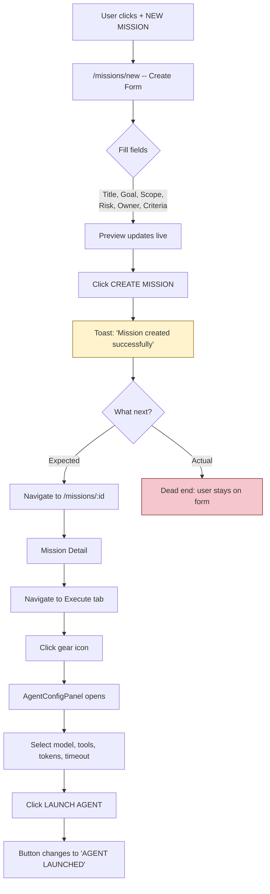
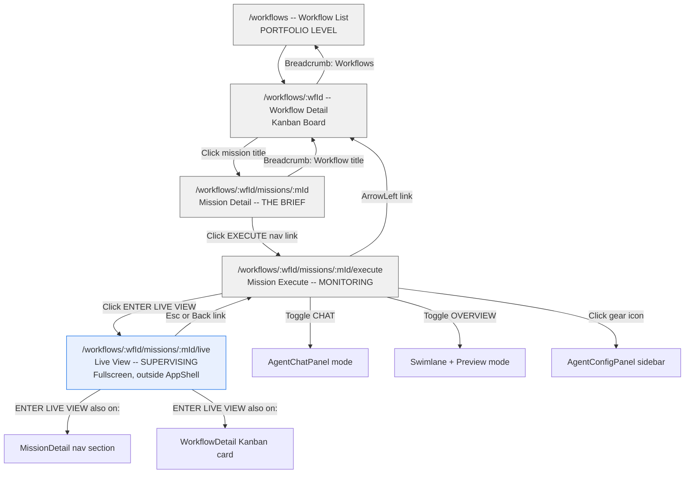
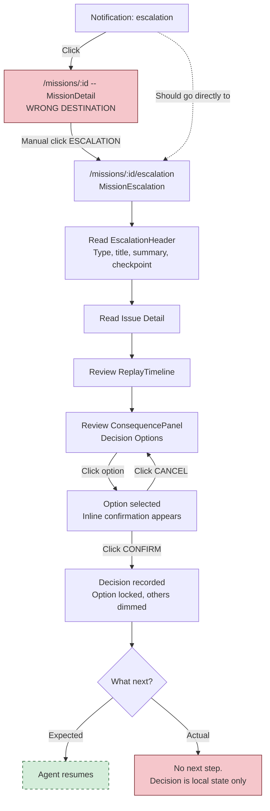

# User Journey Map -- Mission Control

**Document**: `docs/hci/user-journeys.md`
**Date**: 2026-03-23
**Scope**: All primary user journeys in the Mission Control prototype (v0.1.0)
**Method**: Walkthrough analysis of implemented routes, components, and interaction paths

---

## Table of Contents

1. [Journey 1: First-Time Orientation](#journey-1-first-time-orientation)
2. [Journey 2: Create and Launch a Mission](#journey-2-create-and-launch-a-mission)
3. [Journey 3: Monitor Active Agents (The Zoom Pattern)](#journey-3-monitor-active-agents-the-zoom-pattern)
4. [Journey 4: Handle an Escalation](#journey-4-handle-an-escalation)
5. [Journey 5: Review and Approve Agent Work](#journey-5-review-and-approve-agent-work)
6. [Journey 6: Triage Mission Inbox](#journey-6-triage-mission-inbox)
7. [Journey 7: Recover from Agent Failure](#journey-7-recover-from-agent-failure)
8. [Cross-Journey Friction Synthesis](#cross-journey-friction-synthesis)

---

## Journey 1: First-Time Orientation

**User goal**: Understand what Mission Control is, what it shows, and where to start.

**Preconditions**: User has been given a URL. No prior exposure to Mission Control. Missions already exist in the system (prototype ships with seed data).

### Main Flow

| Step | User Action                            | System Response                                                                                                                                                                                          | User Perceives                                                                                              |
| ---- | -------------------------------------- | -------------------------------------------------------------------------------------------------------------------------------------------------------------------------------------------------------- | ----------------------------------------------------------------------------------------------------------- |
| 1    | Opens `/` in browser                   | `<Navigate to="/missions" replace />` redirects to `/missions`                                                                                                                                           | Page loads with a left nav, top bar, and a split-pane mission list                                          |
| 2    | Scans LeftNav                          | Sees: Workflows, Missions (with count badge), Costs, History, Settings. Bottom status shows "N active missions" and "N need review"                                                                      | Two primary entry points (Workflows, Missions) with a separator line distinguishing them from utility pages |
| 3    | Reads TopBar                           | Breadcrumbs show "Missions / Inbox". Right side has search icon, bell (notification center with unread badge), user avatar "SC", and a date stamp                                                        | Orientation cues: where am I (breadcrumbs), what needs attention (bell badge)                               |
| 4    | Scans mission list (left 360px column) | Sees "+ NEW MISSION" button, stage filters (ALL/PLAN/EXECUTE/REVIEW/ESCALATION), risk filters (ALL/LOW/MEDIUM/HIGH), then sorted mission cards                                                           | Understands that missions have stages and risk levels                                                       |
| 5    | Reads first mission card               | Card shows mission title, stage badge, risk badge, verification state                                                                                                                                    | Gets a sense of the information density per mission                                                         |
| 6    | Notices right pane (FocusPanel)        | First mission is auto-selected; FocusPanel shows ID, title, stage/risk/verification badges, goal, scope boundary, acceptance criteria, evidence + escalation counts, owner, and an "Open Mission" button | Learns the preview/detail split without navigating away                                                     |
| 7    | Clicks "Open Mission"                  | Navigates to `/missions/:id/:stage` (the mission's current stage page)                                                                                                                                   | Enters the mission-specific view                                                                            |

### Alternative Flows

- **A1: User opens `/workflows` first** -- sees workflow cards with Kanban boards. Missions are listed within workflows. Clicking a mission card navigates to `/workflows/:wfId/missions/:mId` (same MissionDetail, workflow-contexted breadcrumbs).
- **A2: User presses Ctrl+K** -- CommandPalette opens. Shows all missions (searchable by title, ID, owner), navigation pages, and a "Create Mission" action. User can jump anywhere.
- **A3: User clicks notification bell** -- dropdown shows unread notifications with type icons (escalation, agent-failure, evidence, stage-change, approval). Clicking navigates to `/missions/:missionId` (always the detail page, not the stage-specific page).

### Error Paths

- **E1: User navigates to an unknown URL** -- NotFound page shows "Page not found" with a "Go to Missions" link. No breadcrumb trail to recover from.
- **E2: User lands on a mission that does not exist** -- MissionDetail shows "Mission not found" with breadcrumbs back to Missions.

### Exit State

User understands the LeftNav structure, the mission-as-primary-object pattern, and has previewed at least one mission in the FocusPanel.

### Confusion Risks

1. **No onboarding or empty-state guidance.** The prototype ships with seed data. A real deployment with zero missions would show "No missions match filters" -- no guidance on what to do next. The "+ NEW MISSION" button is above the filters, which helps, but there is no welcome message or tutorial.
2. **"Inbox" breadcrumb is unexplained.** TopBar says "Missions / Inbox" but there is no explanation of what "Inbox" means versus other possible views.
3. **FocusPanel auto-selects the first mission** (`missions[0]?.id`). If the user has not clicked anything, they see detail for a mission they did not choose. This is reasonable but could mislead the user into thinking the first mission is special.
4. **Notification click goes to MissionDetail (`/missions/:id`), not the stage page.** If the notification is about an escalation, the user lands on the overview and must manually navigate to the escalation tab.
5. **CommandPalette search icon in TopBar is not wired up.** The `onOpenCommandPalette` prop is not passed from AppShell to TopBar -- the search icon in the TopBar does nothing. Only Ctrl+K works. This is a dead interaction.

### Design Recommendations

- Wire the TopBar search icon to open CommandPalette (pass the handler through or use a context/store).
- Add an empty-state component for zero-missions that explains what Mission Control is and prompts creation.
- Route notification clicks to the relevant stage page (e.g., escalation notification goes to `/missions/:id/escalation`), not just the detail overview.
- Consider a first-run tooltip or brief onboarding overlay explaining the zoom pattern.

---

## Journey 2: Create and Launch a Mission

**User goal**: Define a new mission, configure an agent, and start execution.

**Preconditions**: User is anywhere in the app.

### Main Flow

| Step | User Action                                                                            | System Response                                                          | User Perceives                                                                                                                                                                     |
| ---- | -------------------------------------------------------------------------------------- | ------------------------------------------------------------------------ | ---------------------------------------------------------------------------------------------------------------------------------------------------------------------------------- |
| 1    | Clicks "+ NEW MISSION" on MissionHome, or selects "Create Mission" from CommandPalette | Navigates to `/missions/new` (MissionCreate)                             | A form/preview split: 60% form on left, 40% live preview card on right                                                                                                             |
| 2    | Fills in Title                                                                         | Preview card updates in real-time with title                             | Direct feedback loop; feels responsive                                                                                                                                             |
| 3    | Fills in Goal                                                                          | Preview card updates                                                     | Same                                                                                                                                                                               |
| 4    | Fills in Scope Boundary                                                                | Preview card updates                                                     | Same                                                                                                                                                                               |
| 5    | Selects Risk Tier (dropdown: LOW/MEDIUM/HIGH)                                          | Preview card shows risk badge                                            | Simple, clear choice                                                                                                                                                               |
| 6    | Enters Owner name                                                                      | Preview card shows owner                                                 | Free text, no user picker                                                                                                                                                          |
| 7    | Adds Acceptance Criteria (type + Enter or click "+")                                   | Criteria appear as removable list items below input                      | Clear add/remove pattern                                                                                                                                                           |
| 8    | Adds Identified Risks (same pattern)                                                   | Risks appear as removable list items                                     | Same pattern, good consistency                                                                                                                                                     |
| 9    | Clicks "CREATE MISSION"                                                                | Toast appears: "Mission created successfully." Auto-hides after 2s       | **Problem: The mission is not actually persisted.** The prototype shows a toast but does not add the mission to the data store, navigate to the new mission, or provide next steps |
| 10   | _(Expected)_ Navigate to new mission                                                   | **Does not happen.** User is left on the create form with the toast gone | Dead end. User must manually navigate away                                                                                                                                         |

### Alternative Flows

- **A1: User wants to assign to a workflow** -- There is no workflow assignment field on the create form. Missions are created unassigned. The Workflows page shows "UNASSIGNED MISSIONS" at the bottom, but there is no mechanism to assign a mission to a workflow from either the create form or the workflow page.
- **A2: User wants to configure and launch an agent** -- The agent configuration (AgentConfigPanel) is only accessible from the MissionExecute page via the gear icon. The create flow does not include agent setup. The user must: create mission -> navigate to mission detail -> navigate to execute tab -> click gear icon -> configure agent -> click "LAUNCH AGENT".

### Error Paths

- **E1: User clicks CREATE without filling required fields** -- No validation. The mission is "created" with placeholders ("Untitled Mission", "No goal specified", "No scope defined", "Unassigned"). No warning.
- **E2: User accidentally navigates away mid-form** -- No draft saving, no unsaved-changes prompt. All input is lost.

### Exit State (Actual)

User sees a 2-second toast and remains on the create form. No mission was persisted. The journey is incomplete.

### Exit State (Expected)

User should be navigated to the new mission's detail page, with a clear prompt to proceed to planning or agent configuration.

### Confusion Risks

1. **Create does not persist.** The `handleCreate` function only triggers a toast. In a prototype context this is understandable, but it creates a broken journey where the user cannot complete the task.
2. **No validation feedback.** Title, Goal, Scope Boundary, and Owner have no required indicators or validation messages.
3. **No workflow assignment.** Users cannot associate a mission with a workflow during creation. This is a multi-step manual process that the prototype does not surface.
4. **No agent configuration in the create flow.** The path from "create" to "launch" requires navigating through detail -> execute -> config panel. This is 4+ clicks with no guided flow.
5. **Owner is a free-text field.** No user directory or autocomplete. Risk of inconsistent owner names across missions.

### Design Recommendations

- After successful creation, navigate to `/missions/:newId` or `/missions/:newId/plan` with a "Mission created" confirmation.
- Add required field indicators and client-side validation before the CREATE button activates.
- Add a workflow assignment dropdown (optional) to the create form.
- Consider a post-creation wizard: "Mission created. Next: Configure agent?" with a direct link to AgentConfigPanel.
- Add an unsaved-changes guard (`beforeunload` or router blocker).

---

## Journey 3: Monitor Active Agents (The Zoom Pattern)

**User goal**: Check the status of executing missions and drill into live agent activity.

**Preconditions**: At least one mission is in the "execute" stage with active agent sessions.

### Main Flow

| Step | User Action                                | System Response                                                                                                                            | User Perceives                                                                                                                                                                                                                                                                |
| ---- | ------------------------------------------ | ------------------------------------------------------------------------------------------------------------------------------------------ | ----------------------------------------------------------------------------------------------------------------------------------------------------------------------------------------------------------------------------------------------------------------------------- |
| 1    | Clicks "Workflows" in LeftNav              | Navigates to `/workflows`. Shows workflow cards with Kanban boards                                                                         | Portfolio-level view: all workflows, missions organized by stage columns (PLAN/EXECUTE/REVIEW/ESCALATION)                                                                                                                                                                     |
| 2    | Clicks a workflow title                    | Navigates to `/workflows/:wfId` (WorkflowDetail). Kanban board with MissionBoardCards                                                      | Missions organized as cards in stage columns. Execute-stage cards show "ENTER LIVE VIEW" button                                                                                                                                                                               |
| 3    | Clicks mission title in Kanban card        | Navigates to `/workflows/:wfId/missions/:mId` (MissionDetail)                                                                              | "The brief": header, goal, scope, criteria, risk assessment, agent sessions summary, evidence summary, escalation alerts, timeline, navigation links                                                                                                                          |
| 4    | Clicks "EXECUTE" in the NAVIGATION section | Navigates to `/workflows/:wfId/missions/:mId/execute` (MissionExecute)                                                                     | "Monitoring": three-column layout. Left: mission context sidebar (260px). Center: agent swimlanes, execute preview (agent log + code viewer), session panes. Right: evidence rail (260px)                                                                                     |
| 5    | Scans Execute Preview                      | Split pane showing last 8 agent log entries on left, code viewer on right. Below: evidence pass count, terminal status, active agent count | Quick monitoring without entering Live View                                                                                                                                                                                                                                   |
| 6    | Toggles OVERVIEW/CHAT                      | Center content switches between swimlane overview and AgentChatPanel                                                                       | Two monitoring modes at the same zoom level                                                                                                                                                                                                                                   |
| 7    | Clicks "ENTER LIVE VIEW" button            | Navigates to `/workflows/:wfId/missions/:mId/live` (LiveView). **Exits AppShell entirely** -- fullscreen mode                              | "Supervising": fullscreen workspace. Top bar: "LIVE SUPERVISION MODE" in accent color, "Press Esc to exit". Below: breadcrumb with Back link, branch badge, active agent count. Main area: WorkspaceLayout with file tree, code editor, terminal, agent chat, browser session |
| 8    | Works in Live View                         | Can view code, see agent activity, monitor terminal and browser sessions                                                                   | Full IDE-like experience for active supervision                                                                                                                                                                                                                               |
| 9    | Presses Esc                                | `useEffect` handler navigates back to the execute page                                                                                     | Returns to the execute monitoring view inside AppShell                                                                                                                                                                                                                        |

### Alternative Flows

- **A1: Direct from MissionDetail** -- The NAVIGATION section has an "ENTER LIVE VIEW" button (with Eye icon, accent-colored border). Also accessible from WorkflowDetail's Kanban cards (execute-stage missions show "ENTER LIVE VIEW").
- **A2: Direct from MissionHome** -- FocusPanel's "Open Mission" button goes to the mission's current stage. If the mission is in execute stage, it goes to `/missions/:id/execute`, where "ENTER LIVE VIEW" is available.
- **A3: From CommandPalette** -- Selecting a mission navigates to `/missions/:id/:stage`. If the mission is in execute stage, the user lands on MissionExecute.
- **A4: Backing out of Live View** -- The "Back" link in LiveViewHeader navigates to the execute page. Esc key does the same. Both paths are consistent.

### Error Paths

- **E1: Mission not found in Live View** -- Shows "Mission not found" with mission ID and a "Return to Missions" link. This is a fullscreen error page (no AppShell).
- **E2: No workspace data for mission** -- Live View constructs an `effectiveWorkspace` with empty defaults. WorkspaceLayout renders but with empty file tree, no terminal, no browser session. The user sees a functional but empty workspace.

### Exit State

User has monitored agent activity at their chosen zoom level and returned to the execute page or navigated elsewhere.

### Confusion Risks

1. **Live View is outside AppShell.** The LeftNav, TopBar, NotificationCenter, and CommandPalette all disappear. The user loses all navigation affordances except the Back link and Esc key. If a notification arrives during Live View, the user cannot see it.
2. **No indication from MissionHome that a mission has live activity.** The MissionCard in MissionHome does not show an "ENTER LIVE VIEW" shortcut. The user must drill through MissionDetail or MissionExecute to reach it.
3. **Execute Preview agent log is limited to last 8 entries** (`s.steps.slice(-8)`). There is no "show more" or scroll indicator. The user might not realize they are seeing a truncated view.
4. **The zoom pattern has 4 levels but no visual map.** There is no breadcrumb or progress indicator showing "you are at level 3 of 4" to help the user understand the hierarchy.

### Design Recommendations

- Add a notification indicator to the Live View header bar (even if simplified).
- Add a "LIVE" indicator badge on MissionCards in MissionHome for execute-stage missions with active agents.
- Add a "Show full log" link below the truncated agent log in Execute Preview.
- Consider a zoom-level indicator in the breadcrumb trail.

---

## Journey 4: Handle an Escalation

**User goal**: Respond to an escalation notification, understand the issue, make a decision, and unblock the agent.

**Preconditions**: An escalation exists for a mission. A notification has been generated.

### Main Flow

| Step | User Action                                   | System Response                                                                                                                                               | User Perceives                                                                                                                                                      |
| ---- | --------------------------------------------- | ------------------------------------------------------------------------------------------------------------------------------------------------------------- | ------------------------------------------------------------------------------------------------------------------------------------------------------------------- |
| 1    | Sees unread badge on bell icon                | NotificationCenter shows count (e.g., "4") in red circle                                                                                                      | Something needs attention                                                                                                                                           |
| 2    | Clicks bell icon                              | Dropdown opens. Unread notifications have accent-colored left border. Escalation notifications show AlertTriangle icon                                        | Can scan notification titles and details. Sees "New escalation: Refresh token race condition"                                                                       |
| 3    | Clicks the escalation notification            | `handleClick` marks it read and navigates to `/missions/:missionId` (MissionDetail overview)                                                                  | **Problem: lands on MissionDetail, not the escalation page.** User sees the overview with escalation alerts listed but must manually navigate to the escalation tab |
| 4    | Scrolls down to ESCALATION ALERTS section     | Sees the escalation title and type badge                                                                                                                      | Confirms the escalation exists                                                                                                                                      |
| 5    | Clicks "ESCALATION" in the NAVIGATION section | Navigates to `/missions/:mId/escalation` (MissionEscalation)                                                                                                  | Escalation page: EscalationHeader (type label, title in accent banner, summary, checkpoint, timestamp), then split layout                                           |
| 6    | Reads EscalationHeader                        | Sees type (e.g., "CONFLICTING EVIDENCE"), title in prominent accent banner, summary text, checkpoint reference, and timestamp                                 | Understands the category and urgency of the escalation                                                                                                              |
| 7    | Reads Issue Detail panel                      | Full detail text explaining the technical issue                                                                                                               | Gets the deep context needed to make a decision                                                                                                                     |
| 8    | Reviews ReplayTimeline                        | Shows the agent session steps leading to the escalation                                                                                                       | Understands what the agent was doing when the issue arose                                                                                                           |
| 9    | Reviews ConsequencePanel (right rail, 300px)  | Shows DECISION OPTIONS: each option is a card with label, description, and risk assessment (HeatNode + risk text)                                             | Can compare options with their trade-offs                                                                                                                           |
| 10   | Clicks a decision option                      | Option expands inline: "Are you sure? This will: [description]" with CONFIRM and CANCEL buttons                                                               | Two-step confirmation prevents accidental decisions                                                                                                                 |
| 11   | Clicks CONFIRM                                | Option card changes to show checkmark, option label in green, and "Decision recorded at [time]". Other options are dimmed (opacity 0.4, pointer-events: none) | Decision is final. Clear visual feedback                                                                                                                            |

### Alternative Flows

- **A1: User navigates directly to escalation page** -- from CommandPalette (which routes to the mission's current stage) or from MissionDetail's NAVIGATION links.
- **A2: Multiple escalations on one mission** -- The primary escalation (first in array) is shown in the EscalationHeader and ConsequencePanel. Additional escalations are listed below the ReplayTimeline as "RELATED ESCALATIONS (N)" with title and summary only. **Problem: there is no way to switch which escalation is the "primary" one being decided on.**
- **A3: Mission has no escalations** -- MissionEscalation shows "No escalations for this mission" centered text. Dead end if user navigated here manually.

### Error Paths

- **E1: User clicks CANCEL after selecting an option** -- `selectedOption` is set to null. The option cards return to their normal state. No decision recorded.
- **E2: User navigates away before confirming** -- All ConsequencePanel state is local (`useState`). Decision is lost. No persistence, no draft.

### Exit State

User has made a decision on one escalation option. The confirmed option is visually locked. However, the decision is not persisted (local state only) and the mission stage does not change. There is no "next step" guidance.

### Confusion Risks

1. **Notification navigates to MissionDetail, not MissionEscalation.** This adds 2 unnecessary clicks for the most time-sensitive journey.
2. **Decision is local state only.** Refreshing the page resets the decision. There is no confirmation that the decision has been sent to the agent or system.
3. **Only the first escalation has a ConsequencePanel.** Related escalations are listed but cannot be acted on individually.
4. **No "unblock agent" action after the decision.** The user makes a decision but there is no visible mechanism to resume the agent. The journey ends ambiguously.
5. **Back link in MissionEscalation goes to `/missions` (or `/workflows/:wfId`), not to MissionDetail.** The user loses the mission context.

### Design Recommendations

- Route escalation notifications directly to `/missions/:id/escalation`.
- Persist escalation decisions and trigger a visible stage transition or agent resumption.
- Allow users to select which escalation to act on when multiple exist.
- Add a post-decision call-to-action: "Decision recorded. Agent will resume with [option label]."
- Make the back link go to MissionDetail (the parent of the escalation page in the zoom hierarchy).

---

## Journey 5: Review and Approve Agent Work

**User goal**: Review what an agent has produced, verify evidence, and approve, reject, or re-plan.

**Preconditions**: A mission is in the "review" stage.

### Main Flow

| Step | User Action                                                                                                                                      | System Response                                                                                                                                                   | User Perceives                                                                                                                                                                    |
| ---- | ------------------------------------------------------------------------------------------------------------------------------------------------ | ----------------------------------------------------------------------------------------------------------------------------------------------------------------- | --------------------------------------------------------------------------------------------------------------------------------------------------------------------------------- |
| 1    | Navigates to `/missions/:id/review` (via MissionDetail NAVIGATION link, FocusPanel "Open Mission" for a review-stage mission, or CommandPalette) | MissionReview loads. ApprovalBar at top, DiffByIntent in center, EvidenceRail on right (280px)                                                                    | Three-zone layout optimized for review                                                                                                                                            |
| 2    | Reads ApprovalBar (sticky top)                                                                                                                   | Shows either "Ready for approval" (green, with checkmark) or "N blockers remaining" (with warning icon). Right side has three buttons: Re-plan, Reject, Approve   | Immediately knows if the mission can be approved. Approve button is visually disabled (opacity 0.5, cursor not-allowed) when blockers exist                                       |
| 3    | Reads DiffByIntent section                                                                                                                       | Changes grouped by acceptance criterion. Each group shows: criterion text, affected files with +/- line counts, and a summary of what changed and why             | **Key design decision**: changes are not shown file-by-file but intent-by-intent. The user reads "All /api/v2/\* routes require valid JWT" and sees the 3 files that implement it |
| 4    | Cross-references with EvidenceRail                                                                                                               | Right rail shows pass/fail/warn counts, filterable by type (Tests/Policy/Traces/Risk), sortable by newest or status. Each EvidenceCard shows the evidence details | User can match criteria groups to evidence items                                                                                                                                  |
| 5    | Reads Rollback Preview                                                                                                                           | Panel at bottom: "If rejected, changes will be reverted to commit a3f8c21. No data migrations to reverse. Admin auth middleware untouched."                       | User understands the consequences of rejection before deciding                                                                                                                    |
| 6a   | Clicks "Approve" (when enabled)                                                                                                                  | **No action handler.** Button has no `onClick`. Prototype dead end                                                                                                | User clicks and nothing happens                                                                                                                                                   |
| 6b   | Clicks "Reject"                                                                                                                                  | **No action handler.** Same issue                                                                                                                                 | Dead end                                                                                                                                                                          |
| 6c   | Clicks "Re-plan"                                                                                                                                 | **No action handler.** Same issue                                                                                                                                 | Dead end                                                                                                                                                                          |

### Alternative Flows

- **A1: User wants to see the actual diff** -- DiffByIntent shows file names and +/- counts but does not render the actual code diff. The user would need to navigate to the execute page or Live View to see code. There is no link from DiffByIntent to the code viewer.
- **A2: User wants to filter evidence by type** -- EvidenceRail supports filtering by test-result, policy-check, requirement-trace, risk-explanation. Also supports sorting by newest or status (fails first).

### Error Paths

- **E1: All three action buttons are non-functional.** This is the most significant dead end in the prototype. The entire review journey has no completion path.
- **E2: User is on review page but mission has no evidence** -- EvidenceRail renders with "0 pass" and no cards. DiffByIntent still shows intent groups, but the user cannot verify anything.

### Exit State (Actual)

User has read the diff-by-intent groups, checked evidence, and understood the rollback preview. But cannot take any action. Must navigate away manually.

### Exit State (Expected)

User clicks Approve/Reject/Re-plan, sees a confirmation, and the mission transitions to the appropriate next stage.

### Confusion Risks

1. **Action buttons are completely non-functional.** No click handler, no disabled state explanation, no loading indicator. The user will click repeatedly and wonder if the app is broken.
2. **Approve is conditionally styled but not conditionally wired.** The `canApprove` logic correctly gates the visual state, but even when `canApprove` is true, the button does nothing.
3. **No link from DiffByIntent to actual code.** The user sees file paths and line counts but cannot view the code itself from the review page.
4. **Blocker count includes warnings.** `blockerCount` counts both `fail` AND `warning` evidence. This may be too conservative -- warnings might not be true blockers.

### Design Recommendations

- Implement action handlers for all three buttons with confirmation dialogs and stage transitions.
- Add code viewing inline in DiffByIntent (expandable file diffs) or a link to the execute page's code viewer.
- Consider separating "blockers" (fails) from "warnings" in the approval gate.
- Add a comment/annotation mechanism for the reviewer to leave notes on specific intent groups.

---

## Journey 6: Triage Mission Inbox

**User goal**: Quickly scan all missions, filter to what needs attention, preview each, and take action.

**Preconditions**: User has multiple missions across different stages and risk levels.

### Main Flow

| Step | User Action                         | System Response                                                                                                      | User Perceives                                                                                                 |
| ---- | ----------------------------------- | -------------------------------------------------------------------------------------------------------------------- | -------------------------------------------------------------------------------------------------------------- |
| 1    | Clicks "Missions" in LeftNav        | Navigates to `/missions` (MissionHome)                                                                               | Split-pane inbox: mission list (360px) with filters, FocusPanel on right                                       |
| 2    | Scans default sort order            | Missions sorted by stage (escalation > review > execute > plan) then by risk (high > medium > low) within each stage | Most urgent items are at the top. Escalations surface first                                                    |
| 3    | Clicks ESCALATION stage filter      | `searchParams` updates to `?stage=escalation`. List filters to only escalation-stage missions                        | Can focus on urgent items. URL is shareable/bookmarkable                                                       |
| 4    | Clicks HIGH risk filter             | URL updates to `?stage=escalation&risk=high`. List narrows further                                                   | Cross-filtering works. Both filters compose                                                                    |
| 5    | Clicks a mission card               | `selectedId` updates. FocusPanel shows that mission's preview                                                        | Quick preview without navigation. Can scan multiple missions rapidly                                           |
| 6    | Reads FocusPanel                    | Shows ID, title, badges, goal, scope, criteria, evidence/escalation counts, owner                                    | Enough to decide whether to act                                                                                |
| 7    | Clicks "Open Mission" in FocusPanel | Navigates to the mission's current stage page (via `stageRoute`)                                                     | Enters the mission at the appropriate depth                                                                    |
| 8    | Returns to inbox                    | Clicks "Missions" in LeftNav or breadcrumbs                                                                          | Filters are preserved in URL (`searchParams`). Previously selected mission may be de-selected (state is local) |

### Alternative Flows

- **A1: Clear filters** -- Clicking "ALL" in either filter group clears that filter (`prev.delete(key)`).
- **A2: No missions match filters** -- "No missions match filters" message appears in the list area. FocusPanel is unchanged (still showing last selected mission, or "Select a mission to preview" if none was selected).
- **A3: Use CommandPalette for faster triage** -- Ctrl+K opens CommandPalette. Missions are searchable by title, ID, or owner. Selecting one navigates directly to its stage page.

### Error Paths

- **E1: Filtered list is empty** -- Soft error: "No missions match filters". User can clear filters. FocusPanel does not update to reflect the empty state (stale preview remains).

### Exit State

User has triaged their inbox, identified missions needing attention, and navigated to the most urgent one.

### Confusion Risks

1. **FocusPanel shows stale data when filter results are empty.** If the user filters to a stage that has no missions, the FocusPanel still shows the previously selected mission. This creates a disconnect.
2. **No bulk actions.** User cannot select multiple missions, mark them as reviewed, or batch-assign to workflows.
3. **Card click only updates the preview; it does not navigate.** Users accustomed to list-click-to-navigate patterns (email clients) might expect clicking a card to open the mission, not just preview it. The two-step pattern (click card -> then click "Open Mission") adds friction.
4. **No keyboard navigation.** Arrow keys do not move through the mission list. No keyboard shortcut to open the selected mission.
5. **Filter state is in URL but selection state is in component state.** Refreshing preserves filters but loses selection.

### Design Recommendations

- Clear the FocusPanel (or show a contextual empty state) when filters produce zero results.
- Consider double-click on card or Enter key to open mission directly.
- Add keyboard navigation (arrow keys for list, Enter to open).
- Consider adding a "mark as seen" or "snooze" capability for triage workflows.

---

## Journey 7: Recover from Agent Failure

**User goal**: An agent has failed or paused. Diagnose the issue and get the mission back on track.

**Preconditions**: A notification indicates agent failure. The mission has agent sessions with status "failed" or "paused".

### Main Flow

| Step | User Action                                           | System Response                                                                                                                                            | User Perceives                                                                                                                         |
| ---- | ----------------------------------------------------- | ---------------------------------------------------------------------------------------------------------------------------------------------------------- | -------------------------------------------------------------------------------------------------------------------------------------- |
| 1    | Sees notification: "Agent AS-004 paused with failure" | Bell badge increments. Dropdown shows agent-failure notification with XCircle icon                                                                         | Something went wrong                                                                                                                   |
| 2    | Clicks notification                                   | Navigates to `/missions/MSN-004` (MissionDetail). **Not the execute page**                                                                                 | Sees the mission overview. Agent Sessions section shows "N sessions: 1 failed". No direct link to the failed session                   |
| 3    | Clicks "EXECUTE" in NAVIGATION                        | Navigates to `/missions/MSN-004/execute` (MissionExecute)                                                                                                  | Execute page loads. Agent swimlanes show the failed session with its status                                                            |
| 4    | Scans Agent Swimlanes                                 | AgentSwimlane components show session status (active/paused/failed/completed) with colored dots. Failed session visible                                    | Can see which session failed                                                                                                           |
| 5    | Toggles to CHAT view                                  | Center area switches to AgentChatPanel                                                                                                                     | Can see the conversation history with the failed agent, including tool calls and results                                               |
| 6    | Reviews chat history                                  | Messages include agent text, tool-call blocks (expandable), tool-result blocks (expandable), and plan proposals                                            | Can diagnose what the agent was doing when it failed                                                                                   |
| 7    | Types a message to the agent                          | Input area accepts text. Enter sends. Agent responds with canned responses (prototype limitation)                                                          | Can "interact" with the agent, though responses are simulated                                                                          |
| 8    | Clicks gear icon (Settings)                           | AgentConfigPanel slides in from right (340px overlay): model selector, tool toggles, system prompt, max tokens slider, timeout slider, LAUNCH AGENT button | Can reconfigure the agent                                                                                                              |
| 9    | Adjusts configuration (model, tools, tokens, timeout) | Local state updates. Preview reflects changes                                                                                                              | **Problem: No "restart with new config" action.** The LAUNCH AGENT button creates a new launch, it does not restart the failed session |
| 10   | Clicks LAUNCH AGENT                                   | Button changes to "AGENT LAUNCHED" with checkmark. Disabled state                                                                                          | **Problem: This is local state only.** No agent is actually launched. No session is created                                            |

### Alternative Flows

- **A1: User enters Live View to diagnose** -- From MissionExecute, clicks "ENTER LIVE VIEW". Gets the full workspace with terminal, code, and agent chat. Can see more context. **Problem: In Live View, there is no AgentConfigPanel. The user must exit Live View to reconfigure.**
- **A2: User uses agent lifecycle controls** -- AgentChatPanel has AgentControls toolbar with Pause/Play, Stop (with "Confirm?" second-click), and Restart buttons. **Problem: These buttons update local state only. No actual agent lifecycle management.**

### Error Paths

- **E1: Mission has no agent sessions** -- Execute page shows "AGENT SESSIONS (0)" and "No agent activity yet" in the log. No guidance on how to start an agent.
- **E2: Failed agent session has no chat history** -- AgentChatPanel shows the session tab but no messages. User has no diagnostic information.

### Exit State (Actual)

User has reviewed the failed session's chat history, possibly reconfigured the agent, and clicked LAUNCH AGENT. But nothing has changed in the system. The failed session remains failed.

### Exit State (Expected)

User diagnoses the issue, reconfigures if needed, restarts the agent, and sees the session transition from failed to active with new activity appearing.

### Confusion Risks

1. **No clear failure diagnosis.** The failed session shows its steps in the swimlane and chat history, but there is no dedicated "failure summary" or "error message" displayed prominently.
2. **Lifecycle controls are non-functional.** Pause, Stop, and Restart buttons exist but do nothing meaningful. The user will try them and be confused.
3. **LAUNCH AGENT creates a "new" agent but does not restart the failed one.** The relationship between launching a new agent and the failed session is unclear.
4. **No error log or stack trace.** For a failure recovery journey, the user needs raw error details. The prototype only shows high-level agent steps.
5. **The path from notification to diagnosis is 3 clicks minimum** (notification -> MissionDetail -> EXECUTE nav link).

### Design Recommendations

- Add a "FAILURE REASON" section in AgentSwimlane for failed sessions with the error message/stack trace.
- Route agent-failure notifications to `/missions/:id/execute` directly.
- Implement a "Restart Session" button on the failed AgentSwimlane card.
- Wire lifecycle controls to visible state changes.
- Consider a "Diagnose" mode that auto-filters the chat to the failure point.

---

## Cross-Journey Friction Synthesis

### Journeys Most Likely to Fail for First-Time Users

1. **Journey 2 (Create and Launch)** -- The most broken journey. Create does not persist, there is no path to agent configuration, and the user is left on a dead-end form. A first-time user following the natural flow will hit a wall.
2. **Journey 5 (Review and Approve)** -- All three action buttons are non-functional. The user can read everything but cannot complete the task.
3. **Journey 7 (Recover from Failure)** -- Lifecycle controls and agent launch are non-functional. The user can diagnose but not act.

### Shared Friction Points Across Multiple Journeys

| Friction Pattern                                                         | Affected Journeys | Impact                                                                                                                                                      |
| ------------------------------------------------------------------------ | ----------------- | ----------------------------------------------------------------------------------------------------------------------------------------------------------- |
| **Notifications navigate to MissionDetail, not the relevant stage page** | J1, J4, J7        | Adds 2+ unnecessary clicks for every notification-driven task. Users of escalation and failure notifications are always one level too high                  |
| **Action buttons are non-functional (prototype stubs)**                  | J2, J5, J7        | The three most consequential journeys (create, approve, recover) all end in dead ends. Users can read and navigate but cannot complete any task             |
| **State is local only (no persistence)**                                 | J2, J4, J5, J7    | Create form, escalation decisions, approval actions, and agent launches all reset on refresh. Work is lost silently                                         |
| **No post-action guidance**                                              | J2, J4, J5, J7    | After a create, decision, approval, or launch, there is no "what next" prompt. The user must figure out the next step themselves                            |
| **Live View severs all shell navigation**                                | J3, J7            | When in Live View, the user loses LeftNav, NotificationCenter, CommandPalette, and breadcrumbs. A new escalation notification during Live View is invisible |
| **CommandPalette search icon in TopBar is not wired**                    | All               | The search icon in the TopBar does nothing. Only Ctrl+K works. Visual affordance without function                                                           |

### Dead Ends and Missing Recovery Paths

| Dead End                                                           | Location                                | Impact                                                         |
| ------------------------------------------------------------------ | --------------------------------------- | -------------------------------------------------------------- |
| CREATE MISSION button shows toast but does not persist or navigate | `MissionCreate.handleCreate()`          | User cannot complete the create journey                        |
| Approve/Reject/Re-plan buttons have no onClick handlers            | `ApprovalBar`                           | User cannot complete the review journey                        |
| LAUNCH AGENT button changes text but does not create a session     | `AgentConfigPanel`                      | User cannot start an agent                                     |
| Pause/Stop/Restart agent controls are non-functional               | `AgentControls` in `AgentChatPanel`     | User cannot manage agent lifecycle                             |
| Escalation decision is local state only                            | `ConsequencePanel`                      | Decision is lost on refresh, no system effect                  |
| Only first escalation in array gets a ConsequencePanel             | `MissionEscalation` (`mEscalations[0]`) | Related escalations cannot be individually acted on            |
| 404 page only links to `/missions`                                 | `NotFound` component                    | No contextual recovery (e.g., link to workflows, or "go back") |
| No workflow assignment mechanism                                   | Missing entirely                        | Missions cannot be assigned to workflows after creation        |

### Design Changes with Highest Impact on Task Completion

Ranked by breadth of improvement (number of journeys affected) and severity of the current gap:

1. **Route notifications to stage-specific pages.** In `NotificationCenter.handleClick`, navigate to `/missions/${n.missionId}/${stageForType(n.type)}` instead of `/missions/${n.missionId}`. Affects J1, J4, J7. Low implementation cost, high friction reduction.

2. **Wire the TopBar search icon to open CommandPalette.** Pass `onOpenCommandPalette` from AppShell to TopBar (currently the prop exists but is never passed). Affects all journeys. Trivial fix.

3. **Implement post-create navigation.** After CREATE MISSION, navigate to `/missions/:newId` or `/missions/:newId/plan`. Add the mission to the data store (or show a clear prototype stub message). Affects J2. Unblocks the most fundamental user journey.

4. **Add a notification indicator to Live View.** Even a minimal unread badge in the LiveViewHeader bar. Prevents the user from missing escalations while supervising. Affects J3, J4.

5. **Implement approval actions with confirmation dialogs.** Even as local-state stubs that change the mission stage in the seed data, this unblocks the review journey (J5) and demonstrates the intended flow.

6. **Add a "Restart" action to failed agent swimlanes.** A button on the AgentSwimlane card for failed sessions that either reopens AgentConfigPanel pre-filled or directly restarts. Affects J7.

7. **Make escalation decisions navigate to a "next step."** After confirming a decision in ConsequencePanel, show a toast and navigate back to MissionDetail or the execute page. Affects J4.

8. **Add keyboard navigation to MissionHome.** Arrow keys to move through mission cards, Enter to open. Affects J6. Improves triage speed significantly for power users.
